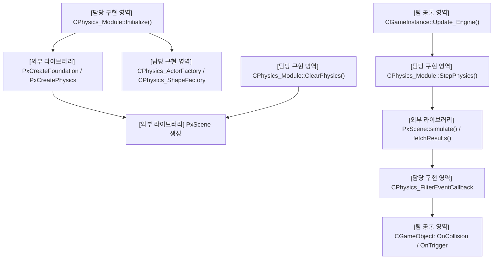
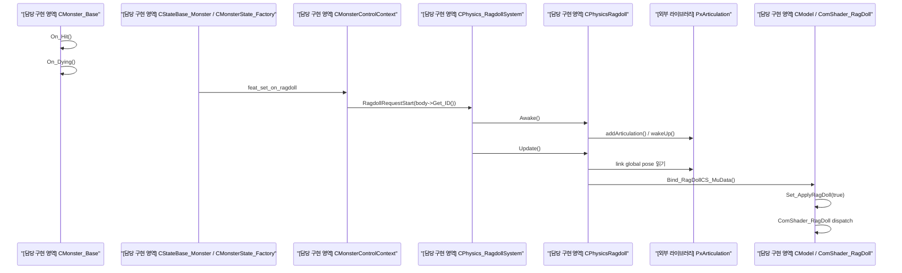

## 프로젝트 개요

| 항목     | 내용                                                |
| :----- | :------------------------------------------------ |
| **기간** | 2026.01 ~ 2026.03                                 |
| **인원** | 6인                                                |
| **역할** | PhysX, 래그돌, 애니메이션 툴, FSM 툴, 중간 보스, 대화/상호작용/퀘스트시스템 |
| **언어** | C++                                               |
| **기술** | PhysX, Data-Driven                                |

> 언리얼4 엔진 기반의 상용 게임 리소스를 활용해 C++/DirectX 11 기반의 환경에서 게임을 재구현 합니다.
> PhysX 연동과 이를 활용한 물리 월드 구축과 래그돌 구현,
> Data-Driven 방식의 FSM 툴 구현,
> 이벤트 연동 방식의 애니메이션 툴 구현,
> 몬스터/중간보스몬스터 구현,
> 퀘스트/상호작용/대화 컨텐츠 시스템 구현을 담당했습니다.

## 기획 의도

언리얼 엔진 4 기반 상용 게임의 콘텐츠를 C++/DirectX 11 환경에서 재구현하며, 상용 엔진이 제공하는 물리·애니메이션·AI·콘텐츠 시스템의 동작 구조를 직접 설계하고 구현하는 것을 목표로 했습니다.

단순한 외형 재현에 그치지 않고, PhysX 기반 물리 시스템과 데이터 중심의 상태 관리, 이벤트 기반 애니메이션 제어, 퀘스트와 상호작용 시스템이 하나의 플레이 흐름 안에서 연동되는 구조를 검증하고자 했습니다.

또한 FSM과 애니메이션을 툴에서 편집할 수 있도록 구성하여, 코드 수정 없이 데이터를 통해 콘텐츠를 확장하고 조정할 수 있는 개발 환경을 구축하는 것을 기술적 목표로 삼았습니다.

## 담당 역할 및 기여

6인 팀 프로젝트에서 물리 시스템과 개발 툴, 몬스터 및 콘텐츠 시스템의 설계와 구현을 담당했습니다.
##### 직접 설계한 부분
* PhysX 연동 및 물리 월드 구축
	* DirectX 11 기반 프레임워크에 PhysX를 연동하고, 물리 객체의 생성/갱신/해제를 관리하는 구조를 구현했습니다.
	* 몬스터 사망 시 본 애니메이션에서 물리 시뮬레이션으로 전환되는 래그돌 시스템을 구현했습니다.
* Data-Driven FSM 툴
	* 몬스터의 상태와 상태 전이 조건을 코드에 고정하지 않고 데이터로 편집할 수 있도록 FSM 구조와 편집 툴을 설계했습니다.
	* 저장된 FSM 데이터를 런타임에서 로드하여 몬스터 AI에 적용하도록 구현했습니다.
* 이벤트 기반 애니메이션 툴
	* 애니메이션 재생 구간에 공격 판정, 효과음, 이펙트 등의 이벤트를 등록할 수 있는 툴을 구현했습니다.
	* 애니메이션 프레임과 게임 로직이 직접 결합되지 않도록 이벤트 기반으로 연동했습니다.
	* 이펙트, 물리 등 다양한 파트의 담당이 기능을 붙이는 것을 고려한 구조를 작성했습니다.
* 몬스터 및 중간 보스
	* 일반 몬스터와 중간 보스의 상태, 이동, 공격 패턴 및 전투 흐름을 구현했습니다.
	* FSM과 애니메이션 이벤트 시스템을 실제 콘텐츠에 적용해 동작을 검증했습니다.
* 퀘스트/상호작용/대화 시스템
	* NPC 및 오브젝트와 상호작용을 기반으로 대화와 퀘스트가 진행되는 콘텐츠의 흐름을 구현했습니다.
	* 퀘스트 진입, 진행, 완료 상태를 관리하고, NPC 대화와, 상호작용, 조건 달성 결과에 따라 상태가 변경되도록 구현했습니다.

## 구현 내용

### PhysX 물리 월드 및 충돌 이벤트 시스템

- ##### 목적
DirectX 11 기반 실행 환경에서 충돌, 트리거, 공격 판정과 캐릭터 이동을 처리하기 위해 PhysX를 연동했습니다.

PhysX API를 각 게임 오브젝트에서 직접 호출하는 방식이 아니라. 물리 월드의 초기화와 시뮬레이션, 물리 객체 생성, 충돌 이벤트 전달을 담당하는 모듈과 팩토리 구조를 구성했습니다.

- ##### 설계
CPhysics_Module이 PhysX Foundation, Physics Scene, Dispatcher와 CCT Manager의 생성 및 해제를 담당하도록 구현했습니다.

물리 객체의 종류에 따른 생성 책임은 다음과 같이 분리했습니다.

- CPhysics_ActorFactory : Static, Dynamic, Kinematic Actor 생성
- CPhysics_ShapeFactory : Box, Sphere, Capsule, Mesh 생성
- CPhysics_FilterEventCallback : Contact, Trigger, Overlap, Raycast 결과를 게임 오브젝트 이벤트로 변환
- CPhysicsCollider, CPhysicsRigidBody : 게임 오브젝트와 PhysX 객체를 연결하는 컴포넌트

게임 오브젝트는 Collider와 RigidBody 설정 데이터를 전달하고, 팩토리는 해당 정보를 바탕으로 PhysX Shape와 Actor를 생성하도록 했습니다.

충돌 관계를 PhysX Filter Data와 커스텀 FilterShader를 통해 레이어 단위로 제어했습니다. 공격, 스킬, 몬스터, 맵, 트리거, 래그돌 등 객체 종류에 따라 필요한 충돌 쌍만 이벤트를 발생시키도록 구성했습니다.

- ##### 구현 방식
게임 엔진 갱신 과정에서 CPhysics_Module::StepPhysics()를 호출하여 PhysX Scene의 simulate()와 fetchResults()를 수행했습니다.

PhysX에서 발생한 충돌과 트리거 결과는 CPhysics_FilterEventCallback을 거쳐 CGameObject의 충돌 이벤트로 전달했습니다. 이를 통해 몬스터, NPC, 상호작용 오브젝트, TriggerBox와 공격 판정이 같은 물리 이벤트 흐름을 사용할 수 있도록 했습니다.

공격 판정에서는 충돌 대상뿐 아니라 충돌 지점과 공격 프리셋 정보가 포함된 HIT_DESC를 전달하여, 데미지와 이펙트, 사운드, 피격 반응에서 공통으로 사용할 수 있도록 구성했습니다.

- ##### 구조

- ##### 결과
PhysX의 물리 월드 생명주기를 게임 엔진의 갱신 흐름과 통합했으며, 정적/동적 객체와 Trigger, 공격 Overlap, Raycast를 공통된 물리 처리 구조에서 관리할 수 있게 되었습니다.

또한 충돌 결과가 게임 오브젝트 이벤트로 전달되도록 구성하여, 물리 라이브러리와 실제 게임 콘텐츠 로직이 직접 결합되는 범위를 줄였습니다.

- `[노란색 캡슐`] : 캐릭터 CCT
- `[초록색 캡슐`] : 몬스터 CCT
- `[빨간색 바닥]`: 지형 Static 메쉬

- `[노란색 직육면체]`: 캐릭터의 상호작용 감지 TriggerBox

- `[노란색 구]`: 캐릭터의 몬스터 감지 Trigger Sphere (미니맵에서 사용)

- `[검은색 구 와이어프레임]`: 공격용 Overlap (Scene Query)
- `[작은 초록색 알갱이]`: 래그돌 (Hit 판정으로 래그돌 상태 돌입)

- PhysX 루프 중 물리 레이어와 마스크를 비교해 충돌 대상 선별 (FilterShader)

- 선별된 충돌 이벤트를 OnCollisionEnter, OnCollision, OnCollisionExit 형태로 게임 오브젝트에 전달

- 공격용 Overlap 충돌 이벤트를 데미지, 공격자 정보와 함께 게임 오브젝트로 넘겨주는 부분

- 총(Gun)의 Raycast 무기 공격 판정을 게임 오브젝트로 넘겨주는 부분
### PhysX 기반 래그돌 시스템

- ##### 목적
몬스터가 사망하거나 강한 공격에 피격됐을 때, 본 애니메이션으로 재생되는 정해진 사망 동작에서 벗어나 물리 환경에 반응하며 쓰러지도록 래그돌 시스템을 구현했습니다.

단순히 여러 개의 RigidBody를 배치하는 방식이 아니라, 캐릭터의 본 계층을 PhysX Articulation Link와 Joint로 구성하고 물리 시뮬레이션 결과를 다시 모델의 본 Transform에 반영하는 구조를 사용했습니다.

- ##### 설계
CModel::Mapping_Ragdoll_Bone()에서 래그돌에 사용할 주요 본을 선별하고, 각 본의 부모/자식 관계와 초기 Transform 정보를 Ragdoll_Bone_Description 형태로 구성했습니다.

CPhysics_RagdollSystem은 해당 정보를 바탕으로 PxArticulationReducedCoordinate와 PxArticulationLink, Joint와 Capsule Shape를 생성하도록 했습니다.

런타임에서는 다음과 같이 책임을 분리했습니다.
- CPhysics_RagdollSystem : 래그돌 생성, 등록, 활성화 요청과 상태 전환 관리
- CPhysicsRagdoll : PhysX Link와 모델 본의 Transform 동기화
- CMonsterControlContext : 몬스터 FSM에서 래그돌 활성화 요청
- CModel : 래그돌 결과를 최종 본 Transform에 반영
- ComShader_RagDoll : 래그돌 Transform을 GPU 애니메이션 처리 과정에 반영

- ##### 구현 방식
몬스터 FSM의 사망 상타에서 래그돌 활성화 Feature를 실행하면, CMonsterControlContext가 래그돌 시스템에 활성화를 요청하도록 구성했습니다.

활성화 시점에는 현재 애니메이션의 본 Pose를 기준으로 PhysX Articulation을 배치한 뒤 Scene에 추가하고 물리 시뮬레이션을 시작했습니다.

매 프레임 PhysX Link의 Global Pose를 읽어 모델 본의 Local Transform으로 변환하고, 이를 래그돌 전용 버퍼와 컴퓨트 쉐이더에 전달하여 최종 스키닝 결과에 반영했습니다.

피격 방향와 힘을 Impulse로 전달하여, 공격이 들어온 방향에 따라 몬스터가 서로 다른 방향으로 밀리도록 했습니다.

- ##### 구조

- ##### 결과

몬스터 사망 시 애니메이션 제어에서 PhysX 물리 제어로 전환되는 흐름을 구현했습니다.

래그돌 결과를 모델의 본 행렬과 GPU 애니메이션 처리 과정에 연결하여, 몬스터가 바닥과 오브젝트에 충돌하며 쓰러지고 피격 방향에 따라 반응하도록 했습니다.

- 피격당한 몬스터 CCT 캡슐은 비활성화 되고 래그돌이 배치된다

- Awake 시 초기 위치가 바닥 밑으로 가는 불상사를 막기 위해 y 값을 보정한다.
- Awake 이전의 본 애니메이션이 수행한 Pelvis 본의 위치를 가져와 래그돌 Root 관절 위치에 셋팅한다.
- 이전 래그돌 활성화 시 남아있던 물리 시뮬레이션이 있다면 초기화해주고 Articulation을 깨워 PhysX의 Scene에서 활동할 수 있게한다.
### 구현내용

- ##### 목적
- ##### 설계
- ##### 구현 방식
- ##### 구조
- ##### 결과

## 트러블슈팅
### 문제
> 실제로 발생한 증상
- 
### 원인
* 어떻게 원인을 확인했는지
* 실제 원인이 무엇이었는지
### 해결
* 어떤 방식으로 수정했는지
* 왜 그 방식을 선택했는지
* 수정 후 어떻게 검증했는지
## 결과 및 배운 점
* 완성한 기능
* 기술적으로 배운 점
* 현재 한계
* 다시 구현한다면 개선할 부분

## 관련 링크

* 영상:
* GitHub:
* 실행 페이지:
* 다운로드: