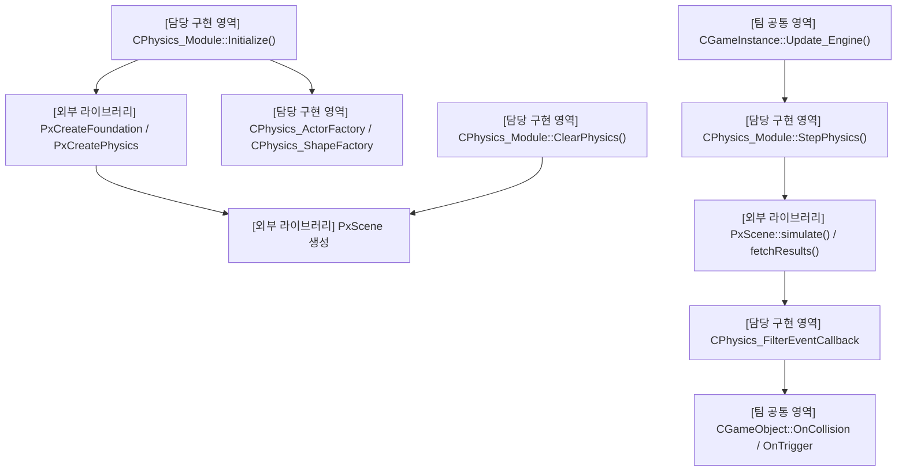
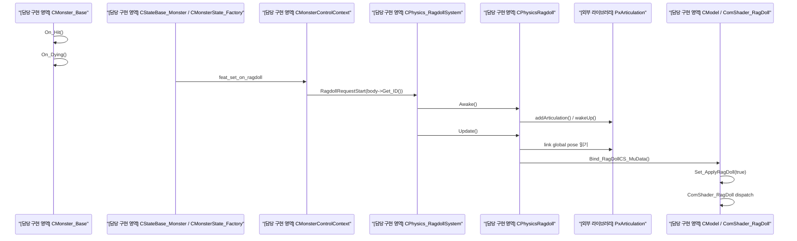
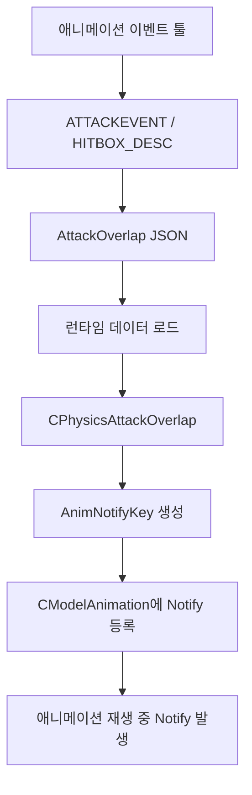
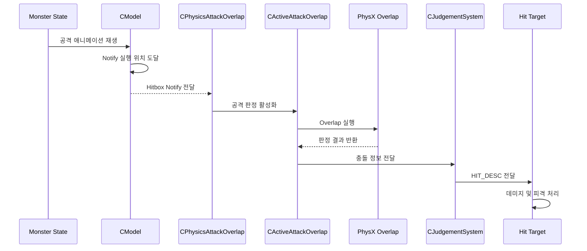
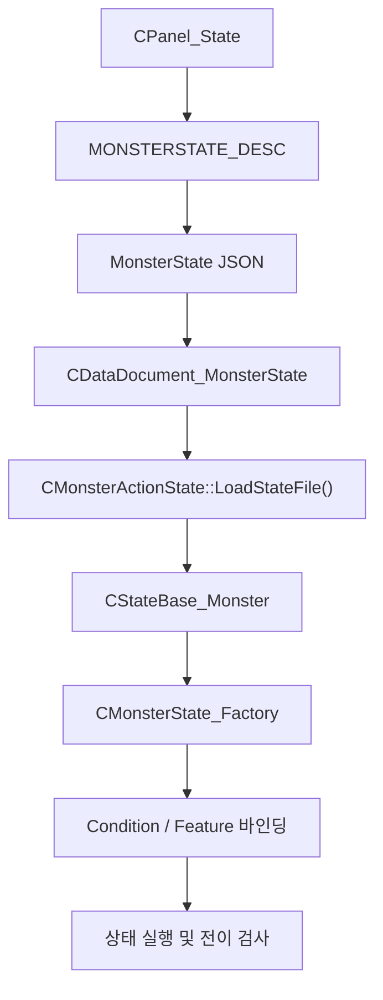
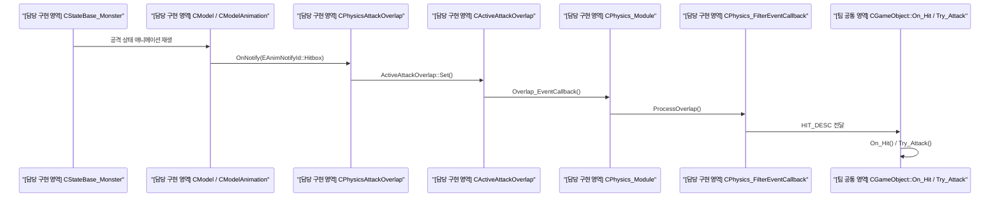
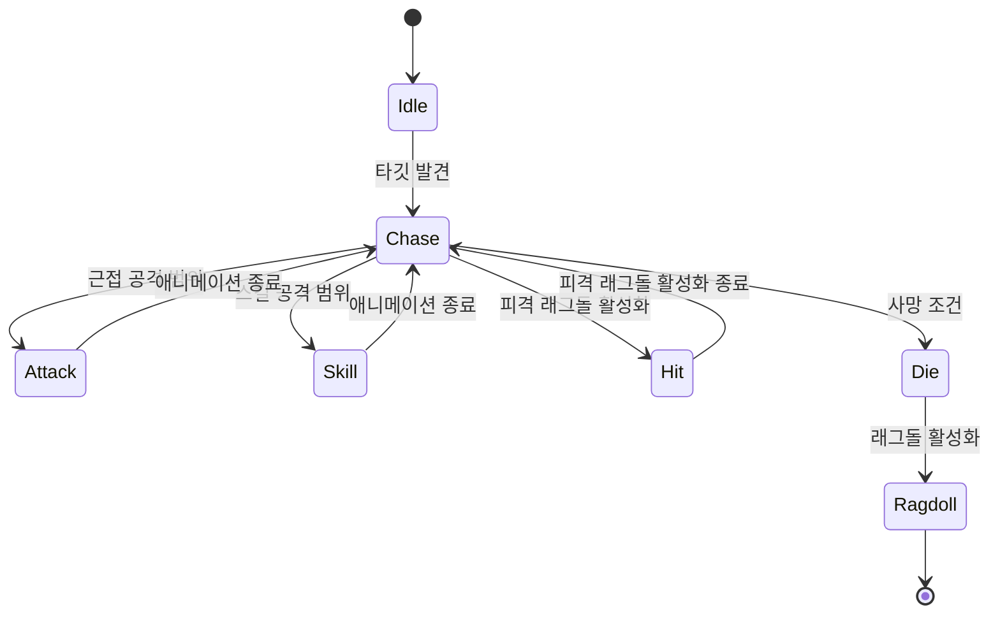
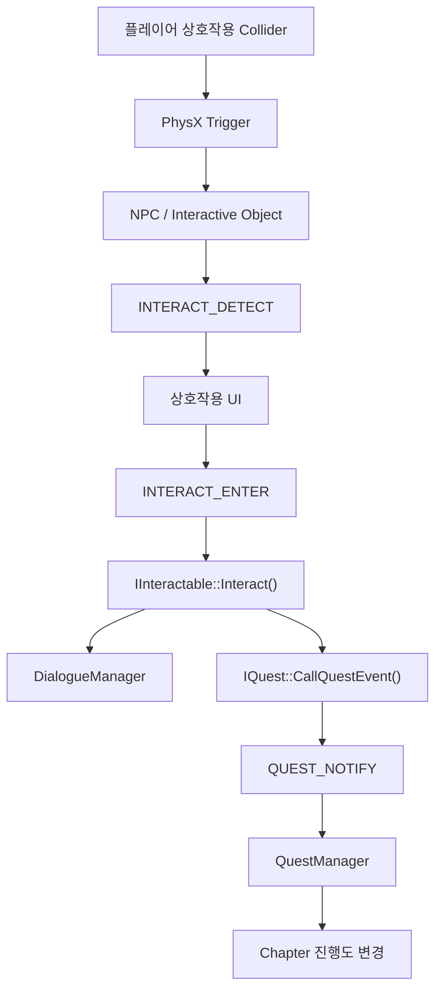

## 프로젝트 개요

| 항목     | 내용                                                   |
| :----- | :--------------------------------------------------- |
| **기간** | 2026.01 ~ 2026.03                                    |
| **인원** | 6인                                                   |
| **역할** | PhysX, 래그돌, 애니메이션 툴, FSM 툴, 중간 보스, 대화/상호작용/퀘스트시스템    |
| **언어** | C++                                                  |
| **기술** | C++, DirectX 11, PhysX, ImGui, JSON, Data-Driven FSM |

> 언리얼4 엔진 기반의 상용 게임을 레퍼런스로 삼아 C++/DirectX 11 기반의 환경에서 게임을 재구현 합니다.
> 
> PhysX 연동과 이를 활용한 물리 월드 구축과 래그돌 구현,
> 
> Data-Driven 방식의 FSM 툴 구현,
> 
> 이벤트 연동 방식의 애니메이션 툴 구현,
> 
> 몬스터/중간보스몬스터 구현,
> 
> 퀘스트/상호작용/대화 컨텐츠 시스템 구현을 담당했습니다.

## 기획 의도

언리얼 엔진 4 기반 상용 게임의 콘텐츠를 C++/DirectX 11 환경에서 재구현하며, 상용 엔진이 제공하는 물리·애니메이션·AI·콘텐츠 시스템의 동작 구조를 직접 설계하고 구현하는 것을 목표로 했습니다.

단순한 외형 재현에 그치지 않고, PhysX 기반 물리 시스템과 데이터 중심의 상태 관리, 이벤트 기반 애니메이션 제어, 퀘스트와 상호작용 시스템이 하나의 플레이 흐름 안에서 연동되는 구조를 검증하고자 했습니다.

또한 FSM과 애니메이션을 툴에서 편집할 수 있도록 구성하여, 코드 수정 없이 데이터를 통해 콘텐츠를 확장하고 조정할 수 있는 개발 환경을 구축하는 것을 기술적 목표로 삼았습니다.

## 담당 역할 및 기여

6인 팀 프로젝트에서 물리 시스템과 개발 툴, 몬스터 및 콘텐츠 시스템의 설계와 구현을 담당했습니다.
### 직접 설계한 부분
* PhysX 연동 및 물리 월드 구축
	* DirectX 11 기반 프레임워크에 PhysX를 연동하고, 물리 객체의 생성/갱신/해제를 관리하는 구조를 구현했습니다.
	* 몬스터 사망 시 본 애니메이션에서 물리 시뮬레이션으로 전환되는 래그돌 시스템을 구현했습니다.
* Data-Driven FSM 툴
	* 몬스터의 상태와 상태 전이 조건을 코드에 고정하지 않고 데이터로 편집할 수 있도록 FSM 구조와 편집 툴을 설계했습니다.
	* 저장된 FSM 데이터를 런타임에서 로드하여 몬스터 AI에 적용하도록 구현했습니다.
* 이벤트 기반 애니메이션 툴
	* 애니메이션 재생 구간에 공격 판정, 효과음, 이펙트 등의 이벤트를 등록할 수 있는 툴을 구현했습니다.
	* 애니메이션 프레임과 게임 로직이 직접 결합되지 않도록 이벤트 기반으로 연동했습니다.
	* 이펙트, 물리 등 다양한 파트의 담당이 기능을 붙이는 것을 고려한 구조를 작성했습니다.
* 몬스터 및 중간 보스
	* 일반 몬스터와 중간 보스의 상태, 이동, 공격 패턴 및 전투 흐름을 구현했습니다.
	* FSM과 애니메이션 이벤트 시스템을 실제 콘텐츠에 적용해 동작을 검증했습니다.
* 퀘스트/상호작용/대화 시스템
	* NPC 및 오브젝트와 상호작용을 기반으로 대화와 퀘스트가 진행되는 콘텐츠의 흐름을 구현했습니다.
	* 퀘스트 진입, 진행, 완료 상태를 관리하고, NPC 대화와, 상호작용, 조건 달성 결과에 따라 상태가 변경되도록 구현했습니다.

## 프로젝트 영상



## 구현 내용

### PhysX 물리 월드 및 충돌 이벤트 시스템

- 핵심 기술 및 패턴

	PhysX, Factory Pattern, Component 기반 구조, Custom Collision Filtering, Callback 기반 이벤트 처리  
	
	Actor와 Shape 생성 책임을 Factory로 분리하고, Collider/RigidBody를 컴포넌트로 구성해 PhysX 충돌 결과를 게임 오브젝트 이벤트로 전달했습니다.

- 목적

	DirectX 11 기반 실행 환경에서 충돌, 트리거, 공격 판정과 캐릭터 이동을 처리하기 위해 PhysX를 연동했습니다.
	
	PhysX API를 각 게임 오브젝트에서 직접 호출하는 방식이 아니라. 물리 월드의 초기화와 시뮬레이션, 물리 객체 생성, 충돌 이벤트 전달을 담당하는 모듈과 팩토리 구조를 구성했습니다.

- 설계

	`CPhysics_Module`이 PhysX Foundation, Physics Scene, Dispatcher와 CCT Manager의 생성 및 해제를 담당하도록 구현했습니다.
	
	물리 객체의 종류에 따른 생성 책임은 다음과 같이 분리했습니다.
	
	- `CPhysics_ActorFactory` : Static, Dynamic, Kinematic Actor 생성
	- `CPhysics_ShapeFactory` : Box, Sphere, Capsule, Mesh 생성
	- `CPhysics_FilterEventCallback` : Contact, Trigger, Overlap, Raycast 결과를 게임 오브젝트 이벤트로 변환
	- `CPhysicsCollider`, `CPhysicsRigidBody` : 게임 오브젝트와 PhysX 객체를 연결하는 컴포넌트
	
	게임 오브젝트는 Collider와 RigidBody 설정 데이터를 전달하고, 팩토리는 해당 정보를 바탕으로 PhysX Shape와 Actor를 생성하도록 했습니다.
	
	충돌 관계를 PhysX Filter Data와 커스텀 FilterShader를 통해 레이어 단위로 제어했습니다. 공격, 스킬, 몬스터, 맵, 트리거, 래그돌 등 객체 종류에 따라 필요한 충돌 쌍만 이벤트를 발생시키도록 구성했습니다.

- 구현 방식

	게임 엔진 갱신 과정에서 `CPhysics_Module::StepPhysics()`를 호출하여 PhysX Scene의 `simulate()`와 `fetchResults()`를 수행했습니다.
	
	PhysX에서 발생한 충돌과 트리거 결과는 `CPhysics_FilterEventCallback`을 거쳐 `CGameObject`의 충돌 이벤트로 전달했습니다. 이를 통해 몬스터, NPC, 상호작용 오브젝트, TriggerBox와 공격 판정이 같은 물리 이벤트 흐름을 사용할 수 있도록 했습니다.
	
	공격 판정에서는 충돌 대상뿐 아니라 충돌 지점과 공격 프리셋 정보가 포함된 `HIT_DESC`를 전달하여, 데미지와 이펙트, 사운드, 피격 반응에서 공통으로 사용할 수 있도록 구성했습니다.

- 구조

- 결과

	PhysX의 물리 월드 생명주기를 게임 엔진의 갱신 흐름과 통합했으며, 정적/동적 객체와 Trigger, 공격 Overlap, Raycast를 공통된 물리 처리 구조에서 관리할 수 있게 되었습니다.
	
	또한 충돌 결과가 게임 오브젝트 이벤트로 전달되도록 구성하여, 물리 라이브러리와 실제 게임 콘텐츠 로직이 직접 결합되는 범위를 줄였습니다.

- `[노란색 캡슐]` : 캐릭터 CCT
- `[초록색 캡슐]` : 몬스터 CCT
- `[빨간색 바닥]`: 지형 Static 메쉬

- `[노란색 직육면체]`: 캐릭터의 상호작용 감지 TriggerBox

- `[노란색 구]`: 캐릭터의 몬스터 감지 Trigger Sphere (미니맵에서 사용)

- `[검은색 구 와이어프레임]`: 공격용 Overlap (Scene Query)
- `[작은 초록색 알갱이]`: 래그돌 (Hit 판정으로 래그돌 상태 돌입)

- PhysX 루프 중 물리 레이어와 마스크를 비교해 충돌 대상 선별 (FilterShader)

- 선별된 충돌 이벤트를 `OnCollisionEnter`, `OnCollision`, `OnCollisionExit` 형태로 게임 오브젝트에 전달

- 공격용 Overlap 충돌 이벤트를 데미지, 공격자 정보와 함께 게임 오브젝트로 넘겨주는 부분

- 총(Gun)의 Raycast 무기 공격 판정을 게임 오브젝트로 넘겨주는 부분

### PhysX 기반 래그돌 시스템

- 핵심 기술 및 패턴

	PhysX Articulation, Skeletal Animation, Compute Shader, Physics–Animation Synchronization  
	
	캐릭터 본 계층을 PhysX Articulation Link와 Joint로 구성하고, 물리 시뮬레이션 결과를 본 로컬 행렬과 GPU 스키닝 과정에 반영했습니다.

- 목적

	몬스터가 사망하거나 강한 공격에 피격됐을 때, 본 애니메이션으로 재생되는 정해진 사망 동작에서 벗어나 물리 환경에 반응하며 쓰러지도록 래그돌 시스템을 구현했습니다.
	
	단순히 여러 개의 RigidBody를 배치하는 방식이 아니라, 캐릭터의 본 계층을 PhysX Articulation Link와 Joint로 구성하고 물리 시뮬레이션 결과를 다시 모델의 본 Transform에 반영하는 구조를 사용했습니다.

- 설계

	`CModel::Mapping_Ragdoll_Bone()`에서 래그돌에 사용할 주요 본을 선별하고, 각 본의 부모/자식 관계와 초기 Transform 정보를 `Ragdoll_Bone_Description` 형태로 구성했습니다.
	
	`CPhysics_RagdollSystem`은 해당 정보를 바탕으로 `PxArticulationReducedCoordinate`와 `PxArticulationLink`, Joint와 Capsule Shape를 생성하도록 했습니다.
	
	런타임에서는 다음과 같이 책임을 분리했습니다.
	- `CPhysics_RagdollSystem` : 래그돌 생성, 등록, 활성화 요청과 상태 전환 관리
	- `CPhysicsRagdoll` : PhysX Link와 모델 본의 Transform 동기화
	- `CMonsterControlContext` : 몬스터 FSM에서 래그돌 활성화 요청
	- `CModel` : 래그돌 결과를 최종 본 Transform에 반영
	- `ComShader_RagDoll` : 래그돌 Transform을 GPU 애니메이션 처리 과정에 반영

- 구현 방식

	몬스터 FSM의 사망 상타에서 래그돌 활성화 Feature를 실행하면, `CMonsterControlContext`가 래그돌 시스템에 활성화를 요청하도록 구성했습니다.
	
	활성화 시점에는 현재 애니메이션의 본 Pose를 기준으로 PhysX Articulation을 배치한 뒤 Scene에 추가하고 물리 시뮬레이션을 시작했습니다.
	
	매 프레임 PhysX Link의 Global Pose를 읽어 모델 본의 Local Transform으로 변환하고, 이를 래그돌 전용 버퍼와 컴퓨트 쉐이더에 전달하여 최종 스키닝 결과에 반영했습니다.
	
	피격 방향와 힘을 Impulse로 전달하여, 공격이 들어온 방향에 따라 몬스터가 서로 다른 방향으로 밀리도록 했습니다.

- 구조
	- 래그돌 전환 흐름

- 결과

	몬스터 사망 시 애니메이션 제어에서 PhysX 물리 제어로 전환되는 흐름을 구현했습니다.
	
	래그돌 결과를 모델의 본 행렬과 GPU 애니메이션 처리 과정에 연결하여, 몬스터가 바닥과 오브젝트에 충돌하며 쓰러지고 피격 방향에 따라 반응하도록 했습니다.

- 피격당한 몬스터 CCT 캡슐은 비활성화 되고 래그돌이 배치된다

- Awake 시 초기 위치가 바닥 밑으로 가는 불상사를 막기 위해 y 값을 보정한다.
- Awake 이전의 본 애니메이션이 수행한 Pelvis 본의 위치를 가져와 래그돌 Root 관절 위치에 셋팅한다.
- 이전 래그돌 활성화 시 남아있던 물리 시뮬레이션이 있다면 초기화해주고 Articulation을 깨워 PhysX의 Scene에서 활동할 수 있게한다.

- PhysX 관절 월드 위치를 캐릭터 월드 공간으로 변환한다
- 캐릭터 월드 공간으로 변환된 관절 위치를 각자의 부모 관절 공간으로 다시 변환한다
- 컴퓨트 쉐이더에 전달하기 위한 GPU 버퍼에 보관
- 최종 위치와 회전을 CCT에 동기화

- 현재 한계 및 개선 방향
	모델마다 공통된 처리를 위해 래그돌 대상 본 이름과 일부 Joint 설정값이 코드에 정의되어있습니다. 다시 구현한다면 본 매핑과 질량, 반지름, 관절 제한값을 외부 데이터로 캐릭터별 래그돌 설정을 툴에서 조정할 수 있도록 개선할 계획입니다.

### 이벤트 기반 애니메이션 편집 툴 및 PhysX Overlap 바인딩

- 핵심 기술 및 패턴

	Event-Driven Architecture, Animation Notify, Observer 방식, Object Pool, PhysX Scene Query  
	
	툴에서 작성한 이벤트를 애니메이션 Notify에 바인딩하고, 공격 시점에 풀링된 Overlap 객체를 활성화해 PhysX 공격 판정으로 연결했습니다.

- 목적

	공격 판정, 이펙트, 사운드와 카메라 연출의 실행 시점을 애니메이션 코드에 직접 작성 할 경우, 애니메이션이나 타격 타이밍이 변경될 때마다 관련 코드를 함께 수정해야 했습니다.
	
	이를 개선하기 위해 애니메이션 클립의 특정 재생 위치에 이벤트를 배치하고, 이벤트 종류와 실행 데이터를 편집할 수 있는 ImGui 기반 애니메이션 이벤트 툴을 구현했습니다.
	
	또한 공격 판정용 Overlap Event를 툴에 추가하여, 애니메이션 이벤트가 PhysX 기반 Hitbox 판정과 실제 피격 처리까지 이어지도록 구성했습니다.

**애니메이션 이벤트 편집 툴**

애니메이션 클립 목록에서 편집할 애니메이션을 선택하고, 현재 재생 위치를 이동하며 타임라인에이벤트를 등록할 수 있도록 구성했습니다.

지원한 이벤트 유형은 다음과 같습니다.
- 공격 판정을 위한 Overlap Event
- 이펙트 실행 이벤트
- 사운드 재생 이벤트
- 카메라 제어 이벤트

각 이벤트는 공통적으로 다음 정보를 가집니다.
- 이벤트가 실행될 애니메이션 재생 위치
- 애니메이션 태그 및 인덱스
- 이벤트 종류별 추가 데이터

타임라인에서 이벤트를 드래그해 실행 위치를 변경할 수 있으며, 상세 편집 패널에서 이벤트별 설정값을 수정하도록 구현했습니다.

이벤트 실행 위치는 프레임 번호가 아니라 `fStartTractPosition` 값으로 저장하여, 런타임 애니메이션 Nofity의 Track Position과 연결했습니다.

- `[좌측 상단`: 애니메이션 목록
- `[좌측 하단]`: 이벤트 편집 패널
- `[우측]`: 애니메이션 모델 목록
- `[중앙 상단`]: 애니메이션 실행 정보
- `[중앙]`: 애니메이션 프레임과 이벤트 정보
- `[중앙 하단]`: 애니메이션과 이벤트 시각화(공격용 Overlap 시각화 예시)

**이벤트 데이터 저장 및 런타임 로드**

공통 이벤트 정보는 `ANIM_EVENT_BASE` 구조에 저장하고, 이벤트 종류에 따라 별도의 데이터 구조로 확장했습니다.

Overlap Event는 `ATTTACKEVENT` 내부에 `HITBOX_DESC`를 포함하며, 툴에서 작성한 데이터는 JSON파일로 저장했습니다.

공격 판정 데이터는 다음 경로에 몬스터별로 저장됩니다.

`Resources/Data/AttackOverlapData/*.json`

런타임에서는 저장된 JSON을 로드해 공격 Overlap 컴포넌트 Prototype을 생성하고, 해당 컴포넌트를 몬스터 또는 플레이어 객체에 추가하도록 구성했습니다.

Effect, Sound, Camera Event도 동일한 타임라인 편집 구조를 사용하되 각각의 데이터 디렉터리와 런타임 처리 객체에 연결하도록 각 파트 담당자들에게 인계했습니다.

- 툴에서 설정한 애니메이션 실행 위치와 Hitbox 정보를 JSON으로 저장해 런타임 공격 판정에 사용했습니다.

**Overlap Event 편집 기능**

Overlap Event의 상세 패널에서 다음 정보를 설정할 수 있도록 구현했습니다.
- 이벤트 실행 위치
- Hitbox 지속 시간
- Box, Sphere, Capsule Shape
- Shape 크기
- 캐릭터 기준 위치 Offset
- 공격 데이터에 사용할 AttackPreset
- 충돌 Filter Layer와 Mask
- 동일 공격의 최대 타격 횟수
- 연속 판정 Tick Interval

툴에서 설정한 `HITBOX_DESC`는 런타임에서 PhysX Geometry와 Query Filter, AttackPreset ID로 변환됩니다.

별도의 Hitbix 회전값은 현재 구현에 포함되어있지 않으며, 월드상의 객체 Look과 HITBOX_DESC의 Offset을 기준으로 공격 영역을 배치했습니다.

**애니메이션 Notify 바인딩**

`CPhysicsAttackOverlap::Ready_OverlapInfo()`에서 로드한 Overlap Event를 런타임 공격 판정 정보로 변환했습니다.

이 과정에서 다음 정보를 준비했습니다.
- PhysX Geometry
- 위치 Offset
- 충돌 Filter 정보
- AttackPreset ID
- 이벤트 인덱스
- Hitbox용 `AnimNotifyKey`

생성한 `AnimNotifyKey`는 `CModelAnimation::Pushback_Nofifies()`를 통해 해당 애니메이션에 등록했습니다.

애니메이션 재생 중 지정한 Track Positino에 도달하면 `CModel::Emit_Notifies()`가 Notify를 발생시키고, 이를 구독한 `CPhysicsAttackOverlap`이 해당 이벤트 인덱스의 공격 판정을 실행하도록 구성했습니다.

- 처리 구조

**PhysX 공격 판정 연동**

Hitbox Notify가 발생하면 `CPhysicsAttackOverlap::CallbackEvent()`가 미리 준비한 `CActiveAttackOverlap`객체를 활성화합니다.

`CActiveAttackOverlap`은 이벤트 데이터에 설정된 Shape, Offset과 Filter 정보를 이용해 PhysX Overlap 판정을 수행합니다.

판정 결과는 다음 순서로 처리됩니다.

애니메이션 Notify 발생
-> `CPhysicsAttackOverlap` 이벤트 처리
-> `CActiveAttackOverlap` 활성화
-> PhysX Overlap 판정
-> Physics Callback 처리
-> COLLIDED_DESC 생성
-> JudgementSystem wjsekf
->`HIT_DESC` 생성
-> 대상의 On_Hit 또는 Try_Attack 호출

공격 판정에서는 다음 처리도 함께 수생했습니다.
- 공격자 자신을 판정 대상에서 제외
- Layer와 Mask를 이용한 피격 대상 필터링
- 이미 판정된 대상의 중복 피격 확인
- AttackPreset을 통한 공격 정보 조회
- 피격 대상의 체력 감소와 피격 반응
- Hit Effect와 Hit Sound 실행
- Damage UI 표시
- 피격 방향과 힘을 래그돌 Impulse에 전달

- 실행 구조

- 결과

	애니메이션의 공격 타이밍과 실제 Hitbox 활성화 시점을 툴 데이터로 동기화할 수 있게 되었습니다.
	
	공격 판정과 이펙트, 사운드, 카메라 연출의 실행 시점을 몬스터 상태 코드에서 분리하여, 코드 수정 없이 타임라인 데이터를 조정하는 방식으로 콘텐츠를 수정할 수 있도록 했습니다.
	
	또한 애니메이션 툴의 공통 이벤트 구조에 Overlap Event를 추가하고, 다음 전체 흐름을 연결했습니다.
	
	툴 편집
	-> JSON 저장
	-> 런타임 데이터 로드
	-> 애니메이션 Notify 바인딩
	-> PhysX 공격 판정
	-> 전투 판정 및 피격 처리
	
	이를 통해 애니메이션 이벤트 시스템이 단순 연출 실행에 그치지 않고, 물리 판정과 전투 로직까지 확장해서 연결할 수 있는 구조임을 검증했습니다.
	
	
	
	
	
	
	- `CPhysicsAttackOverlap::Ready_OverlapInfo()`
	- 툴에서 작성한 Hitbox 데이터를 PhysX Geometry와 Filter 정보로 변환하고, 해당 이벤트를 애니메이션 Notify에 등록합니다.
	
	
	- 활성화된 공격 영역에서 PhysX Overlap을 수행하고, 중복 판정을 확인한 뒤 전투 판정 시스템으로 충돌 결과를 전달했습니다.

- 현재 한계 및 개선 방향

	현재 Hitbox 위치는 Offset을 기준으로 설정하며, 별도의 회전값을 툴에서 편집하는 기능은 포함되어 있지 않습니다.
	
	다시 구현한다면 Hitbox 회전값 편집을 지원하고자합니다.

### Data-Driven 몬스터 FSM 편집 툴

- 핵심 기술 및 패턴

	Data-Driven Architecture, State Pattern, Function Registry, Weighted Random Transition, JSON 직렬화  
	
	상태와 전이 조건, 실행 Feature를 JSON으로 분리하고, 문자열 기반 Condition과 Feature를 런타임 Registry 함수에 바인딩했습니다.

- 목적

	몬스터 상태와 전이 조건이 C++ 코드에 직접 작성되어 있으면 패턴을 변경하거나 새로운 몬스터를 추가할 때마다 코드 수정과 재빌드가 필요합니다.
	
	이를 개선하기 위해 상태, 애니메이션, 전이 조건과 상태별 실행 기능을 JSON 데이터로 구성하고, 해당 데이터를 편집할 수 있는 FSM 툴과 런타임 시스템을 구현했습니다.

- 데이터 구조

	FSM 데이터에는 다음 정보를 저장했습니다.
	- 상태 이름
	- 상태에서 재생할 애니메이션
	- 상태 시작/갱신/종료 시 실행할 Feature
	- 전이 조건
	- 전이 대상 상태
	- 랜덤 전이 대상과 가중치
	- 전역 전이와 지역 전이 정보

상태의 실행 흐름과 전이 관계는 데이터로 저장하고, 실제 조건 판정과 기능 실행 코드는 `CMonsterState_Factory` 에 등록하도록 구성했습니다.

- 편집 툴
	ImGui 기반에서 다음 항목을 편집할 수 있도록 했습니다.
	
	- 상태 추가 및 삭제
	- 상태 별 애니메이션 설정
	- 상태 시작/갱신/종료 Feature 설정
	- 전이 조건 설정
	- 전이 대상 상태 설정
	- 랜덤 전이 대상과 가중치 설정
	- JSON 저장 및 불러오기

툴에서 작성한 데이터는 엔진의 문서 시스템을 통해 JSON으로 저장했습니다.

- 런타임 적용

	`CMonsterActionState`가 몬스터별 JSON 파일을 로드하여 상태 객체를 구성하고, `CStateBase_Monster`가 데이터에 기록된 문자열 Condition과 Feature를 Factory에 등록된 함수에 연결하도록 했습니다.
	
	몬스터 갱신 시 현재 상태의 기능을 실행하고, 전역 및 지역 전이 조건을 검사하여 다음 상태로 전환하도록 구성했습니다.
	
	일반 몬스터와 중간 보스, 지역 보스가 동일한 FSM 데이터 구조를 공유하고, 개별 몬스터는 서로 다른 JSON 데이터와 필요한 전용 기능을 조합해 행동 차이를 구성했습니다.

- 구조
	- Data-Driven FSM 데이터 적용 흐름

- 결과

- 상태 편집 툴 전체 모습

- 상태 이름 입력 창과 추가 버튼
- 상태 목록

- 상태 상세 내용

- 선택한 상태의 애니메이션

- 전이 조건과 전이 대상

- 상태의 기본 수행 Feature

- 상태 진입 시(OnEnter) 한 번만 실행되는 Feature

- 상태 루프 중 조건에 따라 실행되는 Feature

- 상태 종료 시(OnExit) 한 번만 실행되는 Feature

- Condition과 Feature에 바인드되는 인수들
- 시그니처는 통일됩니다.

- 전이 바인딩

- 전이 조건 확인 및 전이

- Condition과 Feature를 공유하기 위해 일관된 시그니처로 미리 생성

- Key는 공통 문서로 관리
- [Condition/Feat Key 관리 문서 링크](https://docs.google.com/spreadsheets/d/1tNnVP_l9EQnbn0V5kPBP3cwy_vDc7hO1qfvCKBPKW9Y/edit?usp=sharing)

- 현재 한계 및 개선 방향
	현재 툴의 Condition, Feature 목록과 런타임 Factory Registry가 각각 수동으로 동기화되는 부분이 있습니다.
	
	다시 구현한다면 하나의 Registry 정의에서 기능, 조건 목록과 바인딩 정보를 함께 생성하고, 저장 단계에서 존재하지 않는 Condition과 Feature를 차단하도록 검증 기능을 강화할 계획입니다.

### 일반 몬스터 및 중간 보스 전투 구현

- 핵심 기술 및 패턴

	공통 베이스 클래스, Component 조합, Data-Driven AI, 재사용 가능한 전투 파이프라인  
	
	공통 몬스터 구조에 FSM, 이동, 공격 판정, 피격, 래그돌 컴포넌트를 조합하고, 몬스터별 데이터와 전용 기능으로 행동 차이를 구성했습니다.

- 목적

	구현한 FSM, 물리 시스템, 공격 판정과 래그돌을 실제 전투 콘텐츠에 적용하여 시스템의 재사용성과 확장 가능성을 검증했습니다.

- 공통 몬스터 구조

	`CMonster_Base`에서 몬스터의 공통 생명주기와 전투 흐름을 처리하고, 다음 구성 요소를 조합하도록 했습니다.
	- `CMonsterActionState`: 데이터 기반 FSM
	- `CMonsterControlContext`: 타깃 방향, 이동, 공격 거리, 피격 및 래그돌 상태 관리
	- CPhysicsAttackOverlap : 공격 판정
	- CCT : 이동과 지형 충돌
	
	개별 몬스터 클래스는 모델, 능력치 CCT 설정, 사용할 FSM 데이터와 스킬/사운드 데이터를 지정하고, 실제 상태 전이와 행동 흐름은 공통 FSM 시스템을 사용하도록 구성했습니다.

- 일반 몬스터

	Dog, Boomer, Fly 몬스터가 동일한 기본 구조를 공유하면서 서로 다른 FSM JSON과 공격 데이터를 사용하도록 했습니다.
	
	이를 통해 근접 추격형, 스킬 사용형, 비행형 몬스터의 행동 차이를 공통 코드 수정이 아니라 데이터와 개별 설정의 조합으로 구성했습니다.

- 중간 보스

	중간 보스 Veteran은 일반 몬스터 구조를 확장하여 다음 기능을 추가했습니다.
	- 근접 연속 공격
	- 돌진
	- 점프 공격
	- 포효 및 충격파
	- 내려찍기
	- 방향 전환 상태
	- 카메라 이벤트
	- 보스 전용 스킬 생성
	
	일반 모스터와 같은 FSM 실행 구조를 사용하면서 더 많은 상태와 조건, 연출 기능을 조합해 복잡한 전투 패턴을 구성했습니다.

- 애니메이션과 공격 판정 연동

	공격 상태에 진입하면 공격 애니메이션을 재생하고, 애니메이션 Notify 시점에 `CPhysicsAttackOverlap`을 활성화하도록 했습니다.
	
	활성화된 공격 영역은 PhysX Overalp 판정을 수행하고, 충돌 결과를 `HIT_DESC`로 변환하여 대상의 피격 처리로 전달했습니다.
	
	이 구조를 통해 애니메이션의 타격 시점과 실제 판정 발생 시점을 동기화하고, 공격 범위와 전투 수치를 데이터로 관리할 수 있도록 했습니다.

- 구조
	- 몬스터 공격과 애니메이션 이벤트 연동 흐름

- 결과

	일반 몬스터와 중간 보스가 공통 전투 구조를 재사용하면서, FSM 데이터와 전용 스킬, 연출 구성에 따라 서로 다른 행동 패턴을 수행하도록 구현했습니다.
	
	또한 공격, 피격, 사망과 래그돌이 독립된 기능으로 끝나지 않고 하나의 전투 흐름 안에서 연결되도록 했습니다.

- Dog, Fly는 피격에 따라 래그돌 활성화
- Boomer는 묵직한 피격 연출을 위해 래그돌을 활성화하지 않음

- Veteran의 돌진

- 원본 Veteran에는 없지만 자체적으로 추가한 연속 공격 패턴

- 구조
	- 몬스터 FSM 상태 전이 예시

### 대화/상호작용/퀘스트 콘텐츠 시스템

- 핵심 기술 및 패턴

	Event-Driven Architecture, Publish–Subscribe, Interface 기반 다형성, Scenario/Chapter 상태 관리  
	
	`IInteractable`, `IQuest` 인터페이스와 공통 이벤트를 통해 물리 감지, UI 입력, 대화, 퀘스트 진행 시스템을 느슨하게 연결했습니다.

- 목적

	NPC 대화, 오브젝트, 상호작용과 퀘스트 진행이 각각 독립적으로 동작하는 것이 아니라, 플레이어의 행동에 따라 하나의 콘텐츠 흐름으로 이어지도록 구현했습니다.

- 상호작용 감지

	플레이어에 상호작용 감지용 PhysX Trigger Collider를 구성하고, NPC 또는 상호작용 오브젝트가 감지 범위에 들어오면 `INTERACT_DETECT` 이벤트를 전달하도록 했습니다.
	
	UI는 감지된 대상을 저장하고 상호작용 안내를 표시합니다. 플레이어가 상호작용 키를 입력하면 `INTERACT_ENTER` 이벤트를 통해 대상의 `IInteractable::Interact()`를 호출하도록 구성했습니다.
	
	이를 통해 NPC, 무기 획득 오브젝트와 레벨 이동 오브젝트가 공통 인터페이스를 사용 하도록 했습니다.

- 대화 시스템

	`CDialogueManager`가 대화 노드를 ID로 관리하고, 대화 시작/다음 문장/종료 이벤트를 처리하도록 했습니다.
	
	대화 시작 시 UI가 현재 대화 노드를 읽어 텍스트를 출력하고, 플레이어는 대화 전용 상태로 전환되어 일반 조작이 제한되도록 했습니다.

- 퀘스트 시스템

	퀘스트는 Scenario와 Chapter 구조로 구성했습니다.
	
	현재 Chapter는 다음과 같은 이벤트를 기준으로 진행도를 갱신합니다.
	- 몬스터 처치
	- NPC 대화
	- 지역 진입 및 이탈
	- 오브젝트 상호작용
	- 몬스터 웨이브 완료
	
	각 콘텐츠 객체는 `QUEST_NOTIFY`이벤트를 발행하고, CQuestManager가 현재 Scenario와 Chapter에 전달합니다.
	
	Chapter는 이벤트 종류와 대상 타입, 필요 횟수를 비교해 진행하도록 갱신하고, 완료 시 다음 Chapter 또는 Scenario로 전환되도록 구성했습니다.

- 구조

- 결과

	물리 Trigger, UI, 입력, 대화와 퀘스트 시스템을 이벤트 중심으로 연결하여 NPC 대화와 오브젝트 상호작용, 몬스터 처치가 동일한 퀘스트 진행 흐름에 반영되도록 구현했습니다.
	
	각 시스템이 서로의 구체적인 구현을 직접 참조하는 범위를 줄이고, 공통 이벤트와 인터페이스를 통해 연결되도록 구성했습니다.

- 상호작용 및 퀘스트 전환

- 대화 및 퀘스트 전환

- 퀘스트/대화 문서 관리
- [퀘스트/대화 문서 링크](https://docs.google.com/spreadsheets/d/1CGzyk6tjHByXM0LA-vXfRlovtc3Dpag1Fr7vBfB51BE/edit?usp=sharing)

- 현재 한계 및 개선 방향

	대화 데이터와 일부 퀘스트 Scenario는 코드에 정의되어 있으며, 퀘스트 진행 상태의 저장/불러오기 기능은 구현하지 못했습니다.
	
	다시 구현한다면 대화 노드와 Scenario 정보를 외부 데이터로 분리하고, 퀘스트 상태를 저장/복원할 수 있는 직렬화 구조를 추가할 계획입니다.
## 결과 및 배운 점

	PhysX 물리 월드와 래그돌 데이터 기반 FSM과 편집 툴, 몬스터 전투 및 퀘스트 콘텐츠를 하나의 플레이 흐름 안에서 연결했습니다.
	
	이 과정에서 외부 라이브러리를 단순히 호출하는 것에 그치지 않고, 게임 오브젝트와 물리 객체의 수명 및 이벤트 흐름을 통합하는 방법을 경험했습니다.
	
	또한 몬스터 상태와 전이 조건을 데이터로 분리하고, 제작 툴에서 작성한 데이터가 런타임 행동으로 이어지는 파이프라인을 구현하며 코드와 콘텐츠 데이터의 책임을 분리하는 방법을 학습했습니다.
	
	대화, 상호작용, 전투와 퀘스트 상태를 연결하면서 게임에서 발생하는 이벤트와 상태 전이가 여러 시스템 사이에서 어떻게 전달되고 관리되는지 이해할 수 있었습니다.
	
	이러한 경험을 바탕으로, 멀티플레이 환경에서 서버가 관리해야 하는 게임 상태와 클라이언트가 표현해야 하는 상태를 구분하고, 몬스터 AI와 퀘스트 진행 상태를 서버 중심 구조로 확장하는 기반을 마련했습니다.
  
## 관련 링크

* 영상: [영상](https://www.youtube.com/watch?v=YddyY0vfiFQ)
* GitHub: [깃허브](https://github.com/Byungcoco/FinalProject)
