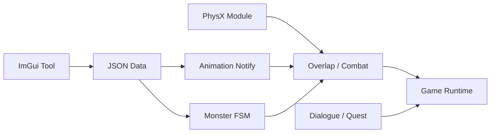

## 프로젝트 개요

| 항목 | 내용 |
| :--- | :--- |
| 기간 | 2026.01 ~ 2026.03 |
| 인원 | 6인 |
| 역할 | PhysX, 래그돌, 애니메이션 이벤트 툴, FSM 툴·런타임, Veteran 중간 보스, 대화·상호작용·퀘스트 |
| 언어 | C++ |
| 기술 | DirectX 11, PhysX, ImGui, JSON, Data-Driven FSM |

언리얼 엔진 기반 상용 게임을 레퍼런스로 삼아 C++/DirectX 11 환경에서 액션 RPG를 재구현한 팀 프로젝트입니다.

PhysX 물리 월드와 래그돌, 데이터 기반 애니메이션 이벤트 및 몬스터 FSM, 대화·상호작용·퀘스트 시스템을 담당했습니다. 툴에서 작성한 데이터가 런타임 전투와 콘텐츠 진행으로 이어지는 흐름을 구축하는 데 집중했습니다.

## 담당 범위

### 직접 설계·구현

- PhysX Foundation·Scene·Factory·Step을 포함한 물리 월드 통합
- 공격용 PhysX Overlap 컴포넌트와 애니메이션 Notify 바인딩
- 애니메이션 이벤트 공통 타임라인과 JSON 저장 구조
- PhysX Articulation 기반 래그돌 구조와 상태 전환
- Data-Driven 몬스터 FSM 툴 UI와 런타임
- 일반 몬스터 공통 구조와 Veteran 중간 보스
- 대화·상호작용·퀘스트 Manager 및 이벤트 진행 구조

### 팀 협업 영역

- Effect·Sound·Camera 이벤트는 공통 애니메이션 이벤트 구조에 다른 팀원이 런타임 처리를 확장
- 전투 판정과 일부 최종 렌더링 경로는 팀 공통 시스템과 연결
- 대화와 상호작용 UI 표현은 다른 팀원이 담당
- Xibi·Lianhuo 보스 패턴은 담당 범위에서 제외

## 프로젝트 영상



## 전체 구조

## 핵심 구현

### 1. PhysX 물리 월드와 충돌 이벤트

PhysX Foundation, Physics, Scene과 Dispatcher를 생성하고, 게임 루프의 물리 갱신·CCT·Collider·Ragdoll이 같은 Scene을 사용하도록 통합했습니다. Shape와 Actor 생성 책임은 Factory로 분리하고, PhysX 충돌 결과를 게임 오브젝트 이벤트로 변환했습니다.

[PhysX 물리 월드 자세히 보기]({{ '/portfolio/duet-night-abyss/physics-world/' | relative_url }})

### 2. PhysX 기반 래그돌

FSM의 래그돌 Feature가 물리 시스템에 활성화를 요청하고, PhysX Articulation Link의 Pose를 캐릭터와 부모 Bone 공간으로 변환해 스켈레톤 갱신 경로에 반영했습니다.

[래그돌 전환과 Bone 동기화 자세히 보기]({{ '/portfolio/duet-night-abyss/ragdoll/' | relative_url }})

### 3. 애니메이션 이벤트 툴과 공격 Overlap

애니메이션 타임라인에서 Hitbox 이벤트의 실행 위치·Shape·Offset·지속 시간·필터·AttackPreset을 편집하고 JSON으로 저장했습니다. 런타임에서는 Track Position을 Animation Notify로 바인딩하고, Notify 시점에 PhysX Overlap을 실행해 전투 판정으로 연결했습니다.

[애니메이션 이벤트와 공격 Overlap 자세히 보기]({{ '/portfolio/duet-night-abyss/animation-overlap/' | relative_url }})

### 4. Data-Driven 몬스터 FSM

상태·전이 조건·Feature·가중치 전이를 JSON으로 구성하고, 문자열 ID를 런타임 함수 Registry에 바인딩했습니다. 일반 몬스터와 Veteran 중간 보스가 동일한 FSM 실행 구조를 사용하면서 서로 다른 데이터와 전용 기능으로 행동을 구성했습니다.

[Data-Driven FSM 자세히 보기]({{ '/portfolio/duet-night-abyss/monster-fsm/' | relative_url }})

### 5. 대화·상호작용·퀘스트 연동

PhysX Trigger로 상호작용 대상을 감지하고, 공통 `IInteractable`과 이벤트를 통해 대화와 퀘스트 진행으로 연결했습니다. NPC 대화, 오브젝트 상호작용, 몬스터 처치와 지역 Trigger가 동일한 Quest Event 흐름을 사용합니다.

[대화·상호작용·퀘스트 자세히 보기]({{ '/portfolio/duet-night-abyss/quest-dialogue/' | relative_url }})

## 실제 적용 사례

### 일반 몬스터

Dog, Boomer, Fly가 공통 Monster Base, FSM, CCT와 AttackOverlap 구조를 공유하도록 구성했습니다. 몬스터별 행동은 FSM JSON과 공격 데이터로 구분하고, 피격·사망·래그돌 전환은 공통 흐름으로 처리했습니다.

### Veteran 중간 보스

일반 몬스터와 동일한 FSM·공격 판정 구조 위에 돌진, 연속 공격, 점프 공격과 포효 패턴을 조합했습니다.

## 구현 결과

- PhysX 물리 월드와 게임 오브젝트 생명주기를 통합했습니다.
- 애니메이션 이벤트 데이터가 Notify, PhysX Query와 전투 판정으로 이어지는 파이프라인을 구현했습니다.
- 몬스터 상태와 전이 조건을 데이터로 분리하고 Tool과 Runtime을 연결했습니다.
- 사망 상태에서 애니메이션 제어를 PhysX 래그돌로 전환했습니다.
- 전투·대화·상호작용 이벤트가 퀘스트 진행 상태에 반영되도록 구성했습니다.
- 공통 시스템을 일반 몬스터와 Veteran 중간 보스에 적용해 재사용성을 검증했습니다.

## 현재 한계

- PhysX 충돌 레이어 예외와 일부 래그돌 Joint 설정이 코드에 고정되어 있습니다.
- Animation Event와 FSM의 문자열 Key가 Tool과 Runtime에서 수동으로 동기화됩니다.
- Dialogue Node 일부는 코드에 정의되어 있으며 퀘스트 진행 상태 저장·복원은 구현하지 못했습니다.
- 일부 최종 통합 코드에는 팀원의 수정이 함께 반영되어 있습니다.

## 관련 링크

- [플레이 영상](https://www.youtube.com/watch?v=YddyY0vfiFQ)
- [GitHub](https://github.com/Byungcoco/FinalProject)
