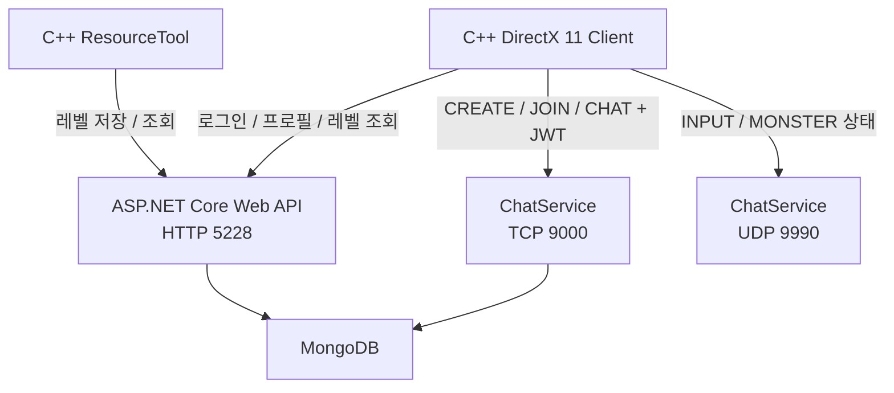

## 프로젝트 개요

| 항목 | 내용 |
| :--- | :--- |
| 기간 | 2025.10 ~ 2026.04 |
| 인원 | 1인 |
| 역할 | 클라이언트, ResourceTool, Web API, TCP/UDP 서버 구현 |
| 클라이언트 | C++, DirectX 11 |
| 서버 | C#, ASP.NET Core, BackgroundService, TCP, UDP |
| 데이터베이스 | MongoDB |
| 도구 | Visual Studio, ImGui 기반 ResourceTool |

엘든링을 레퍼런스로 C++/DirectX 11 액션 RPG 클라이언트를 구현하고, 기존 C#/.NET 백엔드 경험을 연결해 로그인부터 게임 세션, 레벨 데이터 저장·로드, 원격 플레이어 상태 반영까지 하나의 프로젝트로 구성했습니다.

서버는 이동과 전투를 직접 판정하는 권위형 구조가 아니라, 인증·세션·레벨 데이터와 클라이언트 상태 공유를 구현한 멀티플레이 프로토타입입니다.

## 프로젝트 목표

클라이언트 단독 프로젝트에 서버 기능을 추가하며 다음 흐름을 직접 연결하는 것을 목표로 했습니다.

```text
HTTP 로그인
→ JWT 발급
→ TCP 세션 생성·입장
→ ResourceTool 레벨 저장
→ MongoDB 저장
→ 게임 클라이언트 레벨 로드
→ UDP 상태 공유
→ 원격 플레이어 상태 반영
```

데이터의 신뢰성, 순서 보장 필요성, 갱신 빈도에 따라 HTTP·TCP·UDP의 역할을 분리했습니다.

## 담당 범위

### 서버

- ASP.NET Core 로그인·회원가입 API와 JWT 발급
- TCP 첫 패킷의 JWT 검증과 사용자 식별
- TCP 세션 생성·입장·시작·채팅 처리
- UDP INPUT/MONSTER 패킷 파싱
- `InputSeq` 기반 이전·중복 패킷 폐기
- MongoDB 기반 사용자·레벨·Prototype·MapObject 저장

### 클라이언트

- DirectX 11 렌더링과 게임 오브젝트 구조
- HTTP·TCP·UDP 클라이언트 서비스
- 수신 상태를 원격 플레이어 FSM·Quaternion·Position에 반영
- Bone Weight 변환과 스켈레탈 애니메이션
- Root Motion 기반 이동과 Navigation 연동

### ResourceTool

- ImGui 기반 Map/Object/Monster 배치 도구
- 레벨 배치 데이터 DTO 구성
- 서버 저장·로드 API 호출
- 저장된 Prototype과 Transform 기반 런타임 오브젝트 복원

## 플레이 영상



## 전체 아키텍처



HTTP API와 TCP·UDP 서버는 같은 ASP.NET Core 애플리케이션에서 실행됩니다. TCP Listener와 UDP 수신 루프는 `BackgroundService` 기반 `ChatService`에서 관리합니다.

## 프로토콜 역할 분리

| 프로토콜 | 사용 영역 | 선택 기준 |
|---|---|---|
| HTTP | 로그인, 프로필, 레벨 저장·조회 | 요청·응답형 데이터 처리 |
| TCP | 세션 생성·입장·시작, 채팅 | 순서와 전달 신뢰성이 필요한 이벤트 |
| UDP | 플레이어·몬스터 상태 공유 | 이전 상태보다 최신 상태 반영이 중요한 데이터 |

## 핵심 구현

### 1. ResourceTool–API–MongoDB 레벨 데이터 파이프라인

ResourceTool에서 배치한 Map/Object/Monster 목록을 하나의 레벨 요청으로 구성하고, 서버에서 `Level`, `Prototype`, `MapObject`로 나누어 저장했습니다. 게임 클라이언트는 레벨 ID로 데이터를 조회해 Prototype을 선택하고 Position·Rotation·Scale을 적용해 런타임 오브젝트를 생성합니다.

[레벨 데이터 파이프라인 자세히 보기]({{ '/portfolio/elden-ring/level-pipeline/' | relative_url }})

### 2. HTTP 로그인과 JWT 기반 TCP 세션 인증

HTTP 로그인에서 발급한 JWT를 TCP `CREATE/JOIN` 패킷에도 포함했습니다. TCP 서버는 첫 패킷의 JWT를 직접 검증하고 Claim의 사용자 ID를 기준으로 게임 세션 생성·입장 처리를 수행합니다.

[HTTP 로그인과 TCP 세션 인증 자세히 보기]({{ '/portfolio/elden-ring/network-auth/' | relative_url }})

### 3. UDP 상태 공유 프로토타입

클라이언트가 계산한 Position, Quaternion, FSM State와 입력 정보를 UDP로 전달하고, 서버에서 `InputSeq`를 비교해 이전 또는 중복 패킷을 폐기하도록 구성했습니다. 수신 클라이언트는 전달받은 상태를 원격 플레이어의 FSM과 Transform에 반영합니다.

[UDP 상태 공유 프로토타입 자세히 보기]({{ '/portfolio/elden-ring/udp-sync/' | relative_url }})

### 4. 스켈레탈 애니메이션과 Root Motion

Assimp Bone Weight를 프로젝트 Vertex 데이터로 변환하고, 애니메이션 행렬을 이용해 스키닝을 처리했습니다. 이동 상태에서는 Root Bone의 프레임 간 Translation 차이를 캐릭터 월드 축으로 변환하고 Navigation 검사 후 Transform에 적용했습니다.

[스켈레탈 애니메이션과 Root Motion 자세히 보기]({{ '/portfolio/elden-ring/animation-root-motion/' | relative_url }})

## 구현 결과

- DirectX 11 클라이언트와 ASP.NET Core 서버를 HTTP·TCP·UDP로 연결했습니다.
- HTTP 로그인 사용자와 TCP 게임 세션 사용자를 JWT로 연결했습니다.
- ResourceTool의 배치 데이터를 MongoDB에 저장하고 게임 클라이언트에서 복원했습니다.
- 이전 UDP 입력이 최신 상태를 덮어쓰지 않도록 `InputSeq` 비교를 적용했습니다.
- 수신 상태를 원격 플레이어 FSM과 Transform에 연결했습니다.
- Root Motion 이동량을 Navigation 검사와 실제 Transform 갱신에 연결했습니다.

## 현재 한계

- 이동·충돌·전투를 서버가 판정하는 권위형 구조는 구현하지 않았습니다.
- UDP JOIN 인증과 사용자별 Endpoint 등록은 완성되지 않았습니다.
- 원격 상태 보간·예측·서버 보정은 적용하지 않았습니다.
- 세션 상태의 동시성 제어와 비정상 종료 정리가 더 필요합니다.
- 부하 테스트와 장시간 실행 테스트는 수행하지 않았습니다.

## 다음 개선 방향

후속 MO 서버 프로젝트에서는 공통 패킷 검증, 세션과 Room 생명주기, Room 단위 작업 직렬화, 서버 Tick 기반 상태 처리, 더미 클라이언트 부하 테스트를 중심으로 개선하고 있습니다.

## 관련 링크

- [플레이 영상](https://youtu.be/6J3sDV4hN_8)
- [클라이언트 GitHub](https://github.com/Jaehyeok-Soh/3dsolo)
- [서버 GitHub](https://github.com/Jaehyeok-Soh/3dsolo_server)
