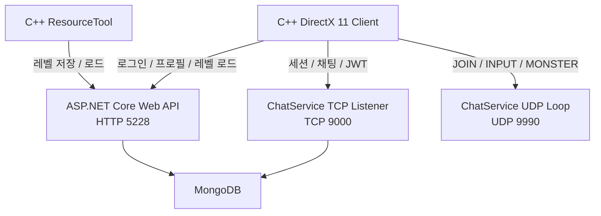

## 📝 프로젝트 개요

| 항목         | 내용                                      |
| :--------- | :-------------------------------------- |
| **기간**     | 2026.10 ~ 2026.12                       |
| **인원**     | 1인                                      |
| **역할**     | 클라이언트 및 서버 설계, 구현                       |
| **클라이언트**  | C++, DirectX 11                         |
| **서버**     | C#, ASP.NET Core, TCP, UDP              |
| **데이터베이스** | MongoDB                                 |
| 기술         | JWT, TCP/UDP, 비동기 네트워크 처리, 상태 동기화, JSON |

> 엘든링을 레퍼런스로 삼아 C++/DirectX 11 기반 액션 RPG 클라이언트를 구현하고, ASP.NET Core 서버를 연동한 프로젝트입니다.
> 
> 클라이언트와 서버 사이의 로그인, 세션, 레벨 데이터를 저장/로드와 실시간 상태 전달 과정을 직접 연결했습니다.

현재 서버는 상용 게임 수준의 서버 권위형 구조가 아니라, HTTP 인증과 데이터 API, TCP 세션, UDP 상태 전달을 실험한 네트워크 프로토타입입니다.

---
## 기획 의도

DirectX 11 기반 게임 클라이언트에 별도의 C# 서버를 연결하여 로그인부터 게임 세션 참가, 플레이어 상태 공유와 레벨 데이터 로드까지 이어지는 전체 흐름을 구현하는 것을 목표로 했습니다.

하나의 통신 방식으로 모든 기능을 처리하지 않고 각 프로토콜의 특성에 따라 역할을 분리했습니다.

- HTTP : 로그인, 사용자 프로필 레벨 데이터 저장 및 로드
- TCP : 세션 생성/참가/시작과 채팅 이벤트
- UDP : 플레이어와 몬스터의 빈번한 상태 전달
- MongoDB : 사용자, 세션, 맵 및 오브젝트 데이터 저장

또한 ResourceTool에서 편집한 데이터를 서버에 저장하고, 게임 클라이언트가 이를 다시 불러와 실제 오브젝트를 복원하는 데이터 파이프라인을 구축했습니다.

---

## 담당 역할 및 기여

* DirectX 11 기반 클라이언트 실행 환경 구성
* 모델 및 스켈레탈 애니메이션 처리
* Root Motion 기반 플레이어 이동
* 맵/오브젝트/몬스터 배치 ResourceTool 구현
* ASP.NET Core 기반 로그인 및 레벨 데이터 API 구현
* JWT 발급과 TCP 세션 인증 처리
* TCP 세션 생성/참가/시작 및 채팅 처리
* UDP JOIN/INPUT/MONSTER 바이너리 패킷 설계
* 원격 플레이어 입력과 Transform 반영
* MongoDB 사용자 및 레벨 데이터 저장 구조 구성
* 외부 네트워크 접속을 위한 HTTP/TCP/UDP 포트 구성

---

## 프로젝트 영상



---

## 전체 아키텍처

### 핵심 기술 및 구조

**DirectX 11, ASP.NET Core, BackgroundService, MongoDB, JWT, TCP/UDP Socket, REST API, DTO Mapping**

클라이언트, ResourceTool과 서버의 통신 경로를 목적별로 분리했습니다.

HTTP API와 TCP/UDP 서버는 하나의 ASP.NET Core 애플리케이션에서 실행되며, `ChatService`를 `BackgroundService`로 등록해 TCP Listener와 UDP 수신 루프를 함께 관리했습니다.
## 구현 내용

### DirectX 11 클라이언트와 게임플레이 환경

**핵심 기술 및 패턴**
- DirectX 11, Skeletal Animation, Root Motion, FSM, Client-side Simulation

서버에서 받은 데이터를 실제 게임 화면에 반영할 수 있도록 DirectX 11 기반의 액션 RPC 클라이언트를 구성했습니다.

클라이언트는 다음 기능을 처리합니다.
- DirectX 11 디바이스와 렌더링 환경
- 모델과 스켈레탈 애니메이션
- 플레이어 및 몬스터 FSM
- Root Motion 기반 이동
- 로컬 충돌
- 로컬/원격 플레이어 객체
- 맵/오브젝트/몬스터 생성
- 서버에서 수신한 상태의 Transform 반영

플레이어 이동은 애니메이션 Root Motion 기반으로 클라이언트에서 계산합니다. 서버는 이동이나 충돌을 직접 계산하지 않으며, 클라이언트가 생성한 입력/상태/위치 정보를 다른 클라이언트에 전달하는 구조입니다.

따라서 현재 구조는 서버 권위형 이동이 아니라 Lockstep 동기화에 가깝습니다.

**결과**

네트워크 기능을 단순 콘솔 출력으로 확인하지 않고, 서버에서 받은 입력과 상태를 실제 원격 캐릭터의 FSM과 Transform에 연결했습니다.

---

### 핵심 기능 2

* 목적
* 설계
* 구현 방식
* 결과

### 핵심 기능 2

* 목적
* 설계
* 구현 방식
* 결과
## 트러블슈팅
### 문제
> 실제로 발생한 증상
- 
### 원인
* 어떻게 원인을 확인했는지
* 실제 원인이 무엇이었는지
### 해결
* 어떤 방식으로 수정했는지
* 왜 그 방식을 선택했는지
* 수정 후 어떻게 검증했는지
## 결과 및 배운 점
* 완성한 기능
* 기술적으로 배운 점
* 현재 한계
* 다시 구현한다면 개선할 부분

## 관련 링크

* 영상: 
* GitHub:
	* [클라이언트](https://github.com/Jaehyeok-Soh/3dsolo)
	* [서버](https://github.com/Jaehyeok-Soh/3dsolo_server)
