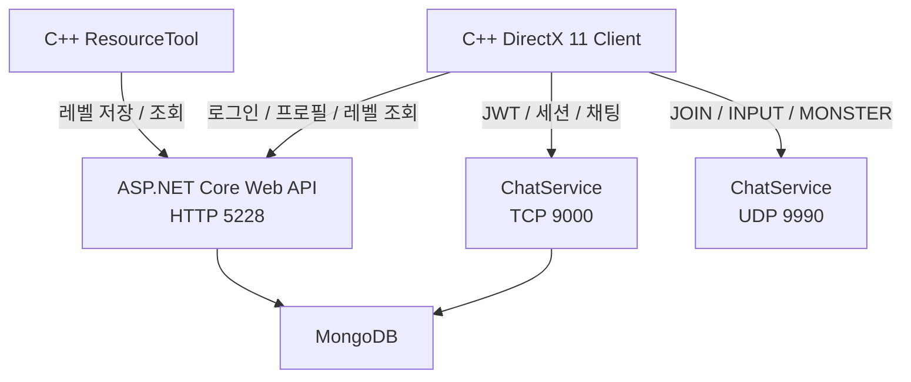

## 📝 프로젝트 개요

| 항목         | 내용                                      |
| :--------- | :-------------------------------------- |
| **기간**     | 2026.10 ~ 2026.12                       |
| **인원**     | 1인                                      |
| **역할**     | 클라이언트 및 서버 설계, 구현                       |
| **클라이언트**  | C++, DirectX 11                         |
| **서버**     | C#, ASP.NET Core, TCP, UDP              |
| **데이터베이스** | MongoDB                                 |
| 개발 도구      | Visual Studio, ResourceTool             |
| 담당 범위      | 클라이언트, 리소스 툴, 백엔드 API, TCP / UDP 서버     |
| 기술         | JWT, TCP/UDP, 비동기 네트워크 처리, 상태 동기화, JSON |

> 엘든링을 레퍼런스로 C++/DirectX 11 기반 액션 RPG 클라이언트를 구현하고, ASP.NET Core 서버를 연동한 프로젝트입니다.
> 
> 클라이언트와 서버 사이의 로그인, 세션, 레벨 데이터를 저장/로드와 실시간 상태 전달 과정을 직접 연결했습니다.

---
## 프로젝트 목표

DirectX 11 기반의 소울라이크 액션 RPG 클라이언트를 직접 구현하고, 별도의 ASP.NET Core 서버와 연결해 다음 흐름을 하나의 프로젝트 안에서 경험하는 것을 목표로 했습니다.

```
> 로그인
> 사용자 식별
> 게임 세션 생성·입장
> 레벨 데이터 로드
> 플레이어 상태 전달
> 게임 클라이언트에서 원격 상태 반영
```

기존 C#/.NET 백엔드 경험을 게임 개발에 연결하기 위해 HTTP, TCP, UDP를 데이터 특성에 따라 분리하고, 클라이언트와 서버 사이의 인증 / 세션 / 데이터 흐름을 직접 설계했습니다.

현재 서버는 서버가 이동과 전투를 직접 계산하는 권위형 게임 서버가 아니라, 인증 / 세션 / 레벨 데이터와 플레이어 상태 중계를 실험한 프로토타입입니다.

---

# 담당 업무

## 서버

- ASP.NET Core 기반 회원가입 / 로그인 API
- JWT 발급 및 TCP 소켓 인증
- MongoDB 기반 사용자 / 레벨 데이터 저장
- TCP 세션 생성 / 입장 / 시작·채팅 처리
- UDP 플레이어·몬스터 상태 패킷 파싱
- Input Sequence 기반 과거 패킷 폐기
- ResourceTool과 게임 클라이언트를 연결하는 레벨 데이터 API 구현

## 클라이언트

- DirectX 11 기반 렌더링 파이프라인 구현
- 모델 / 스켈레톤 / 본 애니메이션 로드
- GPU 스키닝 및 애니메이션 재생
- Root Motion 기반 캐릭터 이동
- FSM 기반 플레이어 / 몬스터 상태 처리
- 충돌 및 내비게이션 처리
- 원격 플레이어 위치 / 회전 / 상태 반영
- HTTP·TCP·UDP 클라이언트 구현

## ResourceTool

- ImGui 기반 레벨 제작 도구 구현
- 맵 / 오브젝트 / 몬스터 배치
- 배치 데이터 JSON 직렬화
- 서버 저장 및 불러오기
- 저장된 Transform 기반 게임 오브젝트 복원


---

## 프로젝트 영상



---

## 전체 아키텍처

### 핵심 기술 및 구조

**DirectX 11, ASP.NET Core, BackgroundService, MongoDB, JWT, TCP/UDP Socket, REST API, DTO Mapping**




HTTP API와 TCP·UDP 서버는 하나의 ASP.NET Core 애플리케이션에서 실행됩니다.

TCP Listener와 UDP 수신 루프는 `BackgroundService` 기반의 `ChatService`에서 관리하도록 구성했습니다
## 프로토콜 역할 분리

|      |                      |                         |
| ---- | -------------------- | ----------------------- |
| 프로토콜 | 사용 영역                | 선택 이유                   |
| HTTP | 로그인, 프로필, 레벨 저장 / 조회 | 요청 / 응답 구조와 데이터 API에 적합 |
| TCP  | 세션 생성 / 입장 / 시작, 채팅  | 순서 보장과 신뢰성이 필요한 이벤트     |
| UDP  | 위치, 회전, FSM, 입력 상태   | 이전 상태보다 최신 상태 반영이 중요    |

모든 데이터를 하나의 프로토콜로 처리하지 않고, 데이터의 신뢰성·순서·갱신 빈도를 기준으로 역할을 분리했습니다.

---
## 구현 내용

### 1. ResourceTool - API - MongoDB 레벨 데이터 파이프라인

ResourceTool에서 배치한 맵·오브젝트·몬스터 정보를 ASP.NET Core API를 통해 MongoDB에 저장하고, 게임 클라이언트가 레벨 ID 기준으로 다시 조회해 실제 게임 오브젝트로 복원하도록 구현했습니다.

```
ResourceTool에서 레벨 배치
→ LevelSaveRequest 생성
→ ASP.NET Core API 전송
→ MongoDB 저장
→ 게임 클라이언트 조회
→ Prototype과 Transform 기반 오브젝트 생성
```

이를 통해 레벨 배치 정보를 클라이언트 코드에서 분리하고, Tool에서 편집한 결과를 런타임 게임에 반영할 수 있게 했습니다.

[레벨 데이터 파이프라인 자세히 보기]({{ '/portfolio/elden-ring/level-pipeline/' | relative_url }})


---


### 2. HTTP 로그인과 JWT 기반 TCP 세션 인증

HTTP 로그인 성공 시 발급된 JWT를 TCP 세션 패킷에도 포함하도록 구성했습니다.

ASP.NET Core의 HTTP 인증 미들웨어는 별도로 생성한 TCP 소켓에 자동으로 적용되지 않기 때문에, TCP 서버가 첫 패킷의 JWT를 직접 검증하고 사용자 정보를 확인한 뒤 세션에 등록하도록 구현했습니다.

```
로그인 API 호출
→ JWT 발급
→ TCP 연결
→ JWT 포함 세션 패킷 전송
→ 서버 JwtValidator 검증
→ 사용자 확인
→ 세션 생성 또는 참가
```

[HTTP 로그인과 TCP 세션 인증 자세히 보기]({{ '/portfolio/elden-ring/network-auth/' | relative_url }})

---

### 3. UDP 상태 공유와 바이너리 패킷

플레이어 위치·회전·FSM·입력 상태처럼 자주 갱신되는 데이터는 UDP 바이너리 패킷으로 구성했습니다.

INPUT 패킷에는 다음 정보를 포함했습니다.

```
PacketType
UserId
InputSequence
Quaternion
FSM State
Position
Input Buttons
Navigation Cell
```

클라이언트는 로컬 입력과 상태를 직렬화하고, 수신 클라이언트는 패킷을 역직렬화해 원격 플레이어의 FSM과 Transform에 반영합니다.

서버에서는 사용자별 마지막 `InputSequence`보다 작거나 같은 패킷을 폐기하도록 구성했습니다.

다만 현재 저장소 기준으로 UDP JOIN의 JWT 검증과 사용자별 Endpoint 등록이 완성되지 않아, 전체 UDP 브로드캐스트 흐름은 후속 개선이 필요합니다.

[UDP 상태 공유와 패킷 구조 자세히 보기]({{ '/portfolio/elden-ring/udp-sync/' | relative_url }})

---
### 5. 스켈레탈 애니메이션과 Root Motion

모델의 스켈레톤과 애니메이션 채널을 로드하고, 본 계층 구조를 따라 최종 변환 행렬을 계산해 GPU 스키닝을 구현했습니다.

플레이어 이동은 애니메이션 Root Bone의 이동량을 추출해 실제 Transform에 반영했습니다.

```
애니메이션 재생
→ Root Bone 이전·현재 위치 비교
→ 이동 Delta 계산
→ 플레이어 월드 위치 반영
```

원격 플레이어는 서버에서 수신한 FSM, Quaternion과 Position을 기반으로 상태와 Transform을 재구성했습니다.

[본 애니메이션과 Root Motion 자세히 보기]({{ '/portfolio/elden-ring/animation-root-motion/' | relative_url }})

---
## 구현별 상세 글

이 페이지에서는 프로젝트 전체 구조와 각 구현의 역할만 요약합니다.

설계 선택, 코드 흐름, 문제 분석과 검증 과정은 다음 상세 글에 정리합니다.

|                           |                                                            |                  |
| ------------------------- | ---------------------------------------------------------- | ---------------- |
| 구현                        | 상세 글                                                       |                  |
| ResourceTool 레벨 데이터 파이프라인 | [자세히 보기]({{ '/portfolio/elden-ring/level-pipeline/'        | relative_url }}) |
| HTTP 로그인·JWT·TCP 세션       | [자세히 보기]({{ '/portfolio/elden-ring/network-auth/'          | relative_url }}) |
| UDP 상태 공유와 패킷 구조          | [자세히 보기]({{ '/portfolio/elden-ring/udp-sync/'              | relative_url }}) |
| 본 애니메이션과 Root Motion      | [자세히 보기]({{ '/portfolio/elden-ring/animation-root-motion/' | relative_url }}) |
|                           |                                                            |                  |

---

## 결과

- DirectX 11 액션 RPG 클라이언트와 ASP.NET Core 서버를 하나의 프로젝트로 연결했습니다.
- HTTP 로그인과 JWT 발급, TCP 세션 생성·참가 흐름을 구성했습니다.
- ResourceTool에서 생성한 레벨 데이터를 MongoDB에 저장하고 게임 클라이언트에서 복원했습니다.
- 플레이어 입력·위치·회전·FSM 상태를 위한 UDP 바이너리 패킷을 설계했습니다.
- 수신 상태를 원격 플레이어의 FSM과 Transform에 연결했습니다.
- 패킷 타입 및 길이 오판으로 발생한 예외를 분석하고 파싱 경로를 개선했습니다.

---

### 현재 한계

#### 게임 서버 구조

- 서버 권위형 이동·충돌·전투 판정 미구현
- 서버 Tick과 고정 주기 GameLoop 미구현
- 클라이언트가 계산한 위치와 상태를 서버가 신뢰
- 플레이어·몬스터 상태 검증 미구현

#### UDP

- UDP JOIN JWT 검증 미완성
- 사용자별 UDP Endpoint 등록 미완성
- 보간·예측·서버 보정 미구현
- 패킷 유실률 및 지연 측정 미수행
- Input Sequence는 이전 패킷 폐기에만 사용

#### 패킷 및 동시성

- 패킷 Version과 Endianness 정책 없음
- 최대 패킷·문자열 길이 검증 보완 필요
- 세션과 사용자 Dictionary 동시 접근 보호 필요
- NetworkStream 동시 Write 직렬화 필요
- 비정상 종료 후 세션 정리 검증 필요

#### 보안 및 운영

- HTTP 대신 HTTPS 적용 필요
- JWT 만료 검증 활성화 필요
- Secret 환경 변수 분리 필요
- 일부 API 인증 정책 보완 필요
- 서버 주소와 포트 설정 파일 분리 필요
- 부하 테스트와 장시간 실행 테스트 미수행

---
## 배운 점

- TCP에는 메시지 경계가 없으므로 애플리케이션 수준의 프레이밍이 필요합니다.
- HTTP 인증과 별도 TCP 소켓 인증은 적용 방식이 다릅니다.
- 통신 데이터의 신뢰성 / 순서 / 빈도에 따라 프로토콜을 분리해야 합니다.
- UDP Sequence는 이전 패킷을 폐기할 수 있지만 유실과 지연 문제 전체를 해결하지는 않습니다.
- 외부에서 들어오는 패킷과 JSON 데이터는 타입 / 길이 / 구조를 검증해야 합니다.
- 클라이언트 상태 중계와 서버 권위형 게임 서버는 책임 구조가 다릅니다.
- ResourceTool, 서버, 데이터베이스와 런타임 클라이언트를 하나의 데이터 흐름으로 연결할 수 있습니다.
---

## 후속 개선

이 프로젝트에서 확인한 한계는 후속 MO 서버 프로젝트에서 다음 항목을 중심으로 개선할 계획입니다.

1. 안전한 패킷 프레이밍과 공통 검증기
2. 세션과 룸 생명주기 관리
3. Room 단위 작업 직렬화와 동시성 제어
4. 서버 권위형 입력 및 게임 상태 처리
5. 더미 클라이언트 기반 부하 테스트
6. 장애 재현과 수정 전후 비교
7. 장시간 실행 및 자원 정리 검증

## 관련 링크

* 영상: 
* GitHub:
	* [클라이언트](https://github.com/Jaehyeok-Soh/3dsolo)
	* [서버](https://github.com/Jaehyeok-Soh/3dsolo_server)
