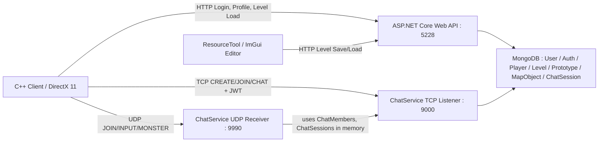
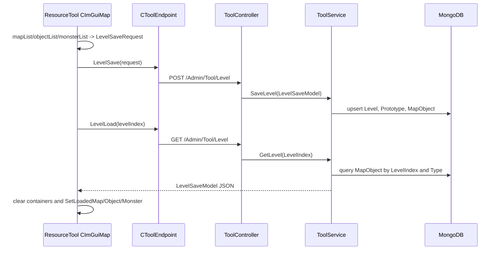
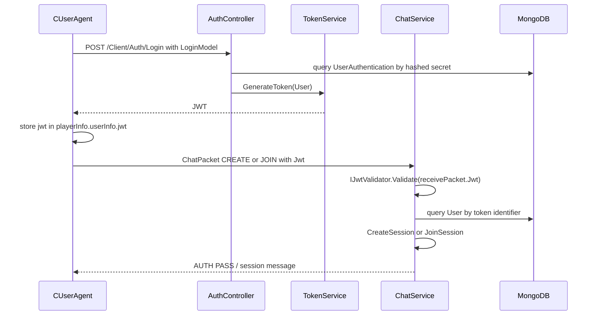
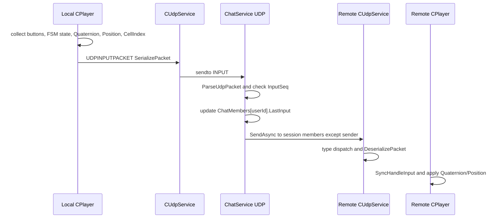
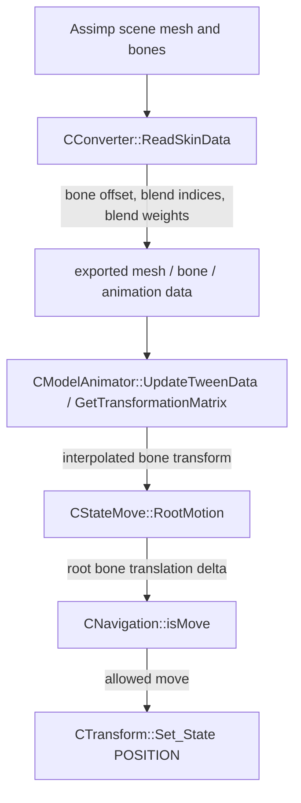

# Elden Ring 모작 포트폴리오 첨부 후보 분석

분석 시점: 2026-06-25  
분석 방식: 읽기 전용 코드/설정/리소스 확인. 빌드, 테스트, 패키지 설치 미실행.  
분석 대상:

- C++ 클라이언트: `D:\Source\3Dsolo_\3dsolo`
- C# 서버: `D:\Source\3Dsolo_\soloServer`
- 기존 포트폴리오 문서: `D:\Source\3Dsolo_\_portfolio`, `D:\Source\3Dsolo_\_posts`는 참고만 함

커밋 기준:

- 클라이언트 HEAD: `0d7545ce6cdc7de51b4c3541d65d9234056ed91a`
- 서버 HEAD: `b06aba1233a4d837398ad57ca7c5c8f20ce030df`
- 주의: 클라이언트 작업 트리에 이미 수정된 파일이 있어, `Client/Private/Player.cpp`, `Client/Private/Level_1.cpp`의 라인 번호와 GitHub permalink는 working tree 기준으로 재확인 필요

## 1. 전체 판정

이 프로젝트는 "상용 게임 서버"나 "완성된 서버 권위형 구조"로 표현하면 위험하다. 서버는 HTTP 로그인/JWT, TCP 세션 입장, UDP 패킷 중계, MongoDB 저장/로드를 갖춘 프로토타입이며, 권위형 이동 판정, 서버 Tick, 충돌/상태 검증, 예측/보정/보간, 지연 보상, 부하 테스트는 코드상 구현되지 않았다.

포트폴리오 비중 추천:

- 클라이언트/리소스 파이프라인/애니메이션: 60%
- HTTP 인증, TCP 세션, MongoDB 저장/로드: 30%
- UDP 동기화와 트러블슈팅/개선 과제: 10%

기능별 분류:

| 기능 | 분류 | 확인 수준 | 핵심 근거 |
|---|---|---:|---|
| ResourceTool -> HTTP API -> MongoDB 레벨 저장/로드 | 기능이 완성되어 포트폴리오 핵심으로 사용 가능 | 확인됨 | `ResourceTool/Private/ImGuiMap.cpp`, `ToolController`, `ToolService`, `LevelSaveModel`, `ToolObjectInfoModel` |
| HTTP 로그인과 JWT 발급 | 기본적인 프로토타입 수준 | 확인됨 | `CUserAgent::Login`, `AuthController::Login`, `TokenService::GenerateToken` |
| JWT 기반 TCP 세션 입장 | 기본적인 프로토타입 수준 | 확인됨 | `CUserAgent::CreateSession`, `CUserAgent::EnterSession`, `ChatService::HandleClient`, `ChatPacket` |
| UDP INPUT/MONSTER 중계 | 일부만 구현됨 | 일부 확인됨 | `UDPINPUTPACKET`, `ChatService::UdpReceiveLoop`, `UdpSessionBroadcastLoop`, `CPlayer::Sync_Key_Input` |
| UDP JOIN JWT 검증 및 Endpoint 등록 | 구현되지 않음 | 확인됨 | 클라이언트 `CLevel_1::SetMultiPlay`는 JOIN 전송, 서버 `UdpReceiveLoop`에는 JOIN 분기 없음 |
| 서버 권위형 이동/충돌 판정 | 구현되지 않음 | 확인됨 | 서버는 `Position`, `Quaternion`, `State`, `Buttons`를 검증 없이 중계 |
| 서버 Tick/GameLoop | 구현되지 않음 | 확인됨 | `ChatService::GameLoop`는 주석 처리된 설계 흔적 |
| InputSeq 순서 처리 | 일부만 구현됨 | 확인됨 | 서버가 `LastInput.InputSeq >= packet.InputSeq`이면 폐기 |
| 세션 수명 관리 | 일부만 구현됨 | 일부 확인됨 | `ChatSession.Expired` 검사와 Mongo `DeletedTime` 업데이트는 있으나 heartbeat/disconnect 정리는 없음 |
| 동시성 제어 | 일부만 구현됨 | 일부 확인됨 | 클라이언트 UDP 수신 mutex는 있음. 서버 `Dictionary`는 lock/ConcurrentDictionary 미사용 |
| 부하 테스트 | 구현되지 않음 | 확인 필요 | 저장소에서 부하 테스트 코드/스크립트 미확인 |
| Skeletal Animation/Root Motion | 기능이 완성되어 포트폴리오 핵심으로 사용 가능 | 확인됨 | `CConverter::ReadSkinData`, `CModelAnimator::GetTransformationMatrix`, `CStateMove::RootMotion` |

## 2. Post별 최종 추천 구성

### Post 1. ResourceTool-API-MongoDB 레벨 데이터 파이프라인

추천 상태: 포트폴리오 핵심으로 사용 가능.

핵심 메시지: "툴에서 배치한 Map/Object/Monster 데이터를 JSON DTO로 만들고, ASP.NET Core API를 거쳐 MongoDB의 Level/Prototype/MapObject 구조로 저장한 뒤 클라이언트가 다시 로드해 게임 오브젝트를 생성했다."

실제 호출 흐름:

`CImGuiMap::SaveLevel` -> `CToolEndpoint::LevelSave` -> HTTP `POST /Admin/Tool/Level` -> `ToolController::SaveLevel` -> `ToolService::SaveLevel` -> MongoDB `Level`, `Prototype`, `MapObject`

`CImGuiMap::LoadLevel` -> `CToolEndpoint::LevelLoad` -> HTTP `GET /Admin/Tool/Level` -> `ToolController::GetLevel` -> `ToolService::GetLevel` -> `CImGuiMap::SetLoadedMap/Object/Monster`

대표 스니펫: S1.  
보조 근거:

- `D:\Source\3Dsolo_\3dsolo\Engine\Private\ToolEndpoint.cpp`, class `CToolEndpoint`, function `LevelSave`, `LevelLoad`, line 20-51
- `D:\Source\3Dsolo_\soloServer\3DSolo.BackApi\Controllers\Admin\Tool\ToolController.cs`, class `ToolController`, function `SaveLevel`, `GetLevel`, line 26-37
- `D:\Source\3Dsolo_\soloServer\3DSolo.BackApi\Services\Admin\ToolService.cs`, class `ToolService`, function `SaveLevel`, line 24-247
- `D:\Source\3Dsolo_\soloServer\3DSolo.BackApi\Models\Level\Tool\LevelSaveModel.cs`, DTO `LevelSaveModel`, line 3-8
- `D:\Source\3Dsolo_\soloServer\3DSolo.BackApi\Models\Level\Tool\ToolObjectInfoModel.cs`, DTO `ToolObjectInfoModel`, line 5-15

주의할 표현:

- "DB 스키마를 정규화했다"보다는 "Prototype과 MapObject로 나누어 중복 리소스 정보와 배치 정보를 분리했다"가 정확하다.
- `ToolService.SaveLevel`의 `MapObject` update filter가 `mapObject.Id`가 아니라 `prototype.Id`를 쓰는 코드가 있어, "완전히 안정화된 저장 로직"이라고 표현하지 않는다.

### Post 2. HTTP 로그인과 JWT 기반 TCP 세션 인증

추천 상태: 기본적인 프로토타입 수준.

핵심 메시지: "HTTP 로그인으로 JWT를 발급받고, TCP 세션 CREATE/JOIN 패킷에 JWT를 포함해 서버가 토큰 검증 후 세션을 생성/입장시킨다."

실제 호출 흐름:

`CUserAgent::Login` -> HTTP `POST /Client/Auth/Login` -> `AuthController::Login` -> `MongoContext.UserAuthentication` 조회 -> `TokenService::GenerateToken` -> 클라이언트 `m_tPlayerInfo.userInfo.jwt` 저장 -> `CUserAgent::CreateSession/EnterSession` -> `CTcpService::TcpSend` -> `ChatService::HandleClient` -> `IJwtValidator.Validate` -> `CreateSession/JoinSession`

대표 스니펫: S2.  
보조 근거:

- `D:\Source\3Dsolo_\3dsolo\Engine\Private\UserAgent.cpp`, class `CUserAgent`, function `Login`, line 74-112
- `D:\Source\3Dsolo_\3dsolo\Engine\Private\UserAgent.cpp`, class `CUserAgent`, function `CreateSession`, `EnterSession`, line 199-220
- `D:\Source\3Dsolo_\3dsolo\Engine\Public\DAO_ChatPacket.h`, struct `DAO::CHATPACKET`, function `SerializePacket`, `DeserializePacket`, line 6-79
- `D:\Source\3Dsolo_\soloServer\3DSolo.BackApi\Services\ChatService.cs`, class `ChatService`, function `HandleClient`, line 85-173
- `D:\Source\3Dsolo_\soloServer\3DSolo.BackApi\Services\TokenService.cs`, class `TokenService`, function `GenerateToken`, line 68-91

주의할 표현:

- `Program.cs`의 JWT 옵션은 `ValidateLifetime = false`라서 "만료 검증까지 완성"이라고 쓰면 안 된다.
- TCP 인증은 구현되어 있지만, TCP disconnect 정리와 세션 수명 관리는 제한적이다.

### Post 3. UDP 상태 공유와 바이너리 패킷 구조

추천 상태: 일부만 구현됨.

핵심 메시지: "클라이언트가 입력, FSM 상태, Quaternion, Position, CellIndex를 바이너리 UDP 패킷으로 직렬화하고, 서버는 InputSeq 기준으로 늦은 패킷을 폐기한 뒤 같은 세션의 다른 클라이언트에 중계한다."

실제 호출 흐름:

`CLevel_1::SetMultiPlay` -> `CUdpService::UdpJoinSend`  
`CPlayer::Key_Input` -> `DAO::UDPINPUTPACKET::SerializePacket` -> `CUdpService::UdpSend` -> `ChatService::UdpReceiveLoop` -> `UdpPacket.ParseUdpPacket` -> `ChatMembers[userId].LastInput` 갱신 -> `UdpSessionBroadcastLoop` -> `CUdpService::UdpReceiveLoop` -> `DAO::UDPINPUTPACKET::DeserializePacket` -> `CPlayer::Sync_Key_Input`

대표 스니펫: S3.  
보조 근거:

- `D:\Source\3Dsolo_\3dsolo\Client\Private\Player.cpp`, class `CPlayer`, function `Key_Input`, `Sync_Key_Input`, line 305-370
- `D:\Source\3Dsolo_\3dsolo\Engine\Private\UdpService.cpp`, class `CUdpService`, function `UdpSend`, `UdpJoinSend`, `UdpReceiveLoop`, line 64-105, 151-215
- `D:\Source\3Dsolo_\soloServer\3DSolo.BackApi\Models\GameSession\UdpPacket.cs`, class `UdpPacket`, `UdpInputPacket`, function `ParseUdpPacket`, line 27-115, 129-172
- `D:\Source\3Dsolo_\soloServer\3DSolo.BackApi\Services\ChatService.cs`, class `ChatService`, function `UdpReceiveLoop`, `UdpSessionBroadcastLoop`, line 376-446

주의할 표현:

- 서버가 위치/회전을 계산하지 않는다. "서버 권위형 이동"이 아니라 "클라이언트 계산 결과를 서버가 중계하는 구조"라고 써야 한다.
- 서버 `UdpReceiveLoop`에는 JOIN 분기가 없어 UDP endpoint 등록과 JWT 검증이 완성된 흐름으로 확인되지 않는다.
- `UdpSessionBroadcastLoop`는 자기 자신 제외를 `!a.Contains(memberInfo.UserId)`로 처리해 문자열 포함 관계에 따른 오동작 가능성이 있다. 정확 비교 `a != memberInfo.UserId`가 더 안전하다.

### Post 4. `std::bad_alloc` 패킷 파싱 트러블슈팅

추천 상태: 트러블슈팅 후보로 사용 가능. 단, 실제 런타임 로그는 저장소에 없으므로 "일부 확인됨"으로 작성한다.

핵심 메시지: "바이너리 패킷은 첫 바이트 PacketType에 따라 서로 다른 형식으로 읽어야 한다. INPUT을 JOIN 문자열 패킷처럼 해석하면 Quaternion/State 바이트를 문자열 길이로 오해해 큰 메모리 할당으로 이어질 수 있어, 수신 루프에서 Type 분기와 길이 검증을 추가했다."

현재 코드로 확인되는 수정/방어 방향:

- 클라이언트 `CUdpService::UdpReceiveLoop`가 `buffer[0]`의 `UdpPacketType`을 먼저 확인한다.
- `DAO::UDPINPUTPACKET::DeserializePacket`이 `userIdSize <= 0` 및 `bufferIndex + userIdSize > bufferSize`를 검사한다.
- 서버 `UdpPacket.ParseUdpPacket`은 `idLength`에 대한 상한/잔여 길이 검증이 없어 개선 여지가 남아 있다.

대표 스니펫: S4.  
관련 변경 흔적 후보:

- 클라이언트 commit `a685e4f feat: boss sync, player sync,`가 `Engine/Private/UdpService.cpp`, `Engine/Public/DAO_UdpPacket.h`, `Client/Private/Player.cpp`를 포함
- 서버 commit `659217c feat: state, rotation sync`가 `Models/GameSession/UdpPacket.cs`, `Services/ChatService.cs`를 포함
- 실제 `std::bad_alloc` 로그 파일은 저장소에서 미확인

주의할 표현:

- "이 문제가 실제로 이 커밋에서 발생했다"는 로그/이슈/커밋 메시지가 없으므로 단정하지 않는다.
- "재현 가능한 원인 후보"와 "현재 코드의 방어 로직"으로 표현한다.

### Post 5. Skeletal Animation과 Root Motion

추천 상태: 포트폴리오 핵심으로 사용 가능.

핵심 메시지: "Assimp 기반 리소스 변환에서 bone weight를 추출하고, 런타임 애니메이터가 프레임 간 scale/rotation/translation을 보간하며, 이동 애니메이션의 root bone delta를 캐릭터 월드 축으로 변환해 충돌 가능한 이동으로 반영했다."

실제 호출 흐름:

`CConverter::ReadSkinData` -> `.mesh/.bone/.anim` 리소스 변환 -> `CModelAnimator::UpdateTweenData` -> `CModelAnimator::GetTransformationMatrix` -> `Renderer` animation update -> `CStateMove::Update` -> `CStateMove::RootMotion` -> `CNavigation::isMove` -> `CTransform::Set_State`

대표 스니펫: S5.  
보조 근거:

- `D:\Source\3Dsolo_\3dsolo\ResourceTool\Private\Converter.cpp`, class `CConverter`, function `ReadSkinData`, line 229-276
- `D:\Source\3Dsolo_\3dsolo\Engine\Private\ModelAnimator.cpp`, class `CModelAnimator`, function `UpdateTweenData`, `GetTransformationMatrix`, line 107-164, 310-348
- `D:\Source\3Dsolo_\3dsolo\Engine\Private\Renderer.cpp`, class `CRenderer`, function rendering/update path, line 680, 725
- `D:\Source\3Dsolo_\3dsolo\Client\Private\StateMove.cpp`, class `CStateMove`, function `RootMotion`, line 62-99

주의할 표현:

- `.hlsl/.fx` 셰이더 파일은 검색되지 않았으므로, "GPU skinning 셰이더를 직접 구현했다"는 표현은 확인 필요다.
- 확인 가능한 강점은 리소스 변환, 본 가중치 추출, 런타임 보간, Root Motion 적용이다.

## 3. 대표 코드 스니펫 5개

### S1. ResourceTool 저장/로드 DTO 생성과 응답 반영

- 대상 Post: 1. ResourceTool-API-MongoDB 레벨 데이터 파이프라인
- 우선순위: 높음
- 구현 상태: 기능이 완성되어 포트폴리오 핵심으로 사용 가능
- 영역: 클라이언트 툴, HTTP DTO, 에디터 데이터 파이프라인
- 코드 위치: `D:\Source\3Dsolo_\3dsolo\ResourceTool\Private\ImGuiMap.cpp`
- 클래스/함수: `CImGuiMap::SaveLevel`, `CImGuiMap::LoadLevel`
- DTO/데이터 구조: `DAO::tagLevelSaveRequest`, `TOOL_OBJECT_INFO`
- 라인 범위: 115-154
- GitHub permalink 후보: `https://github.com/{owner}/3dsolo/blob/0d7545ce6cdc7de51b4c3541d65d9234056ed91a/ResourceTool/Private/ImGuiMap.cpp#L115-L154`

```cpp
void CImGuiMap::SaveLevel()
{
	struct tagLevelSaveRequest saveRequest {};
	saveRequest.levelIndex = m_tLevelInfo.levelIndex;
	saveRequest.mapList = m_tLevelInfo.mapList;
	saveRequest.objectList = m_tLevelInfo.objectList;
	saveRequest.monsterList = m_tLevelInfo.monsterList;

	m_pGameInstance->GetAdminEndpoint()->GetToolEndpoint()->LevelSave(saveRequest);
}

void CImGuiMap::LoadLevel()
{
	struct tagLevelSaveRequest loadResult {};

	future<httplib::Result> future = m_pGameInstance->GetAdminEndpoint()->GetToolEndpoint()->LevelLoad(m_iLevelIndexCurrentFocus);
	httplib::Result result = future.get();

	if (result->status != 200)
		return;

	m_pGameInstance->ResultBodyDeserialize(loadResult, result->status, result->body);

	m_tLevelInfo.levelIndex = loadResult.levelIndex;

	m_tLevelInfo.mapList.clear();
	m_tLevelInfo.mapList.reserve(0);
	for (auto map : loadResult.mapList)
		SetLoadedMap(map);

	m_tLevelInfo.objectList.clear();
	m_tLevelInfo.objectList.reserve(0);
	for (auto object : loadResult.objectList)
		SetLoadedObject(object);

	m_tLevelInfo.monsterList.clear();
	m_tLevelInfo.monsterList.reserve(0);
	for (auto monster : loadResult.monsterList)
		SetLoadedMonster(monster);
}
```

책임:

- 툴 내부 배치 상태를 저장 DTO로 묶는다.
- 저장/로드 HTTP API를 호출한다.
- 로드 응답을 파싱한 뒤 기존 컨테이너를 비우고 Map/Object/Monster 생성 함수로 분배한다.

포트폴리오에서 강조할 내용:

- 수작업 배치 툴과 서버 DB를 연결한 데이터 파이프라인.
- 에디터 데이터와 런타임 데이터가 같은 DTO 흐름으로 이어지는 점.

해설 초안:

> ResourceTool에서 배치한 Map/Object/Monster 목록을 `tagLevelSaveRequest`로 구성해 서버의 Level API로 전달했습니다. 로드 시에는 서버 응답을 같은 DTO로 역직렬화하고, 기존 컨테이너를 비운 뒤 각 타입별 생성 함수로 분기해 에디터 상태를 복원했습니다.

주의할 표현:

- `reserve(0)`은 capacity를 줄이지 않을 수 있으므로 "메모리까지 즉시 정리"라고 표현하지 않는다.
- 로드 응답 파싱 실패 예외 처리는 보강 필요하다.

### S2. 로그인 API와 JWT 발급

- 대상 Post: 2. HTTP 로그인과 JWT 기반 TCP 세션 인증
- 우선순위: 높음
- 구현 상태: 기본적인 프로토타입 수준
- 영역: ASP.NET Core Web API, MongoDB, JWT
- 코드 위치: `D:\Source\3Dsolo_\soloServer\3DSolo.BackApi\Controllers\Client\AuthController.cs`
- 클래스/함수: `AuthController::Login`
- DTO/데이터 구조: `LoginModel`, `UserAuthentication`, `UserSession`
- 라인 범위: 29-57
- GitHub permalink 후보: `https://github.com/{owner}/soloServer/blob/b06aba1233a4d837398ad57ca7c5c8f20ce030df/3DSolo.BackApi/Controllers/Client/AuthController.cs#L29-L57`

```csharp
[HttpPost("Login")]
public string Login([FromBody] LoginModel model)
{
    var secret = model.Secret.ToHashString();
    var user = MongoContext.User.AsQueryable().SingleOrDefault(a => a.Identity == model.Identity);
    var auth = MongoContext.UserAuthentication.AsQueryable()
        .Where(a => !a.DeletedTime.HasValue)
        .SingleOrDefault(a => a.Value == secret);

    if (auth == null || auth.User.Identity != model.Identity || auth.User.DeletedTime.HasValue)
    {
        throw new BadRequestException();
    }

    auth.LastTriedTime = DateTime.UtcNow;
    auth.User.LastTriedTime = DateTime.UtcNow;

    if (model.Session != null)
    {
        auth.User.UserSession.Add(new DataBases.Models.UserSession()
        {
            UserAgent = model.Session.UserAgent,
            CreatedTime = DateTime.UtcNow,
            UpdatedTime = DateTime.UtcNow,
        });
    }

    return TokenService.GenerateToken(auth.User);
}
```

책임:

- 클라이언트 로그인 DTO의 비밀번호를 해시한다.
- MongoDB의 사용자 인증 정보를 조회한다.
- 실패 시 `BadRequestException`으로 로그인 실패를 반환한다.
- 성공 시 JWT를 생성해 클라이언트에 반환한다.

포트폴리오에서 강조할 내용:

- HTTP 인증과 TCP 세션 인증이 JWT로 연결되는 흐름.
- 사용자 인증 데이터와 사용자 프로필/세션 데이터가 분리된 구조.

해설 초안:

> 로그인 요청은 HTTP API에서 처리하고, 서버는 저장된 인증 해시와 사용자 식별자를 검증한 뒤 JWT를 발급합니다. 클라이언트는 이 JWT를 보관하고 TCP 세션 CREATE/JOIN 패킷에 포함해 게임 세션 입장 인증에 재사용합니다.

주의할 표현:

- `user` 변수는 조회되지만 직접 사용되지 않는다.
- 해시 방식은 SHA256+고정 salt이며, 운영용 password hashing으로는 PBKDF2/bcrypt/Argon2가 더 적절하다.
- JWT lifetime 검증은 `Program.cs`에서 꺼져 있다.

### S3. UDP INPUT 패킷 직렬화

- 대상 Post: 3. UDP 상태 공유와 바이너리 패킷 구조
- 우선순위: 높음
- 구현 상태: 일부만 구현됨
- 영역: C++ UDP 바이너리 프로토콜
- 코드 위치: `D:\Source\3Dsolo_\3dsolo\Engine\Public\DAO_UdpPacket.h`
- 구조체/함수: `DAO::tagUdpInputPacket::SerializePacket`
- DTO/패킷 구조: `UDPINPUTPACKET`
- 라인 범위: 114-147
- GitHub permalink 후보: `https://github.com/{owner}/3dsolo/blob/0d7545ce6cdc7de51b4c3541d65d9234056ed91a/Engine/Public/DAO_UdpPacket.h#L114-L147`

```cpp
virtual vector<_byte> SerializePacket()
{
	vector<_byte> buffer;

	buffer.reserve(1 + 4 + UserId.size() + 4 + 4 + 4 + 4 + 4 + 8 + 4 + 4 + 4 + 9 + 4);

	buffer.push_back(static_cast<_byte>(Type));

	WriteInt32(buffer, static_cast<_int>(UserId.size()));
	buffer.insert(buffer.end(), UserId.begin(), UserId.end());

	WriteInt32(buffer, InputSeq);

	WriteFloat32(buffer, QuaternionX);
	WriteFloat32(buffer, QuaternionY);
	WriteFloat32(buffer, QuaternionZ);
	WriteFloat32(buffer, QuaternionW);

	auto* p = reinterpret_cast<_byte*>(&State);
	buffer.insert(buffer.end(), p, p + sizeof(ULONGLONG));

	WriteFloat32(buffer, PositionX);
	WriteFloat32(buffer, PositionY);
	WriteFloat32(buffer, PositionZ);

	p = reinterpret_cast<_byte*>(&Buttons);
	buffer.insert(buffer.end(), p, p + sizeof(_bool) * 9);

	WriteInt32(buffer, CellIndex);

	return buffer;
}
```

책임:

- UDP INPUT 패킷을 명시적인 필드 순서로 직렬화한다.
- PacketType, UserId length/string, InputSeq, Quaternion, FSM State, Position, Buttons, CellIndex를 포함한다.

포트폴리오에서 강조할 내용:

- HTTP JSON DTO와 별도로, 실시간 동기화에는 바이너리 UDP 패킷을 사용한 점.
- `InputSeq`를 포함해 서버가 늦은 패킷을 폐기할 수 있는 최소 구조를 둔 점.

해설 초안:

> INPUT 패킷은 매 프레임 또는 입력 갱신 시점에 필요한 상태만 바이너리로 묶습니다. 서버는 패킷 내부의 `InputSeq`로 이전 입력보다 늦게 도착한 패킷을 폐기하고, 나머지 필드는 원격 클라이언트가 애니메이션 상태와 Transform을 재구성하는 데 사용합니다.

주의할 표현:

- Endianness를 고정하는 변환이 없으므로 동일 플랫폼/동일 엔디언 환경 전제다.
- `_bool[9]`, `ULONGLONG` raw copy는 플랫폼별 크기 차이에 취약할 수 있다.
- Packet version/total length 필드는 없다.

### S4. UDP 수신 Type 분기와 잘못된 파싱 방어

- 대상 Post: 4. `std::bad_alloc` 패킷 파싱 트러블슈팅
- 우선순위: 높음
- 구현 상태: 트러블슈팅 후보. 실제 로그는 미확인
- 영역: C++ UDP 수신 루프
- 코드 위치: `D:\Source\3Dsolo_\3dsolo\Engine\Private\UdpService.cpp`
- 클래스/함수: `CUdpService::UdpReceiveLoop`
- DTO/패킷 구조: `UdpPacketType`, `UDPINPUTPACKET`, `UDPMONSTERPACKET`
- 라인 범위: 184-215
- GitHub permalink 후보: `https://github.com/{owner}/3dsolo/blob/0d7545ce6cdc7de51b4c3541d65d9234056ed91a/Engine/Private/UdpService.cpp#L184-L215`

```cpp
if (rc <= 0)
	continue;

if (m_iReceiveLength == SOCKET_ERROR)
{
	int err = WSAGetLastError();
	if (err == WSAEWOULDBLOCK)
		MSG_BOX("Failed to udp receive : UdpService");

	m_iReceiveLength = 0;

	m_bArrived = false;
	continue;
}

if ((ENUMS::UdpPacketType)buffer[0] == ENUMS::UdpPacketType::JOIN)
{
	m_bArrived = false;
	continue;
}

if ((ENUMS::UdpPacketType)buffer[0] == ENUMS::UdpPacketType::INPUT)
{
	lock_guard<mutex> lock(m_mutex);
	m_bArrived = true;
	m_tUdpInputPacket.DeserializePacket(buffer, rc);
}

if ((ENUMS::UdpPacketType)buffer[0] == ENUMS::UdpPacketType::MONSTER)
{
	lock_guard<mutex> lock(m_mutex);
	m_bArrived = true;
	m_tUdpMonsterPacket.DeserializePacket(buffer, rc);
}
```

책임:

- UDP 수신 버퍼의 첫 바이트를 PacketType으로 해석한다.
- JOIN은 클라이언트 수신 쪽에서 처리하지 않고 폐기한다.
- INPUT과 MONSTER만 각각의 역직렬화 함수로 넘긴다.
- 네트워크 수신 스레드와 게임 스레드 공유 패킷에 mutex를 사용한다.

포트폴리오에서 강조할 내용:

- 패킷 타입별 파서 분리가 왜 필요한지 설명하기 좋은 코드.
- `std::bad_alloc` 같은 길이 오해 문제를 "바이너리 프로토콜 검증" 주제로 풀기 좋다.

해설 초안:

> UDP 패킷은 타입마다 본문 구조가 다르기 때문에, 수신 직후 첫 바이트로 타입을 분기한 뒤 해당 타입의 역직렬화 함수로만 전달하도록 정리했습니다. INPUT 패킷을 JOIN 문자열 구조로 읽으면 임의 바이트를 문자열 길이로 해석할 수 있어 큰 메모리 할당 문제가 발생할 수 있습니다.

주의할 표현:

- 서버의 `UdpPacket.ParseUdpPacket`에는 `idLength` 상한 검증이 아직 부족하므로 "완전한 패킷 방어"라고 쓰지 않는다.
- `m_iReceiveLength`는 이 수신 코드에서 `rc`로 갱신되지 않아 조건 의미가 불명확하다.

### S5. Root Motion을 월드 축 이동으로 변환

- 대상 Post: 5. Skeletal Animation과 Root Motion
- 우선순위: 높음
- 구현 상태: 포트폴리오 핵심으로 사용 가능
- 영역: 애니메이션, Root Motion, Navigation 충돌
- 코드 위치: `D:\Source\3Dsolo_\3dsolo\Client\Private\StateMove.cpp`
- 클래스/함수: `CStateMove::RootMotion`
- DTO/데이터 구조: animation keyframe transform, `CTransform`, `CNavigation`
- 라인 범위: 62-97
- GitHub permalink 후보: dirty file 아님, `https://github.com/{owner}/3dsolo/blob/0d7545ce6cdc7de51b4c3541d65d9234056ed91a/Client/Private/StateMove.cpp#L62-L97`

```cpp
void CStateMove::RootMotion(_float fTimeDelta)
{
	auto modelObj = m_pOwner->Find_PartObject(L"Part_Body");
	auto RootBoneName = modelObj->GetModel()->GetBoneByIndex(2)->GetName();

	auto animation = modelObj->GetModel()->GetAnimationByIndex(m_iAnimIndex);
	auto keyFrame = animation->GetKeyframe(RootBoneName);
	auto keyFrameSize = keyFrame->GetTransforms().size();
	auto currFrame = modelObj->GetAnimator()->GetCurFrame();

	if (currFrame == 0 || keyFrameSize - 1 < currFrame)
		return;

	auto beforeTransform = keyFrame->GetTransform(currFrame - 1);
	auto currentTransform = keyFrame->GetTransform(currFrame);

	_vector distance = XMVectorSubtract(XMLoadFloat3(&currentTransform.m_vTranslation), XMLoadFloat3(&beforeTransform.m_vTranslation));

	_vector ownerPosition = m_pOwner->GetTransform().Get_State(STATE::POSITION);

	float localRight = currentTransform.m_vTranslation.x - beforeTransform.m_vTranslation.x;
	float localUp = currentTransform.m_vTranslation.y - beforeTransform.m_vTranslation.y;
	float localForward = currentTransform.m_vTranslation.z - beforeTransform.m_vTranslation.z;

	_vector ownerPos = m_pOwner->GetTransform().Get_State(STATE::POSITION);
	_vector ownerRight = XMVector3Normalize(m_pOwner->GetTransform().Get_State(STATE::RIGHT));
	_vector ownerUp = XMVector3Normalize(m_pOwner->GetTransform().Get_State(STATE::UP));
	_vector ownerLook = XMVector3Normalize(m_pOwner->GetTransform().Get_State(STATE::LOOK));

	_vector moveDistance = ownerRight * localRight + ownerUp * localUp + ownerLook * localForward;

	_vector destPos = XMVectorAdd(ownerPos, moveDistance);

	if (m_pOwner->GetNavigation()->isMove(destPos))
		m_pOwner->GetTransform().Set_State(STATE::POSITION, destPos);
}
```

책임:

- 현재 애니메이션의 root bone translation delta를 구한다.
- 로컬 right/up/forward 이동량을 캐릭터 월드 축으로 변환한다.
- Navigation 이동 가능 여부를 확인한 뒤 Transform position에 적용한다.

포트폴리오에서 강조할 내용:

- 단순 키 입력 이동이 아니라 애니메이션의 실제 root delta를 이동에 반영한 점.
- 이동 가능성 검사를 거쳐 Root Motion과 충돌/내비게이션을 연결한 점.

해설 초안:

> 이동 애니메이션의 root bone translation 차이를 프레임 단위로 계산하고, 이를 캐릭터의 월드 right/up/look 축에 투영해 실제 이동량으로 변환했습니다. 최종 위치는 Navigation의 이동 가능 검사 후 적용해 애니메이션 기반 이동과 충돌 처리를 연결했습니다.

주의할 표현:

- bone index 2를 root로 사용하는 전제가 코드에 고정되어 있어, 모델별 root bone 매핑 테이블은 추가 개선 사항이다.
- `distance`, `ownerPosition` 지역 변수는 현재 계산 결과에 직접 사용되지 않는다.

## 4. 보조 코드 후보

코드 전문은 본문에 넣지 말고 필요 시 부록 또는 GitHub 링크로 연결하는 편이 좋다.

| 후보 | Post | 위치 | 클래스/함수 | 라인 |
|---|---:|---|---|---:|
| 서버 저장 upsert 시작부 | 1 | `soloServer/3DSolo.BackApi/Services/Admin/ToolService.cs` | `ToolService::SaveLevel` | 24-58 |
| 서버 LevelLoad 응답 구성 | 1 | `soloServer/3DSolo.BackApi/Services/Admin/ToolService.cs` | `ToolService::GetLevel` | 253-321 |
| 클라이언트 런타임 맵 로드 | 1 | `3dsolo/Client/Private/Level_1.cpp` | `CLevel_1::SetLoadedMap/Object/Monster` | 816-908 |
| 클라이언트 로그인 요청 | 2 | `3dsolo/Engine/Private/UserAgent.cpp` | `CUserAgent::Login` | 74-112 |
| TCP 세션 JWT 검증 | 2 | `soloServer/3DSolo.BackApi/Services/ChatService.cs` | `ChatService::HandleClient` | 94-140 |
| JWT 생성 | 2 | `soloServer/3DSolo.BackApi/Services/TokenService.cs` | `TokenService::GenerateToken` | 68-91 |
| UDP 서버 수신/중계 | 3 | `soloServer/3DSolo.BackApi/Services/ChatService.cs` | `UdpReceiveLoop`, `UdpSessionBroadcastLoop` | 376-446 |
| 원격 플레이어 반영 | 3 | `3dsolo/Client/Private/Player.cpp` | `CPlayer::Sync_Key_Input` | 337-370 |
| C++ INPUT 길이 검증 | 4 | `3dsolo/Engine/Public/DAO_UdpPacket.h` | `UDPINPUTPACKET::DeserializePacket` | 149-243 |
| 서버 UDP parser 개선 필요점 | 4 | `soloServer/3DSolo.BackApi/Models/GameSession/UdpPacket.cs` | `UdpPacket::ParseUdpPacket` | 27-115 |
| Bone weight 변환 | 5 | `3dsolo/ResourceTool/Private/Converter.cpp` | `CConverter::ReadSkinData` | 229-276 |
| 애니메이션 보간 | 5 | `3dsolo/Engine/Private/ModelAnimator.cpp` | `CModelAnimator::GetTransformationMatrix` | 310-348 |

## 5. 이미지, GIF, 도구 화면 추천

### A. 저장소에 실제 존재하는 이미지

아래 파일들은 실행 화면이 아니라 텍스처/리소스 이미지다. 단독 증거보다는 포스트의 시각 보조 자료로 쓰는 것이 적절하다.

| 후보 파일 | 용도 | 추천 Post | 주의 |
|---|---|---|---|
| `D:\Source\3Dsolo_\3dsolo\Client\Bin\Resources\Models\Fiona\fiona_D.png` | 플레이어 캐릭터 텍스처 | 5 | 실제 렌더링 화면은 별도 캡처 필요 |
| `D:\Source\3Dsolo_\3dsolo\Client\Bin\Resources\Models\Test\hero_fpp_101_A_c.png` | 캐릭터/장비 리소스 | 5 | 모델 적용 화면과 함께 사용 |
| `D:\Source\3Dsolo_\3dsolo\Client\Bin\Resources\Models\Tong\monster_body_2161_01_c.png` | 몬스터 텍스처 | 3, 5 | 몬스터 UDP 동기화와 연결 가능 |
| `D:\Source\3Dsolo_\3dsolo\Client\Bin\Resources\Models\map\Volcano_ROOMS_lateral.png` | 맵 텍스처 | 1 | ResourceTool 배치 화면과 함께 사용 |
| `D:\Source\3Dsolo_\3dsolo\Client\Bin\Resources\Textures\Explosion\Explosion0.png` | 이펙트 리소스 | 보조 | 서버 포트폴리오 핵심보다 뒤에 배치 |

### B. 직접 캡처하면 좋은 화면

| 캡처/GIF | 추천 Post | 필수 포인트 |
|---|---:|---|
| ResourceTool에서 LevelIndex, Map/Object/Monster 리스트, Transform 패널이 보이는 화면 | 1 | 저장 전/로드 후 동일 배치 비교 |
| MongoDB Compass에서 `Level`, `Prototype`, `MapObject` 컬렉션이 갱신된 화면 | 1 | connection string, 계정, host는 마스킹 |
| Swagger/Postman 로그인 요청과 JWT 응답 | 2 | JWT 전체 노출 금지. 앞/뒤 일부만 표시 |
| TCP 서버 콘솔의 AUTH PASS, session id, member join 로그 | 2 | 토큰과 사용자 식별자는 마스킹 |
| UDP INPUT 패킷 hex dump 또는 Wireshark UDP payload | 3, 4 | PacketType, UserId length, InputSeq 위치에 주석 |
| 2개 클라이언트에서 한쪽 이동이 다른 쪽 원격 플레이어에 반영되는 GIF | 3 | "서버 권위형 아님, 중계형 동기화" 캡션 |
| Root Motion 애니메이션 이동 GIF | 5 | 발 미끄러짐 감소, Navigation 충돌 지점 표시 |
| Animation frame/bone debug overlay 또는 ResourceTool 스켈레톤 화면 | 5 | bone index/root bone 전제 설명 |

## 6. Mermaid 구조도 후보

### 6.1 전체 HTTP/TCP/UDP 아키텍처



### 6.2 ResourceTool 레벨 저장/로드 흐름



### 6.3 로그인, JWT, TCP 게임 세션 JOIN



### 6.4 UDP INPUT, Broadcast, 원격 플레이어 반영



### 6.5 Skeletal Animation과 Root Motion



## 7. 트러블슈팅 후보 정리

### UDP INPUT을 JOIN 형식으로 읽어 `std::bad_alloc`

- 증상: UDP INPUT 수신 중 비정상적인 문자열 길이 해석으로 큰 메모리 할당 또는 `std::bad_alloc` 가능.
- 원인 추적 과정: UDP payload 첫 바이트가 PacketType인데, 타입 분기 없이 JOIN의 `idLength -> id -> tokenLength -> token`처럼 읽으면 INPUT의 Quaternion/State 바이트가 문자열 길이로 오해될 수 있다.
- 실제 원인: 현재 저장소에는 런타임 로그가 없어 일부 확인됨. 단, 현재 코드는 `CUdpService::UdpReceiveLoop`에서 타입 분기 후 `UDPINPUTPACKET::DeserializePacket`으로 보내는 방어 방향을 갖고 있다.
- 수정 방법: 수신 직후 PacketType 분기, 각 타입별 parser 분리, length 상한/잔여 바이트 검증, server parser에도 idLength/tokenLength max 추가.
- 선택 이유: 바이너리 프로토콜에서 타입별 본문 구조가 다르기 때문.
- 검증 방법: INPUT payload를 hex로 기록하고 JOIN parser로 읽지 않는지 확인. 잘못된 `idLength`를 주입했을 때 폐기되는지 확인.
- 남은 한계: 서버 `UdpPacket.ParseUdpPacket`의 `idLength` 상한 검증 부족, 패킷 version/total length 없음.

### 레벨 로드 중 `std::length_error`

- 증상: 레벨 로드 반복 중 문자열/컨테이너 크기 관련 예외 가능.
- 원인 추적 과정: `CImGuiMap::LoadLevel`은 HTTP body를 `ResultBodyDeserialize`로 바로 파싱하고, 리스트를 clear 후 `SetLoadedMap/Object/Monster`로 복원한다.
- 실제 원인: 저장소의 기존 포스트에는 언급이 있으나, 코드상 직접 로그는 미확인. JSON 필드 누락, 배열 형태 불일치, 대량 문자열/잘못된 길이값 가능성이 후보.
- 수정 방법: JSON parse try/catch, DTO 필수 필드 검증, 배열 크기 상한, 실패 시 기존 컨테이너 유지 또는 rollback.
- 선택 이유: 툴 데이터는 사람이 수정하거나 서버 데이터가 바뀔 수 있어 방어적 파싱이 필요하다.
- 검증 방법: 누락 필드, 빈 배열, 과도한 문자열, 잘못된 position 배열을 넣은 fixture로 로드.
- 남은 한계: 현재 C++ `ResultBodyDeserialize`는 status 200이면 바로 `json::parse`와 `get<T>()`를 수행한다.

### Quaternion/행렬 적용으로 인한 원격 플레이어 회전 오류

- 증상: 원격 플레이어 방향이 어긋나거나 회전은 맞지만 위치/축 기준이 어긋날 수 있음.
- 원인 추적 과정: 송신은 `XMMatrixDecompose`로 Quaternion을 추출하고, 수신은 `XMMatrixScalingFromVector(vScale) * XMMatrixRotationQuaternion(syncVec) * XMMatrixTranslationFromVector(vTranslation)` 후 position을 별도 set 한다.
- 실제 원인: 위치는 처음 행렬 구성에서 기존 translation을 사용한 뒤 다시 패킷 position으로 덮는다. 축 기준/행렬 곱 순서/Forward axis가 맞지 않으면 회전 불일치가 발생할 수 있다.
- 수정 방법: `World = Scale * Rotation(packetQuat) * Translation(packetPosition)`로 한 번에 구성하고, 모델 forward axis 문서화.
- 선택 이유: 패킷 position과 rotation을 같은 기준으로 적용해야 재현성이 높다.
- 검증 방법: 0/90/180/270도 회전 테스트, 두 클라이언트 동일 좌표계 표시, 네트워크 패킷 로그와 화면 비교.
- 남은 한계: 서버가 Quaternion 유효성이나 속도/위치 변화를 검증하지 않는다.

### TCP Accept 취소 및 서버 종료 처리

- 증상: 서버 종료 시 accept loop가 블록되거나 UDP 수신이 종료 토큰을 즉시 따르지 않을 수 있음.
- 원인 추적 과정: TCP는 `AcceptTcpClientAsync(stoppingToken)`과 `OperationCanceledException` 처리가 있다. UDP는 `ReceiveAsync()`에 CancellationToken을 넘기지 않는다.
- 실제 원인: TCP는 일부 처리됨. UDP는 `_udpClient.Close()` 또는 cancellation-aware receive가 필요하다.
- 수정 방법: .NET 버전에 맞춰 `ReceiveAsync(stoppingToken)` 사용 또는 StopAsync에서 `_udpClient.Close()` 호출.
- 선택 이유: hosted service 종료 시 TCP/UDP loop 모두 빠져나와야 한다.
- 검증 방법: 서버 실행 후 Ctrl+C 또는 호스트 종료 시 프로세스 종료 시간과 예외 로그 확인.
- 남은 한계: `StopAsync`는 `_listener.Stop()`만 호출한다.

### 외부 접속용 포트/DDNS/공유기 환경

- 증상: 로컬에서는 접속되지만 외부 클라이언트에서 HTTP/TCP/UDP 접속이 실패할 수 있음.
- 원인 추적 과정: 클라이언트 코드에 `sso550.duckdns.org:5228`, TCP `9000`, UDP `9990`가 하드코딩되어 있고, 서버는 Kestrel `IPAddress.Any, 5228`, TCP `IPAddress.Any, 9000`, UDP `9990`를 사용한다.
- 실제 원인: DDNS와 포트포워딩 관련 환경 의존성이 코드에 직접 들어가 있다.
- 수정 방법: 클라이언트/server endpoint를 설정 파일 또는 런처 옵션으로 분리하고, health check와 port check 문서화.
- 선택 이유: 포트폴리오 시연 환경과 개발 환경을 분리해야 한다.
- 검증 방법: 내부망/외부망 각각 HTTP 5228, TCP 9000, UDP 9990 도달성 확인.
- 남은 한계: 저장소에는 공유기/포트포워딩 설정 자체는 없음.

## 8. 구현 근거 요약

| 주장 | 확인 수준 | 근거 |
|---|---:|---|
| HTTP API 포트는 5228 | 확인됨 | `Program.cs` line 130, `launchSettings.json` line 17 |
| TCP 포트는 9000 | 확인됨 | `ChatService` constructor line 47, `CTcpService::OpenSocket` line 29, 37 |
| UDP 포트는 9990 | 확인됨 | `ChatService::ExecuteAsync` line 56, `CUdpService::OpenUdpSocket` line 36 |
| 클라이언트는 DDNS 주소를 사용 | 확인됨 | `CHttpService` line 5, `CTcpService::OpenSocket` line 37, `CUdpService::OpenUdpSocket` line 36 |
| 로그인 JWT는 클라이언트 playerInfo에 저장 | 확인됨 | `CUserAgent::Login` line 103-105 |
| TCP CREATE/JOIN 패킷에 JWT 포함 | 확인됨 | `CUserAgent::CreateSession`, `EnterSession` line 199-220 |
| TCP 서버는 JWT 검증 후 세션 생성/입장 | 확인됨 | `ChatService::HandleClient` line 105-140 |
| UDP JOIN은 클라이언트에서 전송 | 확인됨 | `CLevel_1::SetMultiPlay` line 1008-1011 |
| UDP JOIN을 서버가 검증/Endpoint 등록 | 구현되지 않음 | `ChatService::UdpReceiveLoop` switch에 JOIN case 없음 |
| UDP INPUT은 순서 번호를 일부 사용 | 확인됨 | `ChatService::UdpReceiveLoop` line 390-395 |
| 서버가 이동/충돌을 계산 | 구현되지 않음 | 서버는 `UdpInputPacket` 저장 후 buffer broadcast |
| 원격 플레이어는 Quaternion/Position/FSM State 반영 | 확인됨 | `CPlayer::Sync_Key_Input` line 337-370 |
| MongoDB에 레벨 데이터 저장 | 확인됨 | `ToolService::SaveLevel`, `MongoContext.Level/MapObject/Prototype` |
| JWT/ConnectionString secret이 설정 파일에 존재 | 확인됨 | `appsettings.Development.json`; 값은 보고서에서 마스킹 필요 |

## 9. 포트폴리오 문장 초안

목적:

> 엘든링 모작 프로젝트에서 싱글 플레이 중심 클라이언트에 HTTP/TCP/UDP 서버 기능을 붙여 로그인, 세션 입장, 실시간 상태 중계, 레벨 데이터 저장/로드까지 이어지는 멀티플레이 프로토타입을 구현했습니다.

설계:

> 안정성이 중요한 로그인과 레벨 데이터는 HTTP JSON API로 처리하고, 세션 입장/채팅은 TCP, 플레이어와 몬스터의 빠른 상태 공유는 UDP 바이너리 패킷으로 분리했습니다.

구현:

> ResourceTool은 Map/Object/Monster 배치 정보를 DTO로 묶어 서버에 저장하고, 서버는 MongoDB의 Level/Prototype/MapObject 컬렉션으로 분리 저장합니다. 게임 클라이언트는 로그인 후 JWT를 보관하고 TCP 세션 패킷에 포함해 인증된 세션 입장을 수행합니다.

결과:

> 현재 구현은 서버 권위형 전투 서버가 아니라, 클라이언트 계산 상태를 서버가 검증 일부와 순서 처리 후 중계하는 프로토타입입니다. 포트폴리오에서는 완성된 상용 서버보다 데이터 파이프라인, 인증 흐름, 바이너리 패킷 설계, Root Motion 기반 클라이언트 구현을 중심으로 설명하는 것이 적합합니다.

개선 방향:

> 다음 단계는 UDP JOIN JWT 검증과 endpoint 등록 완성, 패킷 공통 헤더에 version/length 추가, 서버 Tick 기반 상태 검증, 세션 heartbeat/disconnect 정리, 서버 Dictionary 동시성 제어, 패킷 fuzz test와 부하 테스트 구축입니다.

## 10. 생성/수정 파일

이 보고서는 새 분석 산출물로만 생성했다.

- 생성: `D:\Source\3Dsolo_\docs\portfolio\elden-ring-snippet-analysis.md`
- 기존 프로젝트 코드 수정: 없음
- 기존 `_portfolio`, `_posts` 수정: 없음
- 빌드/테스트/패키지 설치: 미실행

