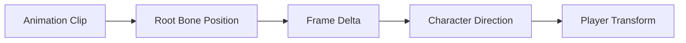

[← 엘든링 프로젝트 종합 페이지로 돌아가기]({{ page.project_page | relative_url }})

## 개요

DirectX 11 클라이언트에서 모델의 스켈레톤과 애니메이션 채널을 로드하고, 본 계층을 따라 최종 변환 행렬을 계산해 GPU 스키닝을 구현했습니다.

플레이어 이동은 고정 속도로 Transform을 이동시키는 대신 애니메이션 Root Bone의 이동량을 추출해 월드 위치에 반영했습니다.

```text
애니메이션 채널 보간
→ 본 Local Matrix
→ 계층 Global Matrix
→ Offset Matrix 적용
→ GPU Skinning
→ Root Bone Delta 추출
→ 플레이어 Transform 이동
```

---

## 구현 배경

엘든링 스타일 액션 캐릭터는 이동과 공격 모션에서 애니메이션 자체의 이동량이 중요합니다.

단순히 다음 방식으로 이동하면 애니메이션과 실제 위치가 어긋날 수 있습니다.

```text
Transform += Direction × Speed × DeltaTime
```

예를 들어 공격 애니메이션에서 캐릭터가 앞으로 전진하는데 Transform이 제자리에 있으면 다음 문제가 발생합니다.

- 발이 미끄러져 보임
- 공격 사거리와 시각적 위치 불일치
- 충돌 위치와 모델 위치 불일치
- 애니메이션 종료 시 위치가 튀어 보임

따라서 애니메이션 시스템과 플레이어 이동 시스템을 연결하는 Root Motion을 적용했습니다.

---

## 스켈레톤 구조

모델은 본 계층 구조를 가집니다.

```text
Root
└─ Pelvis
   ├─ Spine
   │  ├─ Chest
   │  └─ Neck
   ├─ LeftLeg
   └─ RightLeg
```

각 Bone은 다음 정보를 가집니다.

- Bone Name
- Parent Index
- Bind Local Matrix
- Offset Matrix
- Animated Local Matrix
- Global Matrix
- Final Skinning Matrix

Parent Index를 이용해 부모부터 자식 순서로 Global Matrix를 계산합니다.

---

## 애니메이션 채널 보간

애니메이션 클립은 Bone별 Position, Rotation, Scale Keyframe을 가집니다.

현재 재생 시간에 대응하는 두 Keyframe을 찾고 보간합니다.

### Position

```text
P = Lerp(P0, P1, ratio)
```

### Scale

```text
S = Lerp(S0, S1, ratio)
```

### Rotation

Quaternion은 선형 보간보다 구면 보간을 사용합니다.

```text
R = Slerp(R0, R1, ratio)
```

보간된 SRT로 Bone Local Matrix를 만듭니다.

```text
Local = Scale × Rotation × Translation
```

애니메이션 채널이 없는 Bone은 Bind Pose의 Local Matrix를 사용합니다.

---

## 계층 행렬 계산

Bone의 Global Matrix는 부모 Global Matrix와 현재 Local Matrix를 이용해 계산합니다.

프로젝트의 행렬 규칙에 맞춰 곱 순서를 일관되게 유지해야 합니다.

```text
GlobalAnimated = LocalAnimated × ParentGlobal
```

또는 사용하는 수학 규칙과 셰이더 기준에 따라 반대 순서를 사용할 수 있습니다.

중요한 것은 CPU 애니메이션 계산, DirectX 행렬 규칙과 HLSL에서 동일한 규칙을 사용하는 것입니다.

---

## Offset Matrix

Mesh Vertex는 모델의 Bind Pose를 기준으로 저장되어 있습니다.

현재 애니메이션 Bone Transform만 적용하면 Bind Pose가 중복 반영될 수 있으므로 Offset Matrix를 사용합니다.

프로젝트에서는 다음 형태로 최종 본 행렬을 계산했습니다.

```text
FinalBoneMatrix = OffsetMatrix × AnimatedGlobalMatrix
```

Offset Matrix는 Mesh가 Bind Pose에 있을 때 Bone 공간으로 되돌리는 역할을 합니다.

모델 파트와 마스터 스켈레톤을 연결할 때 Bone Name을 기준으로 대응 관계를 구성하고, 필요한 경우 Bind Global Matrix의 역행렬을 Offset으로 사용했습니다.

---

## CPU와 HLSL 행렬 규칙

애니메이션이 비정상적으로 뒤틀리는 원인 중 하나는 CPU와 HLSL의 행렬 저장 및 곱셈 규칙 차이입니다.

프로젝트에서는 다음 항목을 함께 확인했습니다.

- Row-major 또는 Column-major
- CPU에서 Matrix Transpose 여부
- HLSL `mul()`의 인자 순서
- World·View·Projection 곱 순서
- Bone Matrix 배열 전송 방식

셰이더에서는 Vertex의 Bone Index와 Weight를 이용해 Skinning Matrix를 합성합니다.

```hlsl
float4x4 skin =
      BoneMatrices[input.BoneIndices.x] * input.BoneWeights.x
    + BoneMatrices[input.BoneIndices.y] * input.BoneWeights.y
    + BoneMatrices[input.BoneIndices.z] * input.BoneWeights.z
    + BoneMatrices[input.BoneIndices.w] * input.BoneWeights.w;
```

그 후 Vertex Position과 Normal에 Skinning을 적용합니다.

---

## GPU 스키닝

각 Vertex는 최대 4개의 Bone Index와 Weight를 가집니다.

```text
Vertex
├─ Position
├─ Normal
├─ UV
├─ BoneIndices[4]
└─ BoneWeights[4]
```

CPU는 프레임마다 최종 Bone Matrix 배열을 계산하고 Constant Buffer 또는 Bone Buffer로 GPU에 전달합니다.

GPU가 Vertex별 Skinning을 수행하도록 해 CPU에서 모든 Vertex를 변환하는 비용을 줄였습니다.

---

## Root Motion

### 목표

애니메이션 Root Bone의 이동량을 실제 플레이어 위치에 반영합니다.

현재 프레임과 이전 프레임의 Root Bone Translation 차이를 계산합니다.

```text
RootDelta = CurrentRootPosition - PreviousRootPosition
```

그 후 캐릭터의 방향을 고려해 월드 이동량으로 변환하고 Transform에 적용합니다.

```text
WorldDelta = TransformDirection(RootDelta)
PlayerPosition += WorldDelta
```

### 처리 흐름



### 루프 애니메이션 처리

애니메이션이 마지막 프레임에서 첫 프레임으로 돌아갈 때 Root Position 차이를 그대로 계산하면 큰 역방향 이동이 발생할 수 있습니다.

따라서 다음 처리가 필요합니다.

- 애니메이션 루프 감지
- 루프 전후 Root Position 기준 재설정
- 상태 전환 시 이전 Root 값 초기화
- Root Motion을 사용하지 않는 Clip 구분

---

## FSM과 애니메이션 연결

플레이어 FSM은 입력과 현재 상태에 따라 애니메이션을 선택합니다.

```text
Idle
Move
Attack
Skill
Hit
Die
```

각 상태는 다음 책임을 가질 수 있습니다.

- 재생할 Animation Clip 선택
- 상태 전환 조건
- Root Motion 적용 여부
- 입력 허용 여부
- 충돌 또는 공격 판정 시점

예를 들어 이동 상태는 Root Motion을 월드 이동에 적용하지만, Idle 상태는 Root Translation을 제거할 수 있습니다.

공격 상태는 애니메이션 구간에 따라 이동과 공격 판정을 함께 처리해야 합니다.

---

## 리소스 좌표계 문제

외부 리소스는 프로젝트와 다른 좌표계를 사용할 수 있습니다.

확인해야 할 항목은 다음과 같습니다.

- Up Axis
- Forward Axis
- Left-handed 또는 Right-handed
- 모델 기본 방향
- Animation Clip의 축 기준
- Blender Export 설정
- Assimp 변환 옵션

프로젝트에서 일부 리소스는 T-Pose와 애니메이션의 Forward·Up 축이 달라 추가 변환이 필요했습니다.

좌표계 변환을 여러 위치에서 중복 적용하면 다음 문제가 발생합니다.

- 캐릭터가 옆을 봄
- 회전 방향 반전
- Root Motion 축 오류
- Bone Matrix 뒤틀림
- 원격 플레이어 회전 불일치

따라서 Import 단계에서 좌표계 규칙을 통일하고 런타임에서는 동일한 기준을 사용하는 것이 중요합니다.

---

## 원격 플레이어와 애니메이션

네트워크 수신 패킷은 원격 플레이어의 FSM State, Quaternion, Position을 포함합니다.

수신 클라이언트는 다음 흐름으로 상태를 반영합니다.

```text
UDP INPUT 수신
→ 원격 플레이어 식별
→ FSM 상태 반영
→ 해당 Animation Clip 재생
→ Quaternion 회전 적용
→ Position 적용
```

현재 구조에서는 로컬 플레이어가 계산한 상태와 위치를 원격 플레이어가 즉시 적용합니다.

이 방식은 구현이 단순하지만 패킷 간격이 일정하지 않으면 움직임이 끊겨 보일 수 있습니다.

후속 개선에서는 Snapshot 간 보간과 애니메이션 상태 전환 보정이 필요합니다.

---

## 트러블슈팅: 애니메이션이 뒤틀리거나 방향이 어긋남

### 원인 후보

- Bone Offset Matrix 누락 또는 곱 순서 오류
- Parent Global Matrix 계산 순서 오류
- CPU와 HLSL Matrix Transpose 불일치
- Bone Name Mapping 실패
- 외부 모델 파트와 마스터 스켈레톤 불일치
- Forward Axis 변환 중복
- Root Bone 선택 오류

### 확인 방법

1. Bind Pose만 렌더링합니다.
2. Bone 계층을 선으로 시각화합니다.
3. 특정 Bone Matrix를 Identity로 고정합니다.
4. 한 개 Animation Clip만 재생합니다.
5. CPU Final Matrix와 셰이더 입력을 비교합니다.
6. Root Motion 적용 전후 Transform을 로그로 비교합니다.

### 개선

- Bone Name 기준 Mapping
- 누락 Bone 로그
- Offset Matrix 계산 기준 통일
- 최종 Matrix Transpose 위치 단일화
- 좌표계 변환을 Import 단계로 제한
- Root Motion 대상 Bone을 명시적으로 설정

---

## 검증

### 애니메이션

| 테스트 | 예상 결과 |
|---|---|
| Bind Pose | 모델 뒤틀림 없음 |
| Idle Clip | 제자리 애니메이션 |
| Move Clip | 자연스러운 보행 |
| Attack Clip | Bone과 Mesh 일치 |
| Clip Loop | 위치 튐 없음 |
| 상태 전환 | 큰 Pose 점프 없음 |

### Root Motion

| 테스트 | 예상 결과 |
|---|---|
| 직선 이동 Clip | 애니메이션 이동량만큼 전진 |
| 방향 전환 후 이동 | 캐릭터 방향 기준 이동 |
| Clip 반복 | 루프 경계 순간이동 없음 |
| 공격 전진 | 시각적 전진과 Transform 일치 |
| 상태 전환 | 이전 Root 값 초기화 |

### 원격 플레이어

| 테스트 | 예상 결과 |
|---|---|
| FSM 상태 수신 | 동일 애니메이션 재생 |
| Quaternion 수신 | 동일 방향 표시 |
| Position 수신 | 원격 위치 반영 |
| 낮은 송신 주기 | 끊김 현상 확인 및 보간 필요 |

---

## 결과

- 스켈레톤과 애니메이션 채널을 로드해 본 계층 애니메이션을 구현했습니다.
- 최종 Bone Matrix를 GPU에 전달해 스키닝을 처리했습니다.
- Root Bone 이동량을 플레이어 Transform에 반영했습니다.
- FSM 상태와 Animation Clip을 연결했습니다.
- 네트워크 수신 상태를 원격 플레이어 FSM과 Transform에 반영했습니다.
- Offset Matrix, 좌표계와 행렬 규칙의 중요성을 확인했습니다.

---

## 현재 한계

- Blend Tree와 복잡한 Animation Layer가 없습니다.
- 상태 전환 Blend가 제한적입니다.
- Root Motion 보정과 네트워크 보간이 없습니다.
- 원격 플레이어는 수신 위치를 즉시 적용합니다.
- 애니메이션 Event와 서버 전투 판정이 연결되지 않았습니다.
- 서버가 FSM 전이를 검증하지 않습니다.
- 리소스별 좌표계 예외를 완전히 일반화하지 못했습니다.
- Bone Matrix 수와 Buffer 한계에 대한 대규모 성능 측정이 없습니다.

---

## 개선 방향

1. Animation Blend와 Cross Fade를 일반화합니다.
2. Root Motion Clip Metadata를 데이터화합니다.
3. 원격 플레이어 Snapshot 보간을 적용합니다.
4. 공격 Animation Event를 서버 입력과 연결합니다.
5. 서버가 허용 가능한 FSM 전이를 검증하도록 합니다.
6. Bone Mapping과 누락 리소스 검증 도구를 추가합니다.
7. 좌표계와 Matrix 규칙을 Import 문서로 고정합니다.
8. Instancing과 Bone Buffer 성능을 측정합니다.

---

## 관련 링크

- [엘든링 프로젝트 종합 페이지]({{ page.project_page | relative_url }})
- [UDP 상태 공유와 패킷 구조]({{ '/portfolio/elden-ring/udp-sync/' | relative_url }})
- [클라이언트 GitHub](https://github.com/Jaehyeok-Soh/3dsolo)
- [플레이 영상](https://youtu.be/6J3sDV4hN_8)
