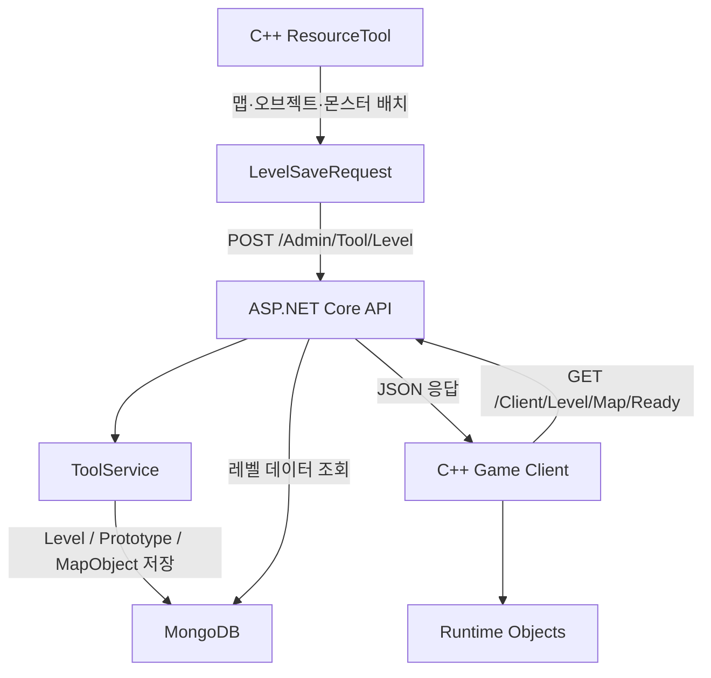
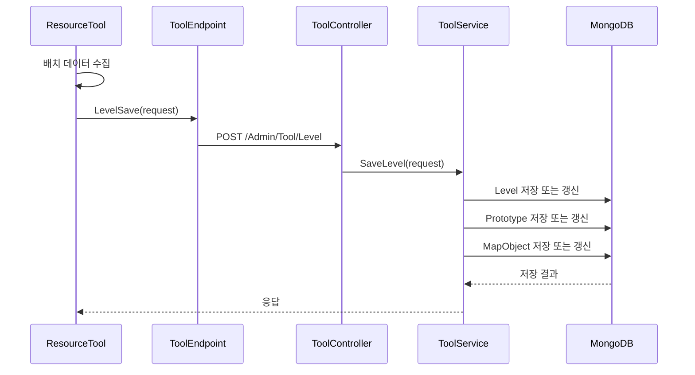
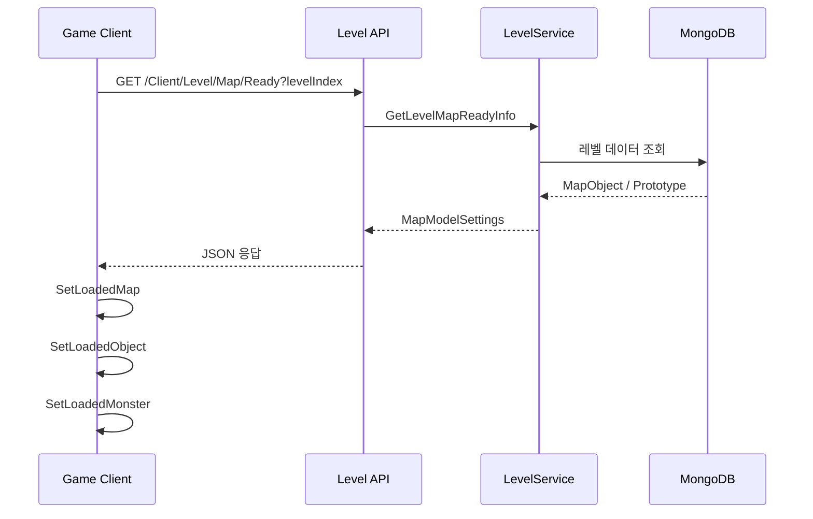

[← 엘든링 프로젝트 종합 페이지로 돌아가기]({{ page.project_page | relative_url }})

## 개요

클라이언트 코드에 맵 오브젝트를 직접 생성하는 대신, 별도의 ResourceTool에서 맵·오브젝트·몬스터를 배치하고 그 결과를 서버에 저장하도록 구현했습니다.

게임 클라이언트는 레벨 ID를 기준으로 저장된 데이터를 다시 조회하고, Prototype과 Transform 정보를 이용해 실제 런타임 오브젝트로 복원합니다.

```text
ResourceTool
→ ASP.NET Core API
→ MongoDB
→ 게임 클라이언트
→ 런타임 오브젝트 생성
```

---

## 구현 배경

초기에는 레벨을 구성하는 맵과 오브젝트를 클라이언트 코드에서 직접 생성했습니다.

이 방식은 빠르게 기능을 확인하기에는 적합했지만, 배치를 수정할 때마다 다음 작업이 반복되었습니다.

- 코드에서 좌표와 회전값 수정
- 클라이언트 재빌드
- 실행 후 위치 확인
- 잘못된 배치 재수정
- 맵과 몬스터 배치 로직이 게임 코드에 누적

프로젝트 규모가 커질수록 레벨 데이터와 런타임 로직의 경계가 불명확해졌습니다.

따라서 레벨 제작과 게임 실행의 책임을 분리하기 위해 다음 구조를 목표로 잡았습니다.

1. ResourceTool에서 배치 데이터를 편집한다.
2. 편집 결과를 DTO로 직렬화한다.
3. ASP.NET Core API를 통해 MongoDB에 저장한다.
4. 게임 클라이언트가 레벨 데이터를 조회한다.
5. 수신 데이터를 기반으로 오브젝트를 생성한다.

---

## 요구사항

레벨 데이터 파이프라인은 다음 조건을 만족해야 했습니다.

- 레벨 단위로 맵·오브젝트·몬스터를 구분할 수 있어야 한다.
- 각 오브젝트의 위치·회전·크기를 저장할 수 있어야 한다.
- ResourceTool과 게임 클라이언트가 동일한 DTO 계약을 이해해야 한다.
- 동일 레벨을 다시 저장할 때 기존 데이터와 충돌하지 않아야 한다.
- 게임 클라이언트가 레벨 ID만으로 필요한 데이터를 조회할 수 있어야 한다.
- 저장된 Prototype 정보를 기준으로 올바른 게임 오브젝트를 생성해야 한다.

---

## 전체 구조



---

## 저장 데이터 설계

ResourceTool에서는 레벨 저장 시 다음 데이터를 하나의 요청 모델로 묶었습니다.

```text
LevelSaveRequest
├─ LevelIndex
├─ MapList
├─ ObjectList
└─ MonsterList
```

개별 오브젝트는 다음 정보를 포함합니다.

```text
ObjectInfo
├─ Prototype 또는 Model 식별자
├─ Position
├─ Rotation
├─ Scale
├─ Object Type
└─ Level Index
```

Transform을 별도 필드로 저장한 이유는 게임 클라이언트가 동일한 Prototype을 여러 위치에 재사용할 수 있게 하기 위해서입니다.

모델 리소스와 인스턴스 배치 정보를 분리하면 다음 장점이 있습니다.

- 하나의 Prototype을 여러 위치에 배치 가능
- 모델 데이터와 레벨 배치 데이터의 중복 감소
- Tool과 런타임에서 동일한 식별자 사용
- 레벨 변경 시 게임 코드 수정 최소화

---

## 저장 흐름

ResourceTool의 `CImGuiMap::SaveLevel()`은 현재 편집 중인 맵·오브젝트·몬스터 정보를 수집해 `tagLevelSaveRequest`를 구성합니다.



서버는 요청을 다음 데이터로 분리해 저장합니다.

- `Level`: 레벨 식별 정보
- `Prototype`: 생성할 모델 또는 오브젝트 원형
- `MapObject`: 레벨에 배치된 개별 인스턴스와 Transform
- 몬스터 데이터: 오브젝트 타입 또는 전용 목록으로 구분

---

## 로드 흐름

게임 클라이언트는 레벨 초기화 과정에서 `/Client/Level/Map/Ready`를 호출합니다.

서버는 레벨 ID를 기준으로 맵·오브젝트·몬스터 데이터를 조회하고 JSON으로 반환합니다.



클라이언트는 응답을 역직렬화한 후 타입에 따라 생성 함수를 분리했습니다.

```text
Map 데이터
→ SetLoadedMap()

Object 데이터
→ SetLoadedObject()

Monster 데이터
→ SetLoadedMonster()
```

각 함수는 Prototype을 확인하고 Position·Rotation·Scale을 적용해 런타임 오브젝트를 생성합니다.

---

```cpp
void CImGuiMap::SaveLevel()
{
	struct tagLevelSaveRequest saveRequest {};
	saveRequest.levelIndex = m_tLevelInfo.levelIndex;
	saveRequest.mapList = m_tLevelInfo.mapList;
	saveRequest.objectList = m_tLevelInfo.objectList;
	saveRequest.monsterList = m_tLevelInfo.monsterList;

	m_pGameInstance->GetAdminEndpoint()->GetToolEndpoint()->LevelSave(saveRequest);
}

void CImGuiMap::LoadLevel()
{
	struct tagLevelSaveRequest loadResult {};

	future<httplib::Result> future = m_pGameInstance->GetAdminEndpoint()->GetToolEndpoint()->LevelLoad(m_iLevelIndexCurrentFocus);
	httplib::Result result = future.get();

	if (result->status != 200)
		return;

	m_pGameInstance->ResultBodyDeserialize(loadResult, result->status, result->body);

	m_tLevelInfo.levelIndex = loadResult.levelIndex;

	m_tLevelInfo.mapList.clear();
	m_tLevelInfo.mapList.reserve(0);
	for (auto map : loadResult.mapList)
		SetLoadedMap(map);

	m_tLevelInfo.objectList.clear();
	m_tLevelInfo.objectList.reserve(0);
	for (auto object : loadResult.objectList)
		SetLoadedObject(object);

	m_tLevelInfo.monsterList.clear();
	m_tLevelInfo.monsterList.reserve(0);
	for (auto monster : loadResult.monsterList)
		SetLoadedMonster(monster);
}
```

ResourceTool에서 배치한 Map/Object/Monster 목록을 `tagLevelSaveRequest`로 구성해 서버의 Level API로 전달했습니다. 로드 시에는 서버 응답을 같은 DTO로 역직렬화하고, 기존 컨테이너를 비운 뒤 각 타입별 생성 함수로 분기해 에디터 상태를 복원했습니다.

---

## 구현 시 고려한 점

### 1. Tool DTO와 Client DTO의 계약 일치

C++ ResourceTool과 게임 클라이언트, C# 서버가 동일한 필드명을 사용해야 했습니다.

필드 이름이나 자료형이 한쪽에서 달라지면 다음 문제가 발생할 수 있습니다.

- JSON 역직렬화 실패
- 기본값으로 초기화된 Transform
- 잘못된 Prototype 생성
- 레벨 일부만 로드
- 문자열 길이 또는 배열 크기 예외

따라서 DTO 변경 시 세 프로젝트의 계약을 함께 확인해야 했습니다.

### 2. Rotation 단위와 좌표계

Tool에서 편집한 회전값과 클라이언트가 기대하는 단위가 일치해야 했습니다.

저장 데이터가 Degree인지 Radian인지, 각 축이 어떤 순서로 적용되는지를 명확히 하지 않으면 오브젝트가 잘못 회전합니다.

프로젝트에서는 Tool이 저장한 회전값을 클라이언트 Transform 규칙에 맞춰 변환해 적용했습니다.

### 3. 재로드 시 기존 데이터 정리

같은 레벨을 반복해서 불러오면 기존 오브젝트와 새 오브젝트가 중복 생성될 수 있습니다.

현재 구현에서는 로드 전 일부 컨테이너를 초기화하지만, 기존 레이어의 모든 런타임 오브젝트까지 일관되게 제거되는지는 추가 검증이 필요합니다.

---

## 트러블슈팅: 레벨 로드 중 `std::length_error`

### 증상

레벨 데이터를 반복해서 불러오는 과정에서 문자열 또는 컨테이너 크기와 관련된 `std::length_error`가 발생했습니다.

### 원인 분석

클라이언트의 JSON 처리 흐름은 다음과 같습니다.

```text
HTTP 응답
→ json::parse
→ j.get<T>()
→ from_json
→ j.at(...).get_to(...)
```

이 과정에서 다음 입력을 정상 데이터라고 가정하고 있었습니다.

- 필수 필드가 모두 존재
- 문자열 형식이 올바름
- 배열 크기가 예상 범위
- 오브젝트 타입과 DTO가 일치
- 기존 컨테이너 상태가 정상

필드 누락이나 예상하지 못한 배열·문자열이 전달되면 예외가 상위 호출부까지 전파될 수 있었습니다.

### 현재 코드에서 확인한 조치

- 로드 전 일부 데이터 컨테이너 초기화
- 예상 데이터 개수에 맞춘 `reserve`
- 반복 로드 과정에서 기존 데이터를 그대로 누적하지 않도록 처리 흐름 정리

### 추가 개선이 필요한 부분

현재 저장소에서는 모든 비정상 JSON 입력에 대한 방어가 확인되지는 않았습니다. 구조를 더 안전하게 만들려면 다음 처리가 필요합니다.

- `json::parse` 예외 구분
- `contains()`를 이용한 필드 존재 확인
- 문자열과 배열 최대 크기 제한
- Enum과 Object Type 범위 검사
- 잘못된 응답에서 조기 반환
- 문제 위치를 추적하기 위한 구조화 로그
- 서버 응답 스키마 버전
- 기존 런타임 레이어의 명시적 정리
- 잘못된 데이터에 대한 사용자 UI 표시

---

## 검증

### 정상 시나리오

| 테스트 | 예상 결과 |
|---|---|
| Tool에서 맵 배치 후 저장 | 레벨 데이터가 서버에 저장됨 |
| 오브젝트 위치 수정 후 재저장 | 변경된 Transform이 반영됨 |
| 게임 클라이언트에서 레벨 조회 | 저장한 오브젝트가 생성됨 |
| 여러 종류의 오브젝트 저장 | 타입별 생성 함수가 호출됨 |
| 몬스터 배치 저장 | 지정된 위치에 몬스터 생성 |

### 예외 시나리오

| 테스트 | 예상 결과 |
|---|---|
| 필수 필드 누락 | 로드 중단 및 오류 로그 |
| 존재하지 않는 Prototype | 해당 오브젝트 생성 거부 |
| 빈 오브젝트 배열 | 빈 레벨로 정상 처리 |
| 과도하게 큰 배열 | 크기 제한 후 요청 거부 필요 |
| 같은 레벨 반복 로드 | 기존 오브젝트 중복 방지 필요 |

현재 정상 저장·로드 흐름은 구현했지만, 모든 비정상 JSON 입력에 대한 자동화 테스트는 아직 수행하지 않았습니다.

---

## 결과

- ResourceTool의 레벨 제작 데이터와 런타임 게임 코드를 분리했습니다.
- 레벨 배치 결과를 MongoDB에 저장하고 다시 조회할 수 있게 했습니다.
- Tool, API, 데이터베이스, 게임 클라이언트를 하나의 데이터 흐름으로 연결했습니다.
- Prototype과 Transform을 이용해 저장된 배치를 런타임 오브젝트로 복원했습니다.
- 맵·오브젝트·몬스터를 동일한 레벨 저장 흐름으로 관리했습니다.

---

## 현재 한계

- Tool API와 일부 Level API가 익명 접근을 허용합니다.
- 저장 요청에 대한 스키마 버전이 없습니다.
- C++ JSON 파싱의 예외 처리가 충분하지 않습니다.
- 재로드 시 기존 런타임 오브젝트 제거를 더 명확히 해야 합니다.
- 데이터 마이그레이션 정책이 없습니다.
- 대규모 레벨 데이터의 응답 크기와 로딩 시간은 측정하지 않았습니다.
- Tool 저장 도중 일부 작업만 성공할 경우의 롤백 정책이 부족합니다.

---

## 개선 방향

1. 레벨 DTO에 버전 필드를 추가합니다.
2. 서버에서 요청 모델을 검증하고 오류 내용을 구조화해 반환합니다.
3. Tool API에 관리자 인증과 권한 검사를 적용합니다.
4. 클라이언트에 JSON 스키마 검증과 실패 UI를 추가합니다.
5. 레벨 단위 트랜잭션 또는 임시 저장 후 교체 방식을 검토합니다.
6. 대규모 데이터는 페이지 분할이나 압축 전송을 적용합니다.
7. 저장·로드 회귀 테스트를 자동화합니다.

---

## 관련 링크

- [엘든링 프로젝트 종합 페이지]({{ page.project_page | relative_url }})
- [클라이언트 GitHub](https://github.com/Jaehyeok-Soh/3dsolo)
- [서버 GitHub](https://github.com/Jaehyeok-Soh/3dsolo_server)
- [플레이 영상](https://youtu.be/6J3sDV4hN_8)
