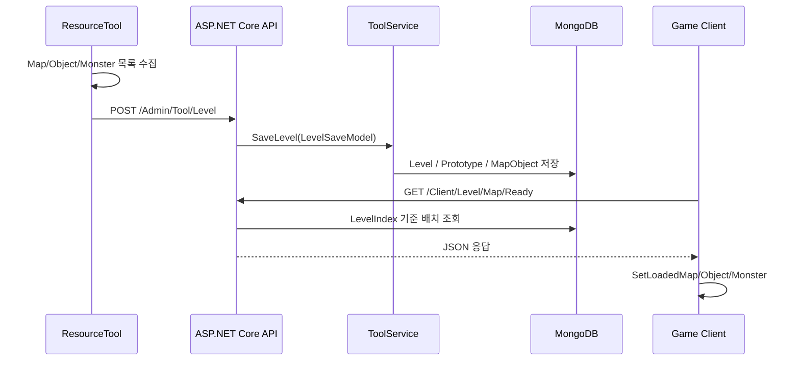

[← 엘든링 프로젝트 종합 페이지로 돌아가기]({{ page.project_page | relative_url }})

## 구현 배경

초기에는 맵과 오브젝트의 좌표를 클라이언트 코드에서 직접 지정했습니다. 배치를 수정할 때마다 코드를 고치고 다시 빌드해야 했고, 레벨 데이터와 게임 실행 로직도 한곳에 섞였습니다.

이를 분리하기 위해 ResourceTool에서 배치한 데이터를 서버에 저장하고, 게임 클라이언트가 같은 데이터를 다시 읽어 런타임 오브젝트로 복원하는 파이프라인을 구성했습니다.

```text
ResourceTool 배치
→ LevelSaveRequest 구성
→ ASP.NET Core API
→ MongoDB 저장
→ 게임 클라이언트 조회
→ Prototype과 Transform 기반 오브젝트 생성
```

## 데이터 설계

레벨 저장 요청은 `LevelIndex`, `MapList`, `ObjectList`, `MonsterList`로 구성됩니다.

서버에서는 리소스 원형과 배치 인스턴스를 분리했습니다.

| 데이터 | 책임 |
|---|---|
| `Level` | 레벨 식별 정보 |
| `Prototype` | 모델 이름, Prototype Tag, 저장 경로 |
| `MapObject` | LevelIndex, 인스턴스 이름, Position·Rotation·Scale |

동일한 Prototype을 여러 위치에서 재사용할 수 있고, 리소스 정보와 배치 Transform을 중복 저장하지 않도록 구성했습니다.

## 전체 흐름



## 핵심 코드 1. ResourceTool 저장 요청 구성

**파일:** `ResourceTool/Private/ImGuiMap.cpp`  
**역할:** 현재 편집 중인 레벨의 Map/Object/Monster 목록을 하나의 저장 요청으로 구성합니다.

```cpp
void CImGuiMap::SaveLevel()
{
	struct tagLevelSaveRequest saveRequest {};
	saveRequest.levelIndex = m_tLevelInfo.levelIndex;
	saveRequest.mapList = m_tLevelInfo.mapList;
	saveRequest.objectList = m_tLevelInfo.objectList;
	saveRequest.monsterList = m_tLevelInfo.monsterList;

	m_pGameInstance->GetAdminEndpoint()->GetToolEndpoint()->LevelSave(saveRequest);
}
```

Tool 내부의 편집 상태를 서버 DTO로 변환하는 시작점입니다. 각 배치 유형을 하나의 레벨 요청으로 전달해 저장 흐름을 레벨 단위로 관리했습니다.

[GitHub에서 전체 코드 보기](https://github.com/Jaehyeok-Soh/3dsolo/blob/0d7545ce6cdc7de51b4c3541d65d9234056ed91a/ResourceTool/Private/ImGuiMap.cpp#L115-L124)

## 핵심 코드 2. Prototype과 배치 인스턴스 분리 저장

**파일:** `3DSolo.BackApi/Services/Admin/ToolService.cs`  
**역할:** 모델 리소스는 `Prototype`, 레벨에 배치된 인스턴스는 `MapObject`로 저장합니다.

```csharp
foreach (var map in model.MapList)
{
    Prototype prototype = MongoContext.Prototype.AsQueryable()
        .FirstOrDefault(a => a.Tag == map.ModelPrototypeTag);

    if (prototype == null)
    {
        prototype = new Prototype()
        {
            Type = 2,//prototypetype::model,
            Name = map.Name,
            Tag = map.ModelPrototypeTag,
            SavePath = map.SavePath,
            CreatedTime = DateTime.UtcNow,
            UpdatedTime = DateTime.UtcNow
        };

        MongoContext.Prototype.InsertOne(prototype);
    }

    // ...

    MapObject mapObject = MongoContext.MapObject.AsQueryable()
        .FirstOrDefault(a => a.PrototypeId == prototype.Id && a.Position == map.Position);

    if (mapObject == null)
    {
        mapObject = new MapObject()
        {
            PrototypeId = prototype.Id,
            LevelIndex = model.LevelIndex,
            Type = map.Type,
            InstanceName = map.InstanceName,
            Position = map.Position,
            Rotation = map.Rotation,
            Scale = map.Scale,
            CreatedTime = DateTime.UtcNow,
            UpdatedTime = DateTime.UtcNow,
            Prototype = prototype
        };

        MongoContext.MapObject.InsertOne(mapObject);
    }
}
```

`Prototype`에는 리소스 식별 정보가, `MapObject`에는 레벨 번호와 Transform이 저장됩니다. 이 분리를 통해 하나의 리소스를 여러 배치 인스턴스가 공유하도록 구성했습니다.

[GitHub에서 전체 코드 보기](https://github.com/Jaehyeok-Soh/3dsolo_server/blob/b06aba1233a4d837398ad57ca7c5c8f20ce030df/3DSolo.BackApi/Services/Admin/ToolService.cs#L49-L99)

## 핵심 코드 3. 게임 클라이언트 런타임 복원

**파일:** `Client/Private/Level_1.cpp`  
**역할:** 서버 응답의 Prototype과 Transform을 이용해 실제 게임 오브젝트를 생성합니다.

```cpp
void CLevel_1::SetLoadedObject(const _wstring& strLayerTag, DAO::tagMapObject info)
{
	fs::path targetPath = info.prototype.savePath;

	string strName = targetPath.stem().string();
	wstring wstrName = wstring(strName.begin(), strName.end());
	wstring gameObjectName = wstring(info.instanceName.begin(), info.instanceName.end());

	wstring wstrPrototype_Component_Model(info.prototype.tag.begin(), info.prototype.tag.end());

	DTO::MAP_OBJECT objectDesc{};
	lstrcpyW(objectDesc.szName, gameObjectName.c_str());
	objectDesc.fSpeedPerSec = 0.f;
	objectDesc.fRotationPerSec = 0.f;
	objectDesc.strModelPrototypeTag = wstrPrototype_Component_Model;
	objectDesc.strModelRendererPrototypeTag = L"Prototype_Component_ModelRenderer";
	objectDesc.strShaderPrototypeTag = L"Prototype_Component_Shader_VtxNorAniTex";
	objectDesc.iRendererPass = 1;

	m_pGameInstance->Add_GameObject_To_Layer(ENUM_TO_UINT(LEVEL::LEVEL_1), TEXT("Prototype_GameObject_MapObject"),
		ENUM_TO_UINT(LEVEL::LEVEL_1), strLayerTag, OBJECTTYPE::OBJECT, &objectDesc);

	auto setObject = m_pGameInstance->Get_GameObjectByName_From_Layer(ENUM_TO_UINT(LEVEL::LEVEL_1), strLayerTag, gameObjectName);

	setObject->GetTransform().Set_Scale(info.scale.x, info.scale.y, info.scale.z);
	setObject->GetTransform().Rotation(XMConvertToRadians(info.rotation.x), XMConvertToRadians(info.rotation.y), XMConvertToRadians(info.rotation.z));
	setObject->GetTransform().Set_State(STATE::POSITION, XMVectorSetW(XMLoadFloat3(&info.position), 1.f));
}
```

서버 데이터의 `prototype.tag`로 생성할 모델을 선택하고, 인스턴스별 Scale·Rotation·Position을 적용합니다. Tool에서 편집한 배치 결과가 런타임 게임 오브젝트로 이어지는 마지막 단계입니다.

[GitHub에서 전체 코드 보기](https://github.com/Jaehyeok-Soh/3dsolo/blob/0d7545ce6cdc7de51b4c3541d65d9234056ed91a/Client/Private/Level_1.cpp#L848-L875)

## 구현 결과

- 레벨 배치 데이터를 게임 코드에서 분리했습니다.
- ResourceTool, ASP.NET Core API, MongoDB, 게임 클라이언트를 하나의 데이터 흐름으로 연결했습니다.
- Prototype과 인스턴스 Transform을 분리해 동일 리소스를 여러 위치에서 재사용할 수 있게 했습니다.
- Tool에서 저장한 Position·Rotation·Scale을 런타임 오브젝트에 반영했습니다.

## 현재 한계

- 저장 DTO에 버전 정보가 없어 구조 변경 시 호환성 관리가 어렵습니다.
- JSON 필드와 배열 크기에 대한 클라이언트 검증이 충분하지 않습니다.
- 반복 로드 시 기존 런타임 오브젝트 제거 정책을 더 명확히 해야 합니다.
- 여러 컬렉션 저장 중 일부만 성공했을 때의 롤백 처리가 없습니다.

## 개선 방향

- DTO에 Schema Version을 추가하고 서버에서 필수 필드와 배열 크기를 검증합니다.
- 레벨 단위 저장을 원자적으로 처리할 수 있는 교체·롤백 전략을 적용합니다.
- ResourceTool 저장 화면과 게임 클라이언트 복원 화면을 자동 비교하는 회귀 테스트를 추가합니다.

## 관련 링크

- [엘든링 프로젝트 종합 페이지]({{ page.project_page | relative_url }})
- [HTTP 로그인과 TCP 세션 인증]({{ '/portfolio/elden-ring/network-auth/' | relative_url }})
- [클라이언트 GitHub](https://github.com/Jaehyeok-Soh/3dsolo)
- [서버 GitHub](https://github.com/Jaehyeok-Soh/3dsolo_server)
- [플레이 영상](https://youtu.be/6J3sDV4hN_8)
