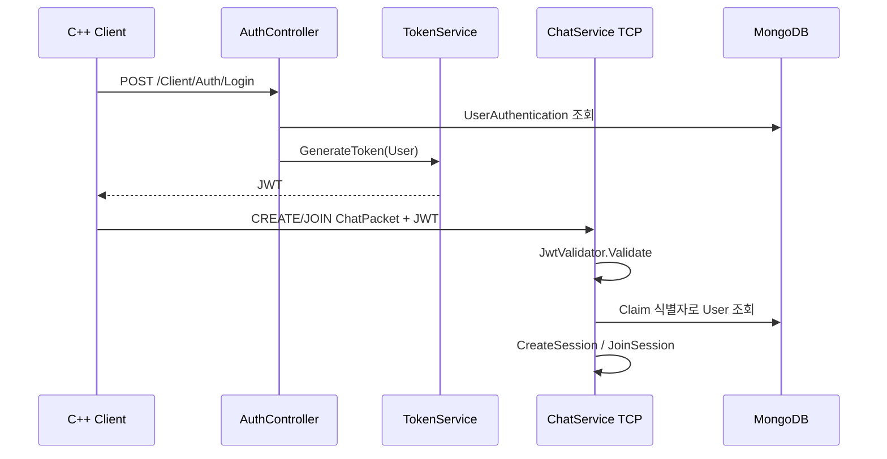

[← 엘든링 프로젝트 종합 페이지로 돌아가기]({{ page.project_page | relative_url }})

## 구현 배경

HTTP 로그인과 별도로 만든 TCP 서버는 ASP.NET Core 인증 미들웨어의 보호를 자동으로 받지 않습니다. TCP 연결만 허용하면 클라이언트가 임의 사용자 정보를 보내 세션에 참가할 수 있기 때문에, HTTP에서 발급한 JWT를 TCP 첫 패킷에도 포함하도록 구성했습니다.

```text
HTTP 로그인
→ JWT 발급 및 클라이언트 저장
→ TCP CREATE/JOIN 패킷에 JWT 포함
→ TCP 서버에서 JWT 검증
→ Claim 기반 사용자 조회
→ 세션 생성 또는 입장
```

## 인증 흐름



## 핵심 코드 1. JWT 발급

**파일:** `3DSolo.BackApi/Services/TokenService.cs`  
**역할:** 사용자 Claim과 서명 정보를 이용해 TCP 인증에도 재사용할 JWT를 생성합니다.

```csharp
private string GenerateToken(List<Claim> claims, string optionKey)
{
    var option = Options[optionKey];
    if (option == null)
    {
        throw new NotFoundException();
    }

    var securityTokenDescriptor = new SecurityTokenDescriptor()
    {
        Subject = new ClaimsIdentity(claims),
        Audience = option.Audience,
        Issuer = option.Issuer,
        SigningCredentials = option.SigningCredentials,
        IssuedAt = DateTime.UtcNow,
        Expires = DateTime.UtcNow.Add(TimeSpan.FromMinutes(option.TokenLifetimeInMinutes ?? 60)),
    };

    var tokenHandler = new JwtSecurityTokenHandler();

    var plainToken = tokenHandler.CreateToken(securityTokenDescriptor);
    var signedToken = tokenHandler.WriteToken(plainToken);

    return signedToken;
}
```

로그인에 성공하면 이 토큰을 응답으로 반환하고, 클라이언트가 사용자 정보에 보관합니다.

[GitHub에서 전체 코드 보기](https://github.com/Jaehyeok-Soh/3dsolo_server/blob/b06aba1233a4d837398ad57ca7c5c8f20ce030df/3DSolo.BackApi/Services/TokenService.cs#L68-L91)

## 핵심 코드 2. TCP 세션 패킷에 JWT 포함

**파일:** `Engine/Private/UserAgent.cpp`  
**역할:** 로그인 결과로 저장한 JWT를 세션 생성·입장 패킷에 포함합니다.

```cpp
void CUserAgent::CreateSession()
{
	DAO::CHATPACKET sendMsg{};
	sendMsg.Header = ENUMS::ChatProtocol::SESSION_CREATE;
	sendMsg.Sender = m_tPlayerInfo.userInfo.userName;
	sendMsg.Jwt = m_tPlayerInfo.userInfo.jwt;
	sendMsg.Body = "";

	m_pGameInstance->TcpSend(sendMsg);
}

void CUserAgent::EnterSession(string sessionId)
{
	DAO::CHATPACKET sendMsg{};
	sendMsg.Header = ENUMS::ChatProtocol::SESSION_JOIN;
	sendMsg.Sender = m_tPlayerInfo.userInfo.userName;
	sendMsg.Jwt = m_tPlayerInfo.userInfo.jwt;
	sendMsg.Body = sessionId;

	m_pGameInstance->TcpSend(sendMsg);
}
```

HTTP 로그인과 TCP 세션이 서로 다른 연결을 사용하지만 같은 JWT를 공유하므로, 두 프로토콜에서 동일한 사용자 식별 기준을 사용할 수 있습니다.

[GitHub에서 전체 코드 보기](https://github.com/Jaehyeok-Soh/3dsolo/blob/0d7545ce6cdc7de51b4c3541d65d9234056ed91a/Engine/Private/UserAgent.cpp#L199-L219)

## 핵심 코드 3. TCP 서버의 토큰 검증과 세션 분기

**파일:** `3DSolo.BackApi/Services/ChatService.cs`  
**역할:** TCP 첫 패킷의 JWT를 검증하고 Claim의 사용자 ID로 세션 요청자를 식별합니다.

```csharp
ChatPacket receivePacket = ReadPacketAsync(stream, ct);

if (receivePacket == null)
{
    Console.WriteLine("empty packet");
    continue;
}

if (receivePacket.Jwt == "" || receivePacket.Jwt == string.Empty)
    continue;

var principal = jwtValidator.Validate(receivePacket.Jwt);
if (principal == null)
{
    //client.Close();
    continue;
}

string? identifier = principal.FindFirst("sub")?.Value ?? principal.FindFirst(ClaimTypes.NameIdentifier)?.Value;

if (identifier == null)
    continue;

User? user = MongoContext.User.AsQueryable().Where(a => a.Id == identifier).SingleOrDefault();
if (user == null)
    continue;

// ...

if (receivePacket.Header == ChatProtocol.CREATE)
{
    memberInfo = CreateSession(client, user, ct);
}
else if (receivePacket.Header == ChatProtocol.JOIN)
{
    memberInfo = JoinSession(client, user, receivePacket.Body, ct);
}
```

패킷의 `Sender` 문자열을 인증 기준으로 사용하지 않고, 검증된 JWT Claim에서 사용자 ID를 얻어 MongoDB 사용자와 연결했습니다. 이후 Protocol에 따라 세션 생성과 입장 로직으로 분기합니다.

[GitHub에서 전체 코드 보기](https://github.com/Jaehyeok-Soh/3dsolo_server/blob/b06aba1233a4d837398ad57ca7c5c8f20ce030df/3DSolo.BackApi/Services/ChatService.cs#L94-L139)

## 세션 처리

인증된 사용자는 TCP Protocol에 따라 다음 흐름으로 처리됩니다.

| Protocol | 처리 |
|---|---|
| `CREATE` | 새로운 세션 생성 후 요청자를 첫 멤버로 등록 |
| `JOIN` | Body의 Session ID를 기준으로 기존 세션 참가 |
| `START` | 세션 시작 이벤트 전달 |
| Chat | 같은 세션 참가자에게 메시지 전달 |

첫 참가자를 호스트로 지정하고, 이후 참가자가 같은 세션의 상태를 공유하도록 구성했습니다.

## 구현 결과

- HTTP 로그인 사용자와 TCP 게임 세션 사용자를 하나의 JWT로 연결했습니다.
- TCP 소켓 서버에서 애플리케이션 수준의 JWT 검증 절차를 구현했습니다.
- 패킷의 사용자 문자열 대신 JWT Claim을 기준으로 요청자를 식별했습니다.
- 인증된 사용자를 세션 생성·입장 흐름에 연결했습니다.

## 현재 한계

- 서버 설정에서 JWT Lifetime 검증이 비활성화되어 있습니다.
- 인증 실패 시 연결을 즉시 종료하지 않고 다음 패킷을 기다리는 경로가 있습니다.
- 세션·멤버 Dictionary의 동시 접근 보호가 충분하지 않습니다.
- 동일 `NetworkStream`에 대한 송신 직렬화 정책이 필요합니다.

## 개선 방향

- JWT 만료 검증과 재인증 정책을 적용합니다.
- 인증 실패 시 연결 종료와 재시도 제한을 명확히 합니다.
- 세션 상태 변경을 Room 단위 JobQueue 또는 명확한 Lock 범위로 직렬화합니다.
- 강제 종료, 중복 참가, 잘못된 JWT를 포함한 회귀 테스트를 추가합니다.

## 관련 링크

- [엘든링 프로젝트 종합 페이지]({{ page.project_page | relative_url }})
- [UDP 상태 공유 프로토타입]({{ '/portfolio/elden-ring/udp-sync/' | relative_url }})
- [클라이언트 GitHub](https://github.com/Jaehyeok-Soh/3dsolo)
- [서버 GitHub](https://github.com/Jaehyeok-Soh/3dsolo_server)
