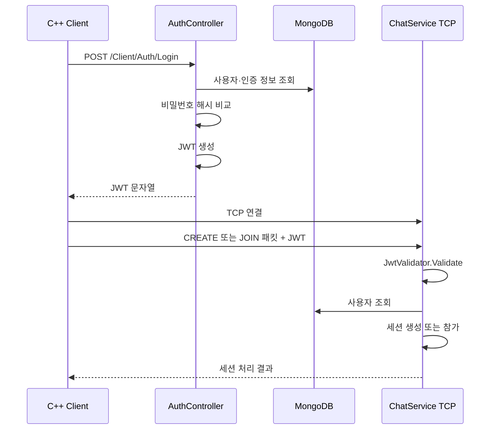

[← 엘든링 프로젝트 종합 페이지로 돌아가기]({{ page.project_page | relative_url }})

## 개요

HTTP 로그인으로 발급받은 JWT를 TCP 게임 세션 연결에도 사용하도록 구현했습니다.

ASP.NET Core의 인증 미들웨어는 HTTP 요청에는 적용되지만 별도로 생성한 `TcpListener` 연결에는 자동으로 적용되지 않습니다. 따라서 클라이언트가 TCP 연결 후 보내는 첫 패킷에 JWT를 포함하고, TCP 서버가 직접 토큰을 검증한 뒤 게임 세션에 등록하도록 구성했습니다.

```text
HTTP 로그인
→ JWT 발급
→ TCP 연결
→ JWT 포함 첫 패킷
→ 서버 토큰 검증
→ 사용자 확인
→ 세션 생성 또는 참가
```

---

## 구현 배경

프로젝트에서는 HTTP와 TCP가 서로 다른 역할을 담당합니다.

- HTTP: 회원가입, 로그인, 사용자 프로필, 레벨 데이터
- TCP: 게임 세션 생성·참가·시작, 채팅
- UDP: 플레이어와 몬스터의 빈번한 상태 전달

로그인 상태를 HTTP API와 TCP 서버에서 각각 별도로 관리하면 다음 문제가 생깁니다.

- 동일 사용자를 서로 다른 식별자로 처리할 수 있음
- TCP 연결만으로 임의 사용자 사칭 가능
- HTTP 로그인 사용자와 게임 세션 참가자의 연결이 불명확함
- 세션 데이터와 사용자 데이터의 관계를 검증하기 어려움

따라서 HTTP 로그인에서 발급한 JWT를 TCP 인증 정보로 재사용했습니다.

---

## 전체 인증 흐름



---

## HTTP 로그인 구현

클라이언트의 `CUserAgent::Login()`은 사용자 입력을 `DAO::USERLOGIN` 형태로 직렬화해 로그인 API에 전송합니다.

```text
CUserAgent::Login
→ DAO::USERLOGIN JSON 생성
→ CHttpService::Post
→ POST /Client/Auth/Login
```

서버의 `AuthController.Login()`은 사용자와 인증 정보를 MongoDB에서 조회한 뒤 비밀번호를 비교합니다.

인증에 성공하면 `TokenService.GenerateToken()`을 호출해 JWT를 발급합니다.

클라이언트는 응답 본문에 포함된 JWT 문자열을 다음 사용자 정보 구조에 보관합니다.

```text
PLAYERINFO_AGENT
└─ USERINFO
   └─ jwt
```

이후 HTTP 요청의 Bearer Token과 TCP 세션 패킷에서 동일한 JWT를 사용합니다.

---

```csharp
[HttpPost("Login")]
public string Login([FromBody] LoginModel model)
{
    var secret = model.Secret.ToHashString();
    var user = MongoContext.User.AsQueryable().SingleOrDefault(a => a.Identity == model.Identity);
    var auth = MongoContext.UserAuthentication.AsQueryable()
        .Where(a => !a.DeletedTime.HasValue)
        .SingleOrDefault(a => a.Value == secret);

    if (auth == null || auth.User.Identity != model.Identity || auth.User.DeletedTime.HasValue)
    {
        throw new BadRequestException();
    }

    auth.LastTriedTime = DateTime.UtcNow;
    auth.User.LastTriedTime = DateTime.UtcNow;

    if (model.Session != null)
    {
        auth.User.UserSession.Add(new DataBases.Models.UserSession()
        {
            UserAgent = model.Session.UserAgent,
            CreatedTime = DateTime.UtcNow,
            UpdatedTime = DateTime.UtcNow,
        });
    }

    return TokenService.GenerateToken(auth.User);
}
```
로그인 요청은 HTTP API에서 처리하고, 서버는 저장된 인증 해시와 사용자 식별자를 검증한 뒤 JWT를 발급합니다. 클라이언트는 이 JWT를 보관하고 TCP 세션 CREATE/JOIN 패킷에 포함해 게임 세션 입장 인증에 재사용합니다.

---

## TCP 패킷 설계

TCP 세션 패킷은 다음 필드를 포함합니다.

```text
[Protocol 1 byte]
[SenderLength 4 bytes]
[JwtLength 4 bytes]
[BodyLength 4 bytes]
[Sender bytes]
[Jwt bytes]
[Body bytes]
```

각 필드의 역할은 다음과 같습니다.

| 필드 | 역할 |
|---|---|
| Protocol | CREATE, JOIN, START, END, 채팅 등 메시지 종류 |
| Sender | 클라이언트가 전달한 사용자 식별 문자열 |
| Jwt | HTTP 로그인에서 발급받은 토큰 |
| Body | 세션 ID, 채팅 메시지 또는 이벤트 데이터 |

JWT를 패킷에 포함한 이유는 TCP 연결 자체에는 HTTP Authorization Header가 없기 때문입니다.

---

## TCP 서버 인증 흐름

서버의 `ChatService.HandleClient()`는 클라이언트 연결마다 실행됩니다.

첫 패킷을 읽은 후 다음 순서로 처리합니다.

```text
ChatPacket 수신
→ JWT 존재 여부 확인
→ IJwtValidator.Validate(jwt)
→ Claim에서 사용자 ID 확인
→ MongoDB 사용자 조회
→ 세션 명령 처리
```

토큰이 유효하면 Protocol에 따라 다음 흐름으로 분기합니다.

- `CREATE`: 새로운 게임 세션 생성
- `JOIN`: 지정된 세션에 참가
- `DEFAULT`: 참가 가능한 세션 선택
- 이후 일반 메시지: 같은 세션에 브로드캐스트

첫 번째 입장자는 호스트로 지정되고, 세션 상태 변화는 클라이언트 이벤트로 전달됩니다.

---

## HTTP 인증과 TCP 인증의 차이

HTTP에서는 ASP.NET Core 미들웨어가 다음 처리를 담당할 수 있습니다.

- Authorization Header 파싱
- JWT 서명 검증
- ClaimPrincipal 생성
- `[Authorize]` 정책 적용

반면 직접 생성한 TCP 서버에서는 이러한 처리를 애플리케이션 코드가 직접 수행해야 합니다.

```text
HTTP
Request
→ Authentication Middleware
→ Controller

TCP
NetworkStream
→ Packet Parser
→ JwtValidator
→ Session Logic
```

이를 통해 프로토콜이 달라도 동일한 사용자 식별 체계를 공유할 수 있었습니다.

---

## 세션 생성과 참가

### 세션 생성

클라이언트가 `CREATE` 패킷을 보내면 서버는 다음 작업을 수행합니다.

1. JWT 검증
2. 사용자 정보 조회
3. 새로운 세션 식별자 생성
4. 세션 목록에 등록
5. 요청 사용자를 첫 참가자로 추가
6. 첫 참가자를 호스트로 지정
7. 생성 결과를 클라이언트에 전달

### 세션 참가

`JOIN` 패킷은 기존 세션 식별자를 Body에 포함합니다.

서버는 다음 조건을 확인해야 합니다.

- 세션 존재 여부
- 중복 참가 여부
- 최대 인원 초과 여부
- 게임 시작 이후 참가 허용 여부
- 사용자 인증 여부

현재 구현은 기본적인 생성·참가 흐름을 제공하지만, 모든 상태 조건에 대한 엄격한 검증은 후속 개선이 필요합니다.

---

## 채팅 브로드캐스트

인증과 세션 입장이 완료되면 `ChatLoopAsync()`에서 TCP 메시지를 지속적으로 수신합니다.

메시지를 수신하면 같은 세션의 참가자 목록을 조회하고 `Task.WhenAll()`로 Write 작업을 요청합니다.

```text
메시지 수신
→ 현재 사용자의 세션 확인
→ 같은 세션 멤버 조회
→ 각 NetworkStream에 Write
```

이 방식은 여러 클라이언트에 비동기적으로 전송할 수 있지만, 동일 스트림에 여러 Write가 동시에 실행될 가능성을 제어해야 합니다.

---

## 보안상 확인한 한계

### 1. JWT Lifetime 검증

현재 서버 설정에서는 JWT Lifetime 검증이 비활성화되어 있습니다.

따라서 만료된 토큰이 허용될 수 있으므로 운영 환경에서는 반드시 활성화해야 합니다.

### 2. HTTP 사용

클라이언트가 로그인 정보를 `http://` 주소로 전송합니다.

JWT와 계정 정보가 네트워크에서 보호되려면 HTTPS 또는 별도의 암호화 계층이 필요합니다.

### 3. 개발 설정의 Secret

개발 설정 파일에 DB와 JWT Secret이 존재합니다.

운영 환경에서는 다음 방식으로 분리해야 합니다.

- 환경 변수
- Secret Manager
- 별도 배포 설정
- Vault 계열 서비스

### 4. 사용자 ID와 Claim 일치

패킷의 Sender 또는 Body에 포함된 사용자 ID를 신뢰하지 않고, JWT Claim에서 얻은 사용자 ID와 일치하는지 확인해야 합니다.

### 5. 인증 실패 연결 처리

현재 인증 실패 시 연결을 유지하는 흐름이 존재할 수 있습니다.

인증 실패 횟수 제한과 즉시 연결 종료 정책을 명확히 해야 합니다.

---

## 동시성과 세션 생명주기

현재 서버의 세션·멤버 저장소는 일반 `Dictionary`를 사용합니다.

TCP 클라이언트 작업과 UDP 수신 작업이 동시에 접근할 수 있으므로 다음 위험이 있습니다.

- 참가 중 다른 작업에서 목록 순회
- 종료와 브로드캐스트 동시 실행
- 중복 제거
- 존재하지 않는 사용자 접근
- 세션 삭제 중 참가 처리

후속 개선에서는 다음 중 하나가 필요합니다.

- `ConcurrentDictionary`
- 명확한 Lock 범위
- Room 또는 Session 단위 JobQueue
- 단일 소유 스레드
- 불변 Snapshot

단순히 자료구조만 바꾸는 것보다 누가 세션 상태를 변경할 수 있는지 책임을 제한하는 것이 중요합니다.

---

## 검증

### 정상 시나리오

| 테스트 | 예상 결과 |
|---|---|
| 올바른 계정 로그인 | JWT 발급 |
| 유효한 JWT로 CREATE | 세션 생성 |
| 유효한 JWT로 JOIN | 기존 세션 참가 |
| 같은 세션에서 채팅 | 참가자에게 메시지 전달 |
| 잘못된 세션 ID | 참가 거부 |

### 예외 시나리오

| 테스트 | 예상 결과 |
|---|---|
| JWT 누락 | 인증 실패 |
| 서명이 잘못된 JWT | 인증 실패 및 연결 종료 |
| 만료된 JWT | 운영 설정에서는 거부 |
| Sender와 Claim 불일치 | 요청 거부 |
| 동일 사용자의 중복 참가 | 중복 방지 |
| 연결 강제 종료 | 참가자와 세션 상태 정리 |

현재 기본 로그인과 TCP JWT 검증 흐름은 구현했지만, 모든 실패 조건과 동시성 상황에 대한 자동화 테스트는 부족합니다.

---

## 결과

- HTTP 로그인 사용자와 TCP 게임 세션 사용자를 하나의 JWT로 연결했습니다.
- 별도 TCP 소켓에서 애플리케이션 수준의 인증 절차를 구현했습니다.
- 인증된 사용자를 기준으로 세션 생성·참가 흐름을 구성했습니다.
- HTTP API와 실시간 소켓 서버가 동일한 사용자 데이터를 공유하도록 만들었습니다.
- 세션과 채팅 이벤트를 TCP로 분리해 순서와 신뢰성이 필요한 메시지를 처리했습니다.

---

## 현재 한계

- JWT Lifetime 검증이 비활성화되어 있습니다.
- HTTPS가 적용되지 않았습니다.
- 인증 실패 연결 종료 정책이 명확하지 않습니다.
- 세션·멤버 Dictionary의 동시 접근 보호가 부족합니다.
- 동일 NetworkStream에 대한 Write 직렬화가 없습니다.
- 세션 종료와 사용자 제거에 대한 회귀 테스트가 없습니다.
- 로그인 비밀번호 저장 방식은 상용 보안 수준으로 보완해야 합니다.
- 재접속과 토큰 갱신 흐름이 없습니다.

---

## 개선 방향

1. HTTPS와 JWT Lifetime 검증을 적용합니다.
2. Secret을 환경 변수와 배포 설정으로 분리합니다.
3. JWT Claim과 패킷 사용자 ID를 비교합니다.
4. 인증 실패 시 연결 종료와 재시도 제한을 적용합니다.
5. Session별 송신 큐를 구현해 Write를 직렬화합니다.
6. 세션 상태 변경을 JobQueue 또는 단일 소유 흐름으로 제한합니다.
7. 강제 종료·중복 참가·재접속 테스트를 자동화합니다.
8. Refresh Token 또는 재인증 정책을 설계합니다.

---

## 관련 링크

- [엘든링 프로젝트 종합 페이지]({{ page.project_page | relative_url }})
- [클라이언트 GitHub](https://github.com/Jaehyeok-Soh/3dsolo)
- [서버 GitHub](https://github.com/Jaehyeok-Soh/3dsolo_server)
