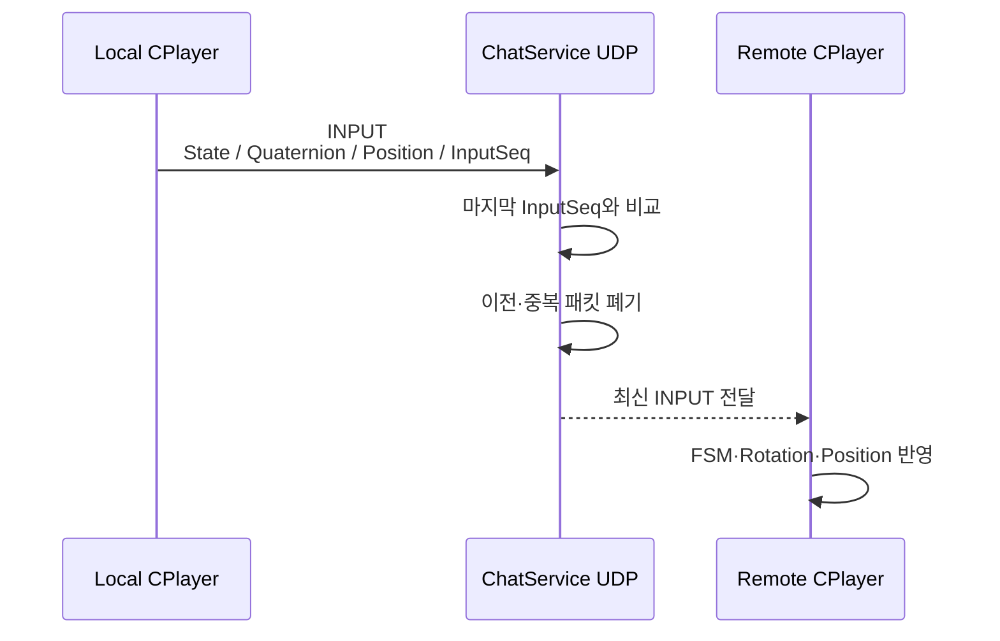

[← 엘든링 프로젝트 종합 페이지로 돌아가기]({{ page.project_page | relative_url }})

## 구현 범위

플레이어의 Position, Quaternion, FSM State와 입력 상태처럼 갱신 빈도가 높은 데이터는 UDP로 전달했습니다.

현재 구현은 서버가 이동 결과를 계산하는 권위형 구조가 아니라, 클라이언트가 계산한 상태를 서버가 받아 다른 클라이언트에 전달하는 상태 공유 프로토타입입니다.

```text
로컬 입력과 상태 수집
→ UDP INPUT 전송
→ 서버 InputSeq 비교
→ 최신 상태 저장 및 중계
→ 원격 플레이어 FSM·Transform 반영
```

## 상태 공유 흐름



`InputSeq`는 UDP 패킷 유실을 복구하기 위한 값이 아니라, 늦게 도착한 이전 상태가 최신 상태를 덮어쓰지 않도록 하기 위한 최소 순서 정보로 사용했습니다.

## 핵심 코드 1. 이전·중복 INPUT 폐기

**파일:** `3DSolo.BackApi/Services/ChatService.cs`  
**역할:** 사용자별 마지막 `InputSeq`와 수신 패킷을 비교해 과거 상태를 폐기합니다.

```csharp
case UdpPacketType.INPUT:
    {
        // 지연 패킷 폐기
        if (ChatMembers[packet.UserId].LastInput != null && ChatMembers[packet.UserId].LastInput.InputSeq >= ((UdpInputPacket)packet).InputSeq)
            break;

        // 최신 상태 갱신 및 같은 세션 유저들에게 브로드캐스트
        ChatMembers[packet.UserId].LastInput = (UdpInputPacket)packet;
        var sernder = ChatMembers.Where(a => a.Key == packet.UserId).SingleOrDefault();
        if (sernder.Value != null)
            UdpSessionBroadcastLoop(sernder.Value, result.Buffer);
    }
    break;
```

새로운 `InputSeq`만 `LastInput`에 저장하고 브로드캐스트 흐름으로 전달합니다. 이 처리로 이전 또는 중복 패킷이 원격 플레이어 상태를 되돌리는 상황을 줄였습니다.

[GitHub에서 전체 코드 보기](https://github.com/Jaehyeok-Soh/3dsolo_server/blob/b06aba1233a4d837398ad57ca7c5c8f20ce030df/3DSolo.BackApi/Services/ChatService.cs#L381-L400)

## 핵심 코드 2. 원격 플레이어 상태 반영

**파일:** `Client/Private/Player.cpp`  
**역할:** 수신 INPUT을 원격 플레이어의 FSM, 회전, 위치와 Navigation Cell에 적용합니다.

```cpp
void CPlayer::Sync_Key_Input(_float fTimeDelta)
{
	DAO::tagUdpInputPacket packet = m_pGameInstance->GetInputPacket();
	string userId = m_pGameInstance->GetPlayerInfo().userInfo.userid;

	if (packet.UserId == userId)
		return;

	CState::STATE_ID input{};
	input.ID = packet.State;

	m_pPlayerFsm->SyncHandleInput(input, fTimeDelta, packet.Buttons);
	m_state = m_pPlayerFsm->GetState();

	_float4 sync{ (_float)packet.QuaternionX, (_float)packet.QuaternionY, (_float)packet.QuaternionZ, (_float)packet.QuaternionW };
	_vector syncVec = XMLoadFloat4(&sync);
	syncVec = XMQuaternionNormalize(syncVec);

	_float4x4 world = m_pTransformCom->Get_WorldMatrix();
	_matrix matWorld = XMLoadFloat4x4(&world);
	_vector vScale;
	_vector vQuaternion;
	_vector vTranslation;
	XMMatrixDecompose(&vScale, &vQuaternion, &vTranslation, matWorld);

	_matrix syncWorld = XMMatrixScalingFromVector(vScale) * XMMatrixRotationQuaternion(syncVec) * XMMatrixTranslationFromVector(vTranslation);

	XMStoreFloat4x4(&world, syncWorld);
	m_pTransformCom->Set_WorldMatrix(world);
	m_pTransformCom->Set_State(STATE::POSITION, XMVectorSet(packet.PositionX, packet.PositionY, packet.PositionZ, 1.f));

	m_pNavigationCom->SetCurrentCellIndex(packet.CellIndex);
}
```

자기 자신의 패킷은 제외하고, 원격 사용자의 State와 버튼 입력을 FSM에 전달합니다. Quaternion은 정규화 후 회전에 적용하고, Position과 Navigation Cell을 갱신합니다.

[GitHub에서 전체 코드 보기](https://github.com/Jaehyeok-Soh/3dsolo/blob/0d7545ce6cdc7de51b4c3541d65d9234056ed91a/Client/Private/Player.cpp#L342-L375)

## 구현 결과

- 위치뿐 아니라 FSM State와 입력 정보를 함께 전달해 원격 애니메이션 상태를 연결했습니다.
- 사용자별 `InputSeq`를 비교해 이전·중복 패킷을 폐기했습니다.
- 수신 Quaternion과 Position을 원격 플레이어 Transform에 적용했습니다.
- UDP 상태 공유와 서버 권위형 상태 처리의 책임 차이를 확인했습니다.

## 현재 한계

- UDP JOIN의 JWT 검증과 사용자별 Endpoint 등록이 완성되지 않았습니다.
- 서버는 클라이언트가 보낸 Position·Quaternion·FSM State를 검증하지 않습니다.
- 원격 플레이어는 수신 위치를 즉시 적용하며 보간·예측·서버 보정이 없습니다.
- 미등록 사용자 패킷과 잘못된 길이에 대한 방어가 더 필요합니다.

## 개선 방향

- UDP JOIN에서 JWT와 UserId를 검증하고 Endpoint를 등록합니다.
- 공통 패킷 헤더와 길이 제한이 있는 Reader를 적용합니다.
- 서버 Tick에서 입력을 처리하고 이동·충돌·상태 전이를 검증합니다.
- Snapshot Buffer와 보간을 적용하고 지연·유실 환경에서 측정합니다.

## 관련 링크

- [엘든링 프로젝트 종합 페이지]({{ page.project_page | relative_url }})
- [HTTP 로그인과 TCP 세션 인증]({{ '/portfolio/elden-ring/network-auth/' | relative_url }})
- [스켈레탈 애니메이션과 Root Motion]({{ '/portfolio/elden-ring/animation-root-motion/' | relative_url }})
- [클라이언트 GitHub](https://github.com/Jaehyeok-Soh/3dsolo)
- [서버 GitHub](https://github.com/Jaehyeok-Soh/3dsolo_server)
