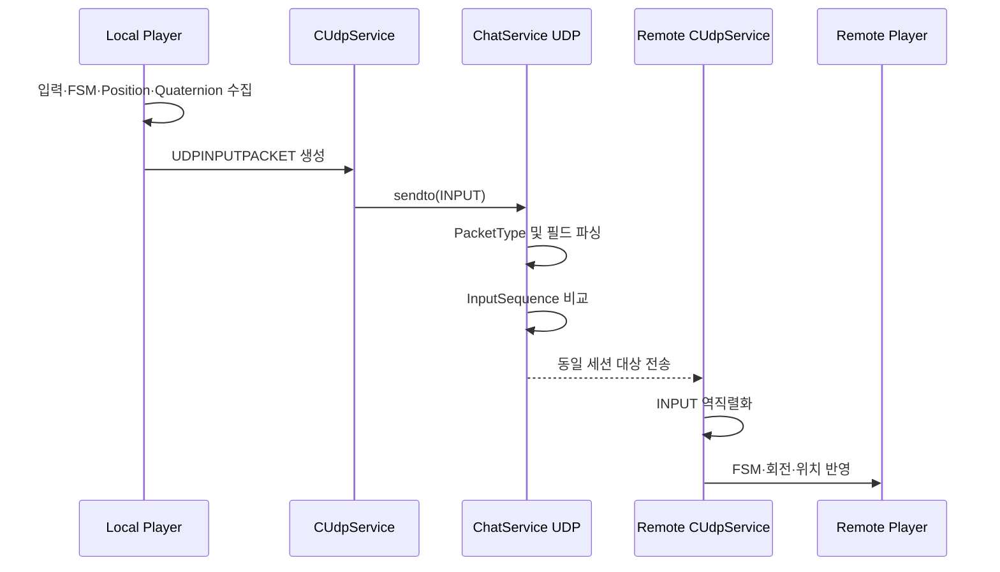

[← 엘든링 프로젝트 종합 페이지로 돌아가기]({{ page.project_page | relative_url }})

## 개요

플레이어의 위치·회전·FSM·입력 상태처럼 자주 갱신되는 데이터를 UDP 바이너리 패킷으로 전달하도록 구현했습니다.

로컬 클라이언트는 현재 입력과 상태를 직렬화해 서버로 보내고, 서버는 같은 게임 세션의 다른 사용자에게 전달하려는 구조입니다. 수신 클라이언트는 패킷을 역직렬화해 원격 플레이어의 FSM과 Transform에 반영합니다.

현재 구현은 서버가 게임 상태를 직접 계산하는 권위형 동기화가 아니라, 클라이언트가 계산한 상태를 공유하는 프로토타입입니다.

---

## 구현 배경

TCP는 패킷 유실 시 재전송과 순서 보장을 제공합니다.

하지만 플레이어 위치처럼 매 프레임 또는 짧은 주기로 갱신되는 데이터는 오래된 패킷이 늦게 도착하는 것보다 최신 상태를 빠르게 반영하는 것이 더 중요하다고 판단했습니다.

따라서 다음과 같이 역할을 나눴습니다.

| 데이터 | 프로토콜 |
|---|---|
| 로그인·레벨 데이터 | HTTP |
| 세션 생성·입장·채팅 | TCP |
| 플레이어·몬스터 상태 | UDP |

UDP를 사용하면서도 이전 패킷이 최신 상태를 덮어쓰지 않도록 `InputSequence` 필드를 추가했습니다.

---

## 전체 흐름



---

## JOIN 패킷

UDP는 연결형 프로토콜이 아니므로 서버가 클라이언트의 Endpoint와 사용자 정보를 연결해야 합니다.

JOIN 패킷은 다음 순서로 구성했습니다.

```text
PacketType: 1 byte
UserIdLength: int32
UserId: variable bytes
JwtLength: int32
Jwt: variable bytes
```

클라이언트는 게임 진입 시 사용자 ID와 JWT를 포함한 JOIN 패킷을 서버로 전송합니다.

의도한 서버 처리 흐름은 다음과 같습니다.

```text
UDP JOIN 수신
→ JWT 검증
→ Token Claim과 UserId 비교
→ 사용자의 게임 세션 확인
→ RemoteEndPoint 저장
→ 이후 INPUT 수신 및 Broadcast 허용
```

그러나 현재 서버 코드에서는 JOIN 타입에 대한 JWT 검증과 사용자별 `UdpEndPoint` 저장이 완성되지 않았습니다.

따라서 패킷 모델과 전송 의도는 존재하지만, 현재 저장소 상태만으로 UDP 브로드캐스트 전체 흐름이 안정적으로 완성되었다고 보기는 어렵습니다.

---

## INPUT 패킷

실제 INPUT 패킷의 직렬화 순서는 다음과 같습니다.

```text
PacketType
UserIdLength
UserId
InputSequence
Quaternion X
Quaternion Y
Quaternion Z
Quaternion W
FSM State
Position X
Position Y
Position Z
Buttons[9]
Navigation Cell Index
```

### 필드 역할

| 필드 | 역할 |
|---|---|
| PacketType | JOIN, INPUT, MONSTER 구분 |
| UserId | 송신 사용자 식별 |
| InputSequence | 입력 패킷 순서 |
| Quaternion | 플레이어 회전 |
| FSM State | Idle, Move, Attack 등 행동 상태 |
| Position | 현재 월드 위치 |
| Buttons | 입력 버튼 상태 |
| CellIndex | 내비게이션 셀 정보 |

문자열 길이와 필드를 명시적으로 기록해 C++과 C#이 동일한 순서로 데이터를 읽도록 구성했습니다.

---

## 클라이언트 송신

로컬 플레이어의 `CPlayer::Key_Input()`은 입력 처리 후 UDP 패킷을 생성합니다.

```text
키 입력 수집
→ FSM 입력 반영
→ 현재 Quaternion 조회
→ 현재 Position 조회
→ InputSequence 증가
→ UDPINPUTPACKET 직렬화
→ CUdpService::UdpSend
```

클라이언트는 위치뿐 아니라 FSM과 버튼 상태도 함께 전송합니다.

이는 수신 클라이언트가 단순히 위치만 이동시키는 것이 아니라, 원격 플레이어의 행동 상태와 애니메이션을 재현하기 위한 선택이었습니다.

---

## 서버 수신과 Sequence 처리

서버의 UDP 수신 루프는 첫 바이트의 `PacketType`을 확인한 뒤 타입에 따라 패킷을 파싱합니다.

INPUT 패킷을 처리할 때 사용자별 마지막 입력을 확인하고 다음 조건이면 폐기합니다.

```text
수신 InputSequence <= 마지막 처리 InputSequence
→ 이전 또는 중복 패킷으로 판단
→ 상태 갱신 없이 폐기
```

이를 통해 늦게 도착한 과거 패킷이 더 최신 상태를 덮어쓰는 문제를 일부 방지했습니다.

### Sequence가 해결하지 못하는 문제

Sequence 번호만으로 다음 문제는 해결되지 않습니다.

- 패킷 유실 복구
- 순서 재정렬 후 처리
- ACK와 재전송
- 네트워크 지터
- 순간 이동 보정
- 서버 상태와 클라이언트 상태 불일치
- Sequence 정수 오버플로 처리

현재 구현은 이전 패킷 폐기를 위한 최소 처리입니다.

---

## 수신 클라이언트 반영

클라이언트의 `CUdpService::UdpReceiveLoop()`는 패킷 타입별로 역직렬화합니다.

INPUT 패킷은 원격 플레이어 처리 코드로 전달되고 `CPlayer::Sync_Key_Input()`에서 다음 정보를 반영합니다.

- 입력 버튼
- FSM 상태
- Quaternion
- Position
- Navigation Cell

수신 Quaternion을 정규화한 뒤 회전 행렬을 만들고 위치를 적용해 원격 플레이어의 Transform을 갱신합니다.

```text
UDP INPUT 수신
→ 역직렬화
→ 원격 플레이어 검색
→ FSM 입력 반영
→ Quaternion 회전 적용
→ Position 적용
→ Navigation Cell 갱신
```

---

## 원격 회전 불일치 문제

### 증상

로컬 플레이어와 원격 플레이어가 같은 입력을 사용해도 회전 방향이나 회전량이 다르게 보이는 문제가 발생할 수 있었습니다.

### 원인 후보

코드 흐름을 확인했을 때 다음 부분이 원인 후보였습니다.

- 모델의 Forward Axis와 게임 좌표축 차이
- Quaternion을 적용하는 행렬 곱 순서
- 기존 Translation을 사용해 회전 행렬을 만든 뒤 위치를 다시 설정
- 수신 Quaternion과 로컬 회전 기준 불일치
- 보간 없이 수신 값을 즉시 적용

### 개선 방향

수신 패킷의 Position과 Quaternion만으로 월드 행렬을 한 번에 구성하도록 단순화할 수 있습니다.

```text
World = Scale × Rotation(Packet Quaternion) × Translation(Packet Position)
```

그리고 다음 시나리오로 검증해야 합니다.

- 제자리에서 Yaw 90도
- 제자리에서 Yaw 180도
- 이동 중 회전
- 좌우 반복 회전
- 두 클라이언트 화면 동시 녹화 비교

---

## 패킷 검증

UDP는 외부에서 임의의 바이트가 들어올 수 있으므로 모든 필드를 신뢰해서는 안 됩니다.

필요한 검증은 다음과 같습니다.

### 공통 검증

- 최소 패킷 크기
- 지원하는 PacketType
- 전체 버퍼 길이
- 문자열 최대 길이
- 남은 버퍼 크기
- 사용자 ID 형식
- 세션 참가 상태
- JWT 또는 인증된 Endpoint 여부

### INPUT 검증

- Quaternion 유효성
- Position의 NaN·Infinity
- 비정상적으로 큰 이동 거리
- FSM State 범위
- Button 배열 길이
- Navigation Cell 범위
- Sequence 범위와 오버플로

현재 C++ 역직렬화는 일부 길이 검사를 수행하지만, C# 서버 파서는 읽은 길이 값을 충분히 제한하지 않는 구간이 있습니다.

공통 Bounded Reader를 만들어 양쪽 파서가 동일한 제한을 적용하는 것이 필요합니다.

---

## 권위형 서버와의 차이

현재 서버는 클라이언트가 계산한 Position과 State를 전달합니다.

```text
현재 구조
Client Simulation
→ Position·State 전송
→ Server Relay
→ Remote Client 적용
```

권위형 서버에서는 클라이언트가 위치 결과가 아닌 입력을 보내고 서버가 최종 상태를 계산합니다.

```text
권위형 구조
Client Input
→ Server Input Queue
→ Fixed Tick Simulation
→ Collision·State Validation
→ Snapshot Broadcast
```

현재 구조는 빠르게 원격 상태를 화면에 반영하는 데는 유용했지만 다음 문제가 있습니다.

- 위치 변조 가능
- 비정상 FSM 전이 가능
- 이동 속도 검증 불가
- 서버와 클라이언트 상태 기준 부재
- 지연과 유실에 대한 보정 없음

---

## 검증

### 정상 시나리오

| 테스트 | 예상 결과 |
|---|---|
| 두 클라이언트 접속 | 원격 플레이어 생성 |
| 로컬 이동 | 상대 화면 위치 변경 |
| 로컬 회전 | 상대 화면 회전 반영 |
| FSM 변경 | 상대 애니메이션 상태 변경 |
| 오래된 Sequence 전송 | 서버에서 폐기 |

### 예외 시나리오

| 테스트 | 예상 결과 |
|---|---|
| 잘못된 PacketType | 패킷 폐기 |
| 음수 UserIdLength | 패킷 폐기 |
| 실제 버퍼보다 큰 길이 | 패킷 폐기 |
| NaN Position | 상태 반영 거부 |
| 미인증 Endpoint | 패킷 거부 |
| 과도한 이동 거리 | 서버 검증 후 거부 필요 |

현재 저장소 기준으로 UDP JOIN Endpoint 등록이 미완성이므로, 정상 브로드캐스트 전체 경로는 추가 구현과 재검증이 필요합니다.

---

## 결과

- 플레이어 입력·위치·회전·FSM을 하나의 UDP 바이너리 패킷으로 구성했습니다.
- C++ 클라이언트와 C# 서버가 동일한 필드 순서로 패킷을 해석하도록 계약을 정의했습니다.
- InputSequence를 이용해 이전 또는 중복 패킷을 폐기했습니다.
- 수신 상태를 원격 플레이어 FSM과 Transform에 연결했습니다.
- 클라이언트 상태 공유 구조와 권위형 서버 구조의 차이를 확인했습니다.

---

## 현재 한계

- UDP JOIN JWT 검증 미완성
- 사용자별 `UdpEndPoint` 저장 미완성
- 서버 권위형 이동·충돌·전투 처리 없음
- 보간·예측·서버 보정 없음
- 패킷 유실률과 지연 측정 없음
- Endianness와 패킷 Version 정책 없음
- C# 서버의 길이 검증 부족
- UDP 수신 큐가 아닌 단일 멤버 덮어쓰기 구조
- `GetInputPacket()`의 임시 객체 참조 반환 위험
- 클라이언트 종료 시 Blocking Receive 정리 문제

---

## 개선 방향

1. UDP JOIN에서 JWT와 UserId를 검증하고 Endpoint를 등록합니다.
2. 공통 Packet Header에 Version과 TotalLength를 추가합니다.
3. Bounded Reader로 모든 길이와 남은 버퍼를 검증합니다.
4. 수신 결과를 Thread-safe Queue에 저장합니다.
5. Fixed Tick 서버와 입력 큐를 구현합니다.
6. 서버 Snapshot에 Sequence 또는 Tick을 포함합니다.
7. 원격 플레이어 보간과 지터 버퍼를 적용합니다.
8. 잘못된 UDP 패킷 Fuzz Test를 자동화합니다.
9. 지연·유실·중복 환경을 시뮬레이션해 측정합니다.

---

## 관련 링크

- [엘든링 프로젝트 종합 페이지]({{ page.project_page | relative_url }})
- [클라이언트 GitHub](https://github.com/Jaehyeok-Soh/3dsolo)
- [서버 GitHub](https://github.com/Jaehyeok-Soh/3dsolo_server)
