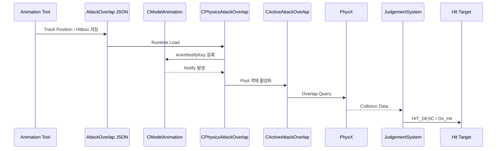

[← 듀엣 나이트 어비스 프로젝트로 돌아가기]({{ page.project_page | relative_url }})

## 구현 배경

공격 판정 시점을 상태 코드나 특정 애니메이션 프레임에 직접 작성하면 애니메이션 수정과 동시에 전투 코드도 수정해야 합니다.

이를 분리하기 위해 애니메이션 타임라인에서 이벤트 실행 위치와 Hitbox 데이터를 편집하고, 런타임에서 Animation Notify와 PhysX Overlap으로 변환하도록 구성했습니다.

```text
Animation Tool
→ Attack Event JSON
→ Runtime Load
→ AnimNotifyKey
→ Active Overlap
→ PhysX Query
→ Combat Judgement
→ Target On_Hit
```

## 담당 범위

- 애니메이션 이벤트 공통 타임라인과 저장 구조
- Hitbox Event 상세 편집
- AttackOverlap JSON 저장·로드 연결
- Animation Notify 바인딩
- Active Overlap Pool과 PhysX Query
- 중복 피격과 Query Filter 처리
- 전투 판정 시스템과의 연결

Effect·Sound·Camera 이벤트는 동일한 공통 구조를 사용하지만 실제 런타임 처리는 다른 팀원이 확장했습니다.

## 전체 구조



## 핵심 코드 1. Tool 데이터를 JSON 구조로 저장

**파일:** `Tool/Private/AnimTool_Manager.cpp`  
**역할:** 편집한 Attack Event를 `ATTACKOVERLAP_DESC`로 구성하고 JSON Document에 저장합니다.

```cpp
HRESULT CAnimTool_Manager::Save_AttackOverlap(fs::path path, string strAnimTag, _int iPool)
{
	ELevelType eLevelType = ELevelType::ANIMATION;
	DTO::ECategory eCategory = DTO::ECategory::OVERLAP_SCRIPT;
	_uint iLevelID = ENUM_TO_UINT(eLevelType);

	if (eCategory != DTO::ECategory::OVERLAP_SCRIPT)
		return E_FAIL;

	if (FAILED(m_pGameInstance->Regist_Document<CDataDocument_AttackOverlap>(iLevelID, eCategory)))
		return E_FAIL;

	CDataDocumentBase* pDocument = m_pGameInstance->Ensure_Document(iLevelID, eCategory, path);
	if (pDocument == nullptr)
		return E_FAIL;

	CDataDocument_AttackOverlap* pAttackOverlapDoc = static_cast<CDataDocument_AttackOverlap*>(pDocument);

	if (pAttackOverlapDoc == nullptr)
		return E_FAIL;

	for (auto& event : m_tEventInfo.vecAttackEvents)
		event.strAnimTag = Engine_Utils::ToString(m_tAnimControllInfo.pModel->Get_AnimationName(event.iAnimIndex));

	DTO::ATTACKOVERLAP_DESC tData{};
	tData.strTag = m_tAnimControllInfo.modelPath.stem().string();
	tData.iNumPool = iPool;
	tData.attackEvents = m_tEventInfo.vecAttackEvents;

	if (FAILED(pAttackOverlapDoc->Try_Add(tData)))
		return E_FAIL;

	m_pGameInstance->Save_File_Json(iLevelID, DTO::ECategory::OVERLAP_SCRIPT, path);
	return S_OK;
}
```

Tool의 Event 목록을 모델 Animation Tag와 함께 저장하고, Runtime에서 Prototype으로 재구성할 수 있는 데이터로 변환했습니다.

[GitHub에서 전체 코드 보기](https://github.com/Byungcoco/FinalProject/blob/18f9e572d38ed55e693e37750daf726033f422da/Tool/Private/AnimTool_Manager.cpp#L548-L581)

## 데이터 예시

```json
                    "fStartTrackPosition": 11.954771995544434,
                    "iAnimIndex": 0,
                    "strAnimTag": "Animation_Monster_Dog_Attack_01",
                    "strDescription": "attack_01",
                    "tHitboxDesc": {
                        "eFilterLayer": 64,
                        "eType": 1,
                        "fDamage": 10.0,
                        "fDuration": 0.10000000149011612,
                        "fHeight": 0.0,
                        "fRadius": 1.0,
                        "fTickTime": -1.0,
                        "iFilterMask": 1,
                        "iMaxHit": 32,
                        "strAttackPresetTag": "Dog_Attack01",
```

Track Position, Shape, 지속 시간, 필터와 AttackPreset을 하나의 Event 데이터로 저장했습니다.

## 핵심 코드 2. Attack Event를 Notify로 바인딩

**파일:** `Engine/Private/PhysicsAttackOverlap.cpp`  
**역할:** Hitbox 데이터를 PhysX Query 설정과 `AnimNotifyKey`로 변환합니다.

```cpp
		event.tHitboxDesc.filterData.data.word0 = event.tHitboxDesc.eFilterLayer;
		event.tHitboxDesc.filterData.data.word1 = event.tHitboxDesc.iFilterMask;
		event.tHitboxDesc.filterData.flags = PxQueryFlag::ePREFILTER | PxQueryFlag::eDYNAMIC | PxQueryFlag::eNO_BLOCK;
		event.tHitboxDesc.matOffset = Matrix::CreateTranslation(event.tHitboxDesc.vOffset);

		event.tHitboxDesc.filterCallback = m_pFilterCallback;

		animTag = event.strAnimTag;
		auto animIter = std::find_if(animations.begin(), animations.end(), findTag);
		
		_int animIdx = m_pOwnerModel->Get_AnimationIndex(Engine_Utils::ToWString(animTag));

		if (animIdx != -1)
			event.iAnimIndex = animIdx;
		else
		{
			wAnimTag = m_pOwnerModel->Get_AnimationName(event.iAnimIndex);
			animIter = std::find_if(animations.begin(), animations.end(), wFindTag);
			event.iAnimIndex = m_pOwnerModel->Get_AnimationIndex(wAnimTag);
		}

		AnimNotifyKey key{};
		key.fTrackPosition = event.fStartTrackPosition;
		key.iParam0 = eventIdx;
		key.iParam1 = event.iAnimIndex;
		(*animIter)->Pushback_Notifies(event.ePhase, key);
		eventIdx++;
		(*animIter)->Sort_Notifies();
```

Tool에서 저장한 실행 위치를 Animation Notify의 Track Position으로 등록하고, Notify Parameter에 Event Index와 Animation Index를 연결했습니다.

[GitHub에서 전체 코드 보기](https://github.com/Byungcoco/FinalProject/blob/18f9e572d38ed55e693e37750daf726033f422da/Engine/Private/PhysicsAttackOverlap.cpp#L305-L333)

## 핵심 코드 3. Active Overlap 실행

**파일:** `Engine/Private/ActiveAttackOverlap.cpp`  
**역할:** Event의 Duration과 Tick에 따라 PhysX Overlap을 실행하고 중복 피격을 관리합니다.

```cpp
void CActiveAttackOverlap::Update(_float fTimeDelta)
{
	if (m_tHitboxDesc == nullptr)
		return;

		m_fSumTime += fTimeDelta;
	if (m_fSumTime >= m_tHitboxDesc->fDuration)
		m_eState = Enum::FIN;

	Tick(fTimeDelta);

	if (m_pGameInstance->Execute_Overlap(
		m_tHitboxDesc->geometry.any(),
		m_pxTransform,
		m_hitBuffer,
		m_tHitboxDesc->filterData,
		(PxQueryFilterCallback*)m_tHitboxDesc->filterCallback))
	{
		for (PxU32 i = 0; i < m_hitBuffer.nbTouches; i++)
		{
			CGameObject* hitObject = static_cast<CGameObject*>(m_hitBuffer.touches[i].actor->userData);
			
			if (CheckAlreadyHit(&m_hitBuffer.touches[i]))
			{
				m_pGameInstance->Overlap_EventCallback(m_pOwner, m_pxTransform.p, &m_hitBuffer.touches[i], PxPairFlag::eNOTIFY_TOUCH_PERSISTS, m_tHitboxDesc);
				continue;
			}

#ifdef _DEBUG
			//Debug_Log(hitObject);
#endif // _DEBUG

			m_pGameInstance->Overlap_EventCallback(m_pOwner, m_pxTransform.p, &m_hitBuffer.touches[i], PxPairFlag::eNOTIFY_TOUCH_FOUND, m_tHitboxDesc);

			m_hitObjects.insert(&m_hitBuffer.touches[i]);
		}
	}
}
```

Notify가 활성화한 Overlap 객체는 설정된 시간 동안 Query를 실행하고, 이미 판정한 대상은 별도 경로로 처리합니다.

[GitHub에서 전체 코드 보기](https://github.com/Byungcoco/FinalProject/blob/18f9e572d38ed55e693e37750daf726033f422da/Engine/Private/ActiveAttackOverlap.cpp#L21-L58)

## 전투 시스템 연결

PhysX Query 결과는 팀 공통 전투 판정 시스템에서 공격자, 피격자와 AttackPreset을 확인한 후 `HIT_DESC`로 변환됩니다.

```text
PxOverlapHit
→ COL_HIT_INFO
→ JudgementSystem
→ AttackPreset
→ HIT_DESC
→ On_Hit / Try_Attack
```

이 연결을 통해 Hit Effect, Sound, Damage UI와 Ragdoll Impulse가 동일한 피격 정보에서 파생됩니다.

## Tool과 실행 결과


- 애니메이션 목록, 이벤트 타임라인과 상세 편집 패널


- Track Position과 Hitbox 설정을 JSON으로 저장


- 활성화된 공격 영역의 PhysX Overlap과 중복 판정 처리

## Veteran 적용 사례

일반 몬스터와 같은 AttackOverlap 구조를 사용해 Veteran의 돌진, 연속 공격과 점프 공격 판정 시점을 Animation Event로 연결했습니다.


## 구현 결과

- 공격 판정 시점을 상태 코드에서 애니메이션 데이터로 분리했습니다.
- Tool의 Hitbox 설정을 Runtime Animation Notify로 변환했습니다.
- 짧은 수명의 Hitbox를 Object Pool 기반 Active Overlap으로 실행했습니다.
- PhysX Query Filter와 중복 피격 처리를 적용했습니다.
- 전투 판정과 피격·래그돌 반응까지 하나의 이벤트 흐름으로 연결했습니다.

## 현재 한계

- Hitbox 회전을 Tool에서 별도로 편집하지 못하고 Offset 중심으로 배치합니다.
- 중복 피격 Key가 안정적인 Actor ID가 아닌 Query 결과 주소에 의존합니다.
- Tool Field별 Preview 반영 시점이 완전히 통일되어 있지 않습니다.
- Effect·Sound·Camera Runtime 처리는 다른 팀원 구현입니다.

## 개선 방향

- Actor 또는 GameObject ID 기반으로 중복 피격을 관리합니다.
- Hitbox Rotation과 Bone Socket 기준 Offset을 Tool에서 편집합니다.
- 모든 Animation Event가 공통 검증과 저장 Pipeline을 사용하도록 통합합니다.
- 잘못된 Animation Tag, AttackPreset과 Filter 설정을 저장 전에 차단합니다.

## 관련 링크

- [프로젝트 종합 페이지]({{ page.project_page | relative_url }})
- [PhysX 물리 월드]({{ '/portfolio/duet-night-abyss/physics-world/' | relative_url }})
- [Data-Driven FSM]({{ '/portfolio/duet-night-abyss/monster-fsm/' | relative_url }})
- [GitHub](https://github.com/Byungcoco/FinalProject)
