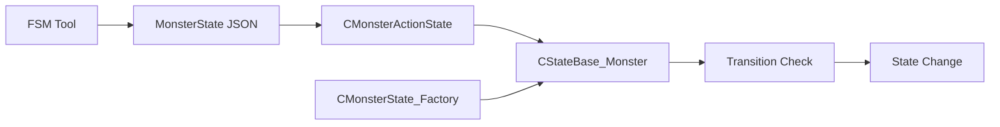

[← 듀엣 나이트 어비스 프로젝트로 돌아가기]({{ page.project_page | relative_url }})

## 구현 배경

몬스터 상태와 전이 조건이 C++ 코드에 고정되어 있으면 패턴을 수정할 때마다 코드 수정과 재빌드가 필요합니다.

상태 Graph와 전이 데이터는 JSON으로 분리하고, 실제 행동 함수는 Runtime Registry에 등록하는 구조로 나누었습니다.

```text
FSM Tool
→ MonsterState JSON
→ State 객체 생성
→ Condition / Feature Registry Binding
→ Transition Evaluation
→ State Change
```

## 담당 범위

- ImGui 기반 FSM Tool UI
- 상태·전이·Feature 데이터 구조
- JSON 저장·로드
- Runtime State 객체 구성
- Condition·Feature 문자열 Registry
- Global·Local Transition과 가중치 전이
- 일반 몬스터와 Veteran 적용

## 전체 구조



## 핵심 코드 1. JSON에서 State 객체 생성

**파일:** `Client/Private/MonsterActionState.cpp`  
**역할:** MonsterState JSON을 읽고 Runtime State 객체와 이름·Index Binding을 구성합니다.

```cpp
HRESULT CMonsterActionState::LoadStates(wstring stateTag, _uint iLevelIndex)
{
	std::filesystem::path path = L"../../Resources/Data/MonsterState";
	path /= stateTag;
	path.replace_extension(".json");

	m_tDesc = LoadStateFile(path, iLevelIndex);

	if (FAILED(Bind_State(m_tDesc.setStates)))
		return E_FAIL;

	for (auto& stateDesc : m_tDesc.vecMonsterStateDesc)
	{
		_uint stateIdx = (*m_umapState.find(stateDesc.strName)).second;

		if (stateDesc.bIsCustom == true)
			continue;

		if (FAILED(Add_State(stateIdx, CState_Monster::Create(this, stateIdx, &stateDesc))))
			return E_FAIL;
	}

	return S_OK;
}
```

몬스터별 State Tag를 JSON 경로로 변환한 뒤 State Description을 읽고, State 이름과 Runtime Index를 연결했습니다.

[GitHub에서 전체 코드 보기](https://github.com/Byungcoco/FinalProject/blob/18f9e572d38ed55e693e37750daf726033f422da/Client/Private/MonsterActionState.cpp#L146-L169)

## 핵심 코드 2. 문자열 ID와 함수 Registry 바인딩

**파일:** `Client/Private/StateBase_Monster.cpp`  
**역할:** JSON의 Condition·Feature 문자열을 Runtime 함수 객체에 연결합니다.

```cpp
HRESULT CStateBase_Monster::Bind_Transition(vector<DTO::STATE_TRANSITION>& transition)
{
	auto factory = CMonsterState_Factory::GetInstance();

	for (auto& trans : transition)
	{
		trans.vecConditionIdx.clear();
		trans.mapRandomStatePoolIdx.clear();
		trans.fTotalWeight = 0.f;

		for (auto& entry : trans.vecConditionEntry)
		{
			auto func = factory->GetCondition(entry.strCondition);
			if (func == nullptr)
				return E_FAIL;

			_uint idx = (_uint)m_vecCondition.size();

			BOUND_CONDITION bound{};
			bound.func = std::bind(func, this, std::placeholders::_1);
			bound.tParam = entry.tParam;

			m_vecCondition.push_back(bound);
			trans.vecConditionIdx.push_back(idx);
		}

		// ...
	}

	return S_OK;
}

// ...

HRESULT CStateBase_Monster::Bind_Feature()
{
	auto factory = CMonsterState_Factory::GetInstance();

	m_vecFeature.clear();
	m_vecFeature.reserve(m_pDesc->vecFeatureEntry.size());
	for (auto& entry : m_pDesc->vecFeatureEntry)
	{
		auto func = factory->GetFeature(entry.strFeature);
		if (func == nullptr)
			return E_FAIL;

		BOUND_FEATURE bound{};
		bound.func = std::bind(func, this, std::placeholders::_1, std::placeholders::_2);
		bound.tParam = entry.tParam;
```

State의 OnEnter·Update·OnExit에서 실행할 Feature도 동일한 Registry 방식으로 연결했습니다.

[GitHub에서 전체 코드 보기](https://github.com/Byungcoco/FinalProject/blob/18f9e572d38ed55e693e37750daf726033f422da/Client/Private/StateBase_Monster.cpp#L268-L341)

## 핵심 코드 3. 조건 평가와 가중치 전이

**파일:** `Client/Private/StateBase_Monster.cpp`  
**역할:** Transition Condition을 평가하고 사용 가능한 State 중 Weight에 따라 다음 상태를 선택합니다.

```cpp
_bool CStateBase_Monster::Check_Transition(vector<DTO::STATE_TRANSITION>& transition)
{
	for (auto& trans : transition)
	{
		_bool allClear = { true };
		for (auto& condIdx : trans.vecConditionIdx)
		{
			if (m_vecCondition[condIdx].func(m_vecCondition[condIdx].tParam) == false)
			{
				allClear = false;
				break;
			}
		}

		if (allClear)
		{
			if (trans.fTotalWeight <= 0.f || trans.mapRandomStatePoolIdx.empty())
				continue;

			_int total = {};
			for (auto& to : trans.mapRandomStatePoolIdx)
			{
				if (static_cast<CMonsterActionState*>(m_pOwnerStateComp)->IsStateReady(to.first) == true)
					total += (_int)to.second;
			}

			if (total <= 0)
				continue;

			_float randomValue = (_float)(rand() % total);

			_float curWeight = {};
			for (auto& to : trans.mapRandomStatePoolIdx)
			{
				if (static_cast<CMonsterActionState*>(m_pOwnerStateComp)->IsStateReady(to.first) == false)
					continue;

				curWeight += to.second;
				if (randomValue < curWeight)
				{
					Change_MonsterState(to.first); // ���� state�� change
					// ...
					return m_iThisStateIndex != to.first;
```

모든 Condition이 참인 Transition만 후보가 되고, Cooldown 상태를 통과한 State Pool에서 Weight 기반으로 다음 상태를 결정합니다.

[GitHub에서 전체 코드 보기](https://github.com/Byungcoco/FinalProject/blob/18f9e572d38ed55e693e37750daf726033f422da/Client/Private/StateBase_Monster.cpp#L439-L512)

## Tool 화면


- FSM Tool 전체 화면


- 상태별 전이 조건과 대상 State 편집


- State Feature 구성

## 적용 사례

### 일반 몬스터

Dog, Boomer, Fly는 같은 FSM Runtime과 Monster Base를 공유하고, 서로 다른 JSON과 AttackOverlap 데이터를 사용했습니다.

### Veteran 중간 보스

Veteran은 동일한 구조에서 더 많은 State, Condition과 전용 Feature를 조합해 돌진, 연속 공격과 점프 공격을 구현했습니다.


## 구현 결과

- 상태 Graph와 전이 조건을 코드에서 JSON 데이터로 분리했습니다.
- Tool에서 State·Transition·Feature를 편집하도록 구성했습니다.
- 문자열 ID를 함수 Registry에 연결해 Runtime 로직을 재사용했습니다.
- Global·Local Transition, Cooldown과 Weight 기반 전이를 지원했습니다.
- 일반 몬스터와 Veteran이 같은 FSM 구조를 공유하도록 구현했습니다.

## 현재 한계

- 새로운 Condition과 Feature를 추가하려면 Factory 코드를 수정해야 합니다.
- Tool 목록과 Runtime Registry가 수동으로 동기화됩니다.
- 잘못된 Key, 순환 전이와 도달 불가능 State를 저장 전에 검증하지 못합니다.
- 일부 최종 State Tool 마이그레이션에는 팀원 수정이 반영되었습니다.

## 개선 방향

- 하나의 Registry 정의에서 Tool 목록과 Runtime Binding을 함께 생성합니다.
- 저장 단계에서 존재하지 않는 Key와 잘못된 Parameter를 차단합니다.
- State Graph의 Cycle, Unreachable State와 Transition 충돌을 시각화합니다.
- Random 전이에 재현 가능한 Seed와 로그를 추가합니다.

## 관련 링크

- [프로젝트 종합 페이지]({{ page.project_page | relative_url }})
- [애니메이션 이벤트와 공격 Overlap]({{ '/portfolio/duet-night-abyss/animation-overlap/' | relative_url }})
- [래그돌 전환과 Bone 동기화]({{ '/portfolio/duet-night-abyss/ragdoll/' | relative_url }})
- [GitHub](https://github.com/Byungcoco/FinalProject)
