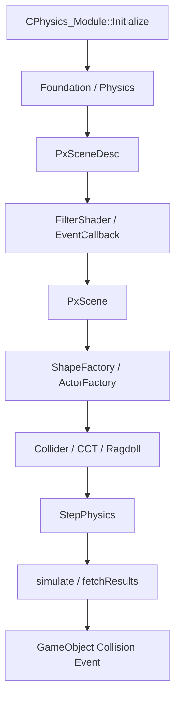

[← 듀엣 나이트 어비스 프로젝트로 돌아가기]({{ page.project_page | relative_url }})

## 구현 배경

게임 오브젝트마다 PhysX API를 직접 호출하면 물리 객체 생성, Scene 등록, 충돌 필터와 해제 책임이 각 콘텐츠 코드에 분산됩니다.

이를 방지하기 위해 PhysX 수명 주기와 시뮬레이션을 `CPhysics_Module`에 모으고, Actor와 Shape 생성은 Factory, 충돌 결과 전달은 Callback으로 분리했습니다.

```text
Engine Initialize
→ PhysX Foundation / Physics / Scene
→ Shape·Actor Factory
→ Collider / CCT / Ragdoll 등록
→ StepPhysics
→ Collision Callback
→ GameObject Event
```

## 담당 범위

- PhysX Foundation·Physics·Scene 생성과 해제
- Dispatcher, Scene Flag, FilterShader, Callback 설정
- 게임 루프의 Physics Step과 CCT Interaction 갱신
- Actor·Shape Factory와 물리 객체 생성 흐름
- 물리 Debug Render와 Ragdoll/CCT 시스템 연동
- 충돌 Callback의 최종 GameObject 전달은 팀 공통 코드와 함께 통합

## 전체 구조



## 핵심 코드 1. PhysX Scene 초기화

**파일:** `Engine/Private/Physics_Module.cpp`  
**역할:** Foundation과 Physics를 생성하고 Scene 설정과 충돌 Callback을 등록합니다.

```cpp
HRESULT CPhysics_Module::Initialize()
{
	if (!(m_pFoundation = PxCreateFoundation(PX_PHYSICS_VERSION, m_Allocator, m_ErrorCallback)))
	{
		MSG_BOX("Failed to created : PxFoundation");
		return E_FAIL;
	}

	if (!(m_pPhysics = PxCreatePhysics(PX_PHYSICS_VERSION, *m_pFoundation, PxTolerancesScale(), true, m_pPvd)))
	{
		MSG_BOX("Failed to created : PxPhysics");
		return E_FAIL;
	}

	PxInitExtensions(*m_pPhysics, m_pPvd);

	// ...

	PxSceneDesc sceneDesc(m_pPhysics->getTolerancesScale());
	sceneDesc.gravity = PxVec3(0.f, -9.81f, 0.f);
	sceneDesc.flags |= PxSceneFlag::eENABLE_CCD;
	sceneDesc.flags |= PxSceneFlag::eENABLE_PCM;
	sceneDesc.flags |= PxSceneFlag::eENABLE_ACTIVE_ACTORS;

	PxU32 numCores = PxThread::getNbPhysicalCores();
	m_pDispatcher = PxDefaultCpuDispatcherCreate(numCores == 0 ? 0 : numCores - 1);
	sceneDesc.cpuDispatcher = m_pDispatcher;

	// ...

	sceneDesc.filterShader = FilterShader;

	m_pFilterEventCallback = CPhysics_FilterEventCallback::Create();
	sceneDesc.simulationEventCallback = m_pFilterEventCallback;

	if (!(m_pScene = m_pPhysics->createScene(sceneDesc)))
	{
		MSG_BOX("Failed to created : PxScene");
		return E_FAIL;
	}
```

CCD, PCM과 Active Actor 옵션을 Scene에 적용하고, 커스텀 FilterShader와 Simulation Event Callback을 연결했습니다.

[GitHub에서 전체 코드 보기](https://github.com/Byungcoco/FinalProject/blob/18f9e572d38ed55e693e37750daf726033f422da/Engine/Private/Physics_Module.cpp#L26-L147)

## 핵심 코드 2. Physics Step

**파일:** `Engine/Private/Physics_Module.cpp`  
**역할:** 엔진 갱신 단계에서 PhysX Scene과 CCT Interaction을 업데이트합니다.

```cpp
void CPhysics_Module::StepPhysics(_float fTimeDelta)
{
	m_pScene->lockWrite();

	m_pScene->simulate(std::clamp(fTimeDelta, 1.f / 120.f, 1.f / 30.f));
	m_pScene->fetchResults(true);

	m_pScene->unlockWrite();

	m_pCCTManager->GetPhysicsCCTManager()->computeInteractions(fTimeDelta);
```

입력 Delta Time을 제한해 시뮬레이션에 전달하고, 결과를 회수한 뒤 CCT 상호작용을 갱신했습니다.

[GitHub에서 전체 코드 보기](https://github.com/Byungcoco/FinalProject/blob/18f9e572d38ed55e693e37750daf726033f422da/Engine/Private/Physics_Module.cpp#L211-L220)

## 충돌 이벤트 전달

PhysX Callback에서 생성한 충돌 정보를 엔진의 `COL_HIT_INFO`로 변환한 뒤 `CGameObject::OnCollision_Enter`, `OnCollision`, `OnTrigger` 계열 이벤트로 전달했습니다.

이 영역은 팀 공통 게임 오브젝트 이벤트 구조와 연결되는 통합 지점입니다.

```cpp
void CPhysics_FilterEventCallback::Ready_EventCallChain()
{
	m_arrCollisionEvent[COLLISIONEVENT::Enum::ON_COLLISION_ENTER] = [=](GAMEOBJECTINFO& info) {
		COL_HIT_INFO hitInfo{};
		hitInfo.bHasHitPoint = info.bHasHitPoint;
		hitInfo.iCollisionPhase = COLLISIONEVENT::Enum::ON_COLLISION_ENTER;
		hitInfo.iRequester_AttackPresetID = info.leftColliderDesc.iAttackPresetID;
		hitInfo.iOther_AttackPresetID = info.rightColliderDesc.iAttackPresetID;
		hitInfo.fDepth = info.fDepth;
		hitInfo.vPosition = info.vHitPoint;
		hitInfo.vRawNormal = info.vRawNormal;
		info.leftObject->OnCollision_Enter(info.leftColliderDesc.eFilterLayer, info.rightColliderDesc.eFilterLayer, info.rightObject, hitInfo);
#ifdef _DEBUG
		Debug_Log(COLLISIONEVENT::Enum::ON_COLLISION_ENTER, info);
#endif // _DEBUG
		};

	m_arrCollisionEvent[COLLISIONEVENT::Enum::ON_COLLISION_STAY] = [=](GAMEOBJECTINFO& info) {
		info.leftObject->OnCollision(info.leftColliderDesc.eFilterLayer, info.rightColliderDesc.eFilterLayer, info.rightObject);
#ifdef _DEBUG
		Debug_Log(COLLISIONEVENT::Enum::ON_COLLISION_STAY, info);
#endif // _DEBUG
		};
```

[GitHub에서 통합 코드 보기](https://github.com/Byungcoco/FinalProject/blob/18f9e572d38ed55e693e37750daf726033f422da/Engine/Private/Physics_FilterEventCallback.cpp#L269-L291)

## 실행 결과


- 노란색 Capsule: 플레이어 CCT
- 초록색 Capsule: 몬스터 CCT
- 빨간색 Mesh: 지형 Static Collider


- 플레이어 상호작용 감지 TriggerBox


- 공격용 PhysX Overlap Debug Shape

## 구현 결과

- PhysX 수명 주기와 게임 엔진 갱신 단계를 하나의 모듈로 관리했습니다.
- Static·Dynamic·Kinematic Actor와 Shape 생성 책임을 Factory로 분리했습니다.
- Collider, CCT, 공격 Overlap과 Ragdoll이 같은 Physics Scene을 공유하도록 구성했습니다.
- PhysX 충돌 결과를 게임 오브젝트 이벤트로 변환해 콘텐츠 코드의 PhysX 직접 의존 범위를 줄였습니다.

## 현재 한계

- 일부 Filter Layer 예외가 FilterShader 코드에 고정되어 있습니다.
- PVD와 일부 리소스 경로가 실행 환경에 의존합니다.
- 새로운 충돌 Layer를 추가할 때 Tool과 Runtime 정책을 함께 갱신해야 합니다.

## 개선 방향

- 충돌 Layer와 Mask 정책을 데이터 또는 공통 Registry로 관리합니다.
- Scene 초기화 옵션과 Debug 설정을 실행 환경별 설정 파일로 분리합니다.
- Collider 생성 실패와 잘못된 Filter 설정을 Tool 단계에서 검증합니다.

## 관련 링크

- [프로젝트 종합 페이지]({{ page.project_page | relative_url }})
- [래그돌 전환과 Bone 동기화]({{ '/portfolio/duet-night-abyss/ragdoll/' | relative_url }})
- [애니메이션 이벤트와 공격 Overlap]({{ '/portfolio/duet-night-abyss/animation-overlap/' | relative_url }})
- [GitHub](https://github.com/Byungcoco/FinalProject)
