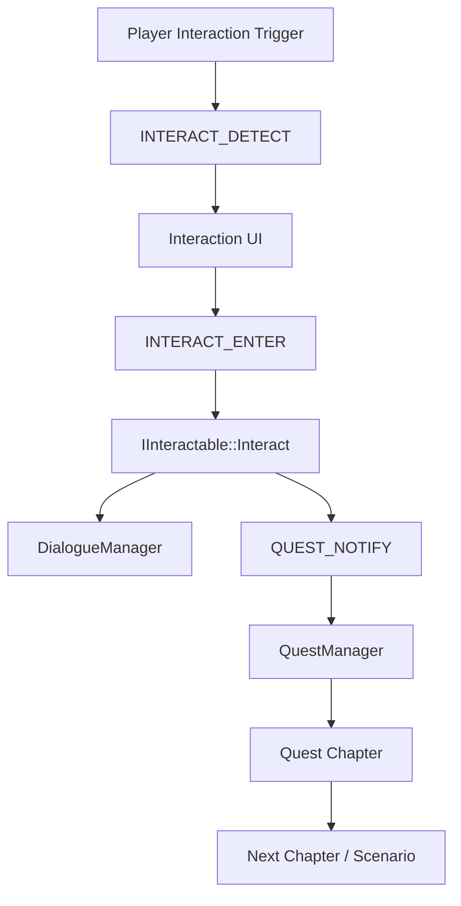

[← 듀엣 나이트 어비스 프로젝트로 돌아가기]({{ page.project_page | relative_url }})

## 구현 배경

NPC 대화, 오브젝트 상호작용, 몬스터 처치와 지역 진입을 각각 독립적으로 구현하면 퀘스트 진행 시스템이 모든 콘텐츠 클래스를 직접 참조하게 됩니다.

이를 피하기 위해 상호작용은 `IInteractable`, 콘텐츠 진행은 공통 `QUEST_NOTIFY` 이벤트로 연결했습니다.

```text
PhysX Trigger
→ Interaction Detect
→ UI Input
→ IInteractable::Interact
→ Dialogue 또는 Object Action
→ QUEST_NOTIFY
→ Scenario / Chapter Progress
```

## 담당 범위

- `IInteractable` 기반 NPC·Object 상호작용 구조
- DialogueManager와 대화 Node 진행
- Quest Manager, Scenario와 Chapter 진행 구조
- Quest Event Signature와 Event Bus 연결
- NPC 대화·오브젝트 상호작용·몬스터 처치 이벤트 연동

UI Prompt와 대화창의 시각적 표현은 다른 팀원이 담당했습니다.

## 전체 구조



## 상호작용 흐름

플레이어의 PhysX Trigger가 NPC 또는 Object를 감지하면 UI에 대상이 전달됩니다. 상호작용 입력이 발생하면 UI는 대상의 구체 클래스 대신 `IInteractable::Interact()`를 호출합니다.

NPC와 Object는 같은 인터페이스를 사용하지만, 각자 대화 시작·아이템 획득·레벨 이동과 같은 서로 다른 동작을 수행합니다.

## 핵심 코드 1. NPC 상호작용

**파일:** `Client/Private/NPC_Base.cpp`  
**역할:** 현재 Quest 상태에 따라 대화 ID를 선택하고 Quest Event를 전달합니다.

```cpp
void CNPC_Base::Interact()
{
	if (Is_Quest_Enabled() && m_eQuestEvent == DTO::QUESTEVENT::NPC_TALK)
	{
		auto chapterDesc = CQuestManager::GetInstance()->Get_QuestChapterInfo();

		auto iter = std::find(chapterDesc.eTargetType.begin(), chapterDesc.eTargetType.end(), m_eObject_Enum_Tag);

		if (iter != chapterDesc.eTargetType.end() && chapterDesc.tQuestDesc.iInteractDialogueId != -1)
			CDialogueManager::GetInstance()->Start_Dialogue(chapterDesc.tQuestDesc.iInteractDialogueId);
	}
	else
	{
		CDialogueManager::GetInstance()->Start_Dialogue(m_iDefaultDialogueId);
	}

	CallQuestEvent(m_eObject_Enum_Tag, 1);
}
```

Quest 대상 NPC라면 Chapter에 연결된 대화를 선택하고, 그 외에는 기본 대화를 재생합니다. 대화 시작 후 동일한 상호작용을 Quest Event로 전달합니다.

[GitHub에서 전체 코드 보기](https://github.com/Byungcoco/FinalProject/blob/18f9e572d38ed55e693e37750daf726033f422da/Client/Private/NPC_Base.cpp#L409-L426)

## 핵심 코드 2. Quest Event 수신

**파일:** `Client/Private/QuestManager.cpp`  
**역할:** 전역 `QUEST_NOTIFY`를 구독하고 현재 Scenario의 진행 상태를 갱신합니다.

```cpp
void CQuestManager::Bind_Events()
{
	m_vecEventHandles.push_back(
		m_pGameInstance->Subscribe<QUEST_NOTIFY>([this](DTO::QUEST_EVENT_SIGNATURE ID)
			{
				this->EventCallback(ID);
			})
	);
}

void CQuestManager::EventCallback(DTO::QUEST_EVENT_SIGNATURE ID)
{
	if (m_scenario[m_iCurScenarioId] == nullptr || m_scenario.find(m_iCurScenarioId) == m_scenario.end())
		return;

	m_scenario[m_iCurScenarioId]->UpdateProgress(ID);

	if (m_scenario[m_iCurScenarioId]->IsComplete())
		Change_Scenario();
}
```

현재 Scenario에 Event를 전달하고 완료되면 다음 Scenario로 전환합니다. Map 조회 순서는 존재하지 않는 ID 처리 측면에서 개선할 여지가 있습니다.

[GitHub에서 실제 코드 보기](https://github.com/Byungcoco/FinalProject/blob/18f9e572d38ed55e693e37750daf726033f422da/Client/Private/QuestManager.cpp#L114-L133)

## 핵심 코드 3. Chapter 진행도 갱신

**파일:** `Client/Private/Quest_Chapter.cpp`  
**역할:** Event Type과 Target Type을 비교해 필요한 Count를 누적합니다.

```cpp
void CQuest_Chapter::UpdateProgress(DTO::QUEST_EVENT_SIGNATURE ID)
{
	if (this == nullptr || m_tDesc.eEvent != ID.eEvent)
		return;

	auto iter = std::find(m_tDesc.eTargetType.begin(), m_tDesc.eTargetType.end(), ID.eTargetType);
	if (iter != m_tDesc.eTargetType.end())
		m_tDesc.iCurrentCount += ID.iCount;
}

_bool CQuest_Chapter::IsComplete()
{
	return m_tDesc.iCurrentCount >= m_tDesc.iCount;
}
```

대화, 오브젝트, 몬스터 처치와 지역 Trigger가 같은 Event Signature를 사용하므로 Chapter는 Event 종류와 대상, 횟수만 확인하면 됩니다.

[GitHub에서 전체 코드 보기](https://github.com/Byungcoco/FinalProject/blob/18f9e572d38ed55e693e37750daf726033f422da/Client/Private/Quest_Chapter.cpp#L69-L82)

## 실행 결과


- 상호작용과 Quest Chapter 전환


- NPC 대화와 Quest 진행


- [Quest·Dialogue 데이터 관리 문서](https://docs.google.com/spreadsheets/d/1CGzyk6tjHByXM0LA-vXfRlovtc3Dpag1Fr7vBfB51BE/edit?gid=1864237876#gid=1864237876)

## 전투와 Quest 연결

몬스터 사망 시 `MONSTER_KILL` Event를 발생시켜 같은 Quest 진행 구조에 전달했습니다.

```text
Combat HIT_DESC
→ Monster HP 감소
→ On_Dying
→ QUEST_NOTIFY(MONSTER_KILL)
→ Quest Chapter Count 증가
```

이 흐름으로 전투 시스템과 Quest Manager가 서로의 구체 구현을 직접 참조하지 않도록 했습니다.

## 구현 결과

- PhysX Trigger, UI 입력과 게임 콘텐츠 동작을 `IInteractable`로 분리했습니다.
- NPC와 Object가 동일한 상호작용 진입점을 공유하도록 구성했습니다.
- 대화·오브젝트·전투 이벤트를 공통 Quest Event로 통합했습니다.
- Quest 상태에 따라 같은 NPC가 다른 Dialogue를 시작하도록 연결했습니다.
- Scenario와 Chapter 단위로 콘텐츠 진행 상태를 관리했습니다.

## 현재 한계

- Dialogue Node 일부가 코드에 직접 정의되어 있습니다.
- Quest 진행 상태의 저장·복원 기능을 구현하지 못했습니다.
- 독립적인 Quest Authoring Tool과 데이터 검증 기능이 없습니다.
- UI 표현은 다른 팀원 영역이며 이 글에서는 Manager와 진행 구조만 다룹니다.

## 개선 방향

- Dialogue와 Quest Scenario를 외부 데이터로 완전히 분리합니다.
- Quest 상태를 저장·복원할 수 있는 직렬화 구조를 추가합니다.
- Event Type, Target과 Dialogue ID 유효성을 Tool 단계에서 검증합니다.
- 다중 상호작용 대상이 겹칠 때 Priority 정책을 명시합니다.

## 관련 링크

- [프로젝트 종합 페이지]({{ page.project_page | relative_url }})
- [Data-Driven FSM]({{ '/portfolio/duet-night-abyss/monster-fsm/' | relative_url }})
- [애니메이션 이벤트와 공격 Overlap]({{ '/portfolio/duet-night-abyss/animation-overlap/' | relative_url }})
- [GitHub](https://github.com/Byungcoco/FinalProject)
