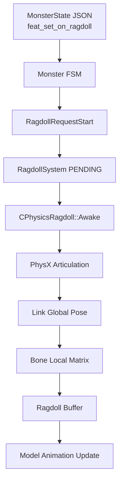

[← 듀엣 나이트 어비스 프로젝트로 돌아가기]({{ page.project_page | relative_url }})

## 구현 목표

고정된 사망 애니메이션 대신 피격 방향과 주변 물체에 반응하는 사망 연출을 만들기 위해 PhysX Articulation 기반 래그돌을 구현했습니다.

핵심 문제는 물리 객체를 생성하는 데 그치지 않고, PhysX Link의 월드 Pose를 캐릭터와 Bone 공간으로 다시 변환해 렌더링 스켈레톤에 반영하는 것이었습니다.

```text
Monster FSM Feature
→ Ragdoll Start Request
→ PhysX Articulation Awake
→ Link Global Pose
→ Character Local
→ Parent Bone Local
→ Bone Buffer
→ Animation / Rendering
```

## 담당 범위

- 래그돌 Bone Mapping과 Articulation 구조 설계
- Ragdoll System의 생성·등록·상태 전환
- FSM Feature와 래그돌 활성화 연결
- 피격 Impulse 전달
- Bone 동기화와 Compute Shader 경로 통합

최종 Bone 동기화와 렌더링 경로에는 팀 통합 과정의 수정이 함께 반영되었습니다.

## 전체 흐름



## 핵심 코드 1. 래그돌 시작 요청

**파일:** `Engine/Private/Physics_RagdollSystem.cpp`  
**역할:** 객체별 래그돌 상태를 `PENDING`으로 변경하고 Awake 또는 Process 단계로 분기합니다.

```cpp
void CPhysics_RagdollSystem::RequestStart(uint64 objID)
{
	auto item = m_umapRegisteredMap.find(objID);
	if (item == m_umapRegisteredMap.end())
		return;

	if (item->second.second == ERagdollState::PROCESSING)
		return;

	item->second.second = ERagdollState::PENDING;
}

void CPhysics_RagdollSystem::SyncStates(uint64 objID, vector<class CChannel*>& vecChannels)
{
	auto item = m_umapRegisteredMap.find(objID);
	if (item == m_umapRegisteredMap.end())
		return;

	if (item->second.second == ERagdollState::PENDING)
	{
		Awake(objID, vecChannels);
		return;
	}
	else if (item->second.second == ERagdollState::PROCESSING)
	{
		Process(objID, vecChannels);
		return;
	}
}
```

FSM에서 요청한 래그돌 전환을 즉시 직접 실행하지 않고 상태로 기록한 뒤, 물리 갱신 흐름에서 Awake와 Process를 구분했습니다.

[GitHub에서 전체 코드 보기](https://github.com/Byungcoco/FinalProject/blob/18f9e572d38ed55e693e37750daf726033f422da/Engine/Private/Physics_RagdollSystem.cpp#L123-L151)

## 핵심 코드 2. PhysX Pose를 Bone Local Matrix로 변환

**파일:** `Engine/Private/PhysicsRagdoll.cpp`  
**역할:** Articulation Link의 Global Pose를 캐릭터 Local과 부모 Bone Local 공간으로 변환합니다.

```cpp
	Matrix objectWorldInverse = static_cast<CPartObject*>(Get_Owner())->Get_Parent()->Get_Component<CTransform>()->Get_WorldMatrix_Inverse();
	_uint iRagDollSize = ENUM_TO_UINT(ERagdollJoint::END);
	CS_OUT_BONE* pInitialData = new CS_OUT_BONE[iRagDollSize];
	// ...
	for (_int i = 0; i < RAGDOLLJOINT::END; i++)
	{
		auto& link = m_tRagdollElements.vecPhysicsLink[i];
		if (!link.first) continue;
		PxTransform pose = link.first->getGlobalPose();
		Matrix matGlobal = m_pGameInstance->PxTransformToXMMatrix(pose);
		m_tRagdollElements.vecRagdollLiveTransform[i] = matGlobal * objectWorldInverse;
	}
	// ...
	for (_int i = 0; i < RAGDOLLJOINT::END; i++)
	{
		auto& link = m_tRagdollElements.vecPhysicsLink[i];
		RAGDOLLJOINT::Enum eParentJoint = link.second.eParentJoint;
		Matrix matCombined = m_tRagdollElements.vecRagdollLiveTransform[i];
		Matrix matBoneLocal;
		if (eParentJoint < 0 || i == RAGDOLLJOINT::PELVIS)
		{
			matBoneLocal = matCombined;
		}
		else
		{
			Matrix matParentCombined = m_tRagdollElements.vecRagdollLiveTransform[eParentJoint];
			matBoneLocal = matCombined * matParentCombined.Invert();// * matCombined;
		}
		pInitialData[i].matCombinedTransform = matBoneLocal;
	}

	m_pMatrixBuffer->Copy_Data(pInitialData, sizeof(CS_OUT_BONE), iRagDollSize);
	Safe_Delete_Array(pInitialData);
```

Articulation Link Pose를 캐릭터 World의 역행렬로 변환한 뒤, 부모 관절 Transform의 역행렬을 적용해 각 Bone의 Local Matrix를 계산했습니다.

[GitHub에서 전체 통합 코드 보기](https://github.com/Byungcoco/FinalProject/blob/18f9e572d38ed55e693e37750daf726033f422da/Engine/Private/PhysicsRagdoll.cpp#L215-L249)

## 애니메이션 경로 반영

몬스터 Body는 래그돌 상태를 확인하고 Matrix Buffer를 Ragdoll Compute Shader에 바인딩한 뒤 기존 Animation Update 경로에 전달합니다.

```cpp
	if (m_bRagDollOn = m_pGameInstance->CheckRagdollState(Get_ID()))
	{
		auto model = Get_Component<CModel>();
		auto animIdx = model->Get_CurrentAnimationIndex();
		m_pGameInstance->RagdollSyncStates(Get_ID(), model->Get_Animation(animIdx)->Get_Channels());
	}

	Get_Component<CModel>()->Set_ApplyRagDoll(m_bRagDollOn);
}

void CMonster_Body_Base::Update(_float fTimeDelta)
{
	Super::Update(fTimeDelta);

	if (m_bRagDollOn)
	{
		if (m_bRagDollOnPre == false)
		{
			Get_Component<CModel>()->Set_ApplyRagDoll(false);
			m_bRagDollOnPre = true;
		}

		else if (m_bRagDollOnPre)
		{
			Get_Component<CPhysicsRagdoll>()->Bind_RagDollCS_MuData(m_pRagDollCS);
		}
	}

	else
	{
		m_bRagDollOnPre = false;
	}

	{
		Get_Component<CModel>()->Update_Animation(m_pBoneCombineCS, m_pBoneAnimEvaluateCS, fTimeDelta,
			Get_Parent()->Get_Component<CTransform>(), Get_Parent()->Get_Component<CPhysicsCCT>(), m_pBoneAnimBlendCS, m_pBoneAnimMixCS, nullptr, m_pRagDollCS);
	}
```

[GitHub에서 렌더링 통합 코드 보기](https://github.com/Byungcoco/FinalProject/blob/18f9e572d38ed55e693e37750daf726033f422da/Client/Private/Monster_Body_Base.cpp#L136-L176)

## 실행 결과


- 몬스터 사망 시 CCT를 비활성화하고 Articulation을 활성화


- PhysX Link World Pose를 캐릭터 및 부모 Bone 공간으로 변환

## 구현 결과

- FSM Feature에서 물리 제어권 전환을 요청하도록 구성했습니다.
- PhysX Articulation Link와 캐릭터 Bone을 매핑했습니다.
- 물리 Pose를 Bone Local Matrix로 변환해 GPU 갱신 경로에 전달했습니다.
- 피격 방향과 AttackPreset의 Impulse를 래그돌 반응에 연결했습니다.
- 일반 몬스터가 동일한 래그돌 구조를 재사용하도록 구현했습니다.

## 현재 한계

- Joint Limit, Mass, Radius와 일부 Bone Mapping이 코드에 고정되어 있습니다.
- 현재 애니메이션 Pose를 모든 경로에서 완전하게 보존하는 전환은 추가 검증이 필요합니다.
- 최종 Bone 동기화 코드에는 팀 통합 수정이 반영되어 있습니다.

## 개선 방향

- 캐릭터별 Ragdoll Profile을 JSON과 Tool에서 편집하도록 분리합니다.
- 애니메이션 Pose와 Articulation 초기 Pose의 차이를 자동 검증합니다.
- Bone Mapping 누락과 잘못된 Parent Joint를 Tool 단계에서 검사합니다.

## 관련 링크

- [프로젝트 종합 페이지]({{ page.project_page | relative_url }})
- [PhysX 물리 월드]({{ '/portfolio/duet-night-abyss/physics-world/' | relative_url }})
- [Data-Driven FSM]({{ '/portfolio/duet-night-abyss/monster-fsm/' | relative_url }})
- [GitHub](https://github.com/Byungcoco/FinalProject)
