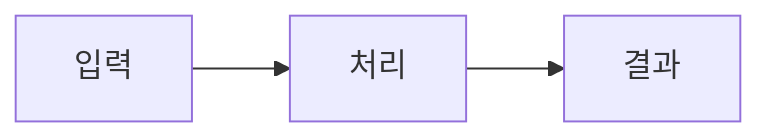

<%*
// ─────────────────────────────────────────────
// 포트폴리오 구현 상세 Post 템플릿
// 저장 대상: _posts
// ─────────────────────────────────────────────

const FOLDER = "_posts";
const dv = app.plugins.plugins["dataview"]?.api;

// 지정 필드의 기존 값 수집
async function getUniqueValues(field) {
    if (!dv) return [];

    const pages = dv.pages(`"${FOLDER}"`);
    const values = new Set();

    pages.forEach(p => {
        const val = p[field];
        if (!val) return;

        if (Array.isArray(val)) {
            val.forEach(v => {
                if (v) values.add(String(v).trim());
            });
        } else {
            if (typeof val === "object") return;
            values.add(String(val).trim());
        }
    });

    return [...values].filter(Boolean).sort();
}

// 기존 값 또는 새 값 선택
async function pickOrNew(existing, promptText) {
    const options =
        existing.length > 0
            ? [...existing, "+ 새로 입력"]
            : ["+ 새로 입력"];

    const pick = await tp.system.suggester(options, options);

    if (!pick || pick === "+ 새로 입력") {
        return ((await tp.system.prompt(promptText)) ?? "").trim();
    }

    return pick;
}

// 태그 다중 선택
async function pickTags(existing) {
    const selected = [];

    while (true) {
        const remaining = [
            ...existing.filter(t => !selected.includes(t)),
            "+ 새 태그 입력",
            "✅ 완료"
        ];

        const pick = await tp.system.suggester(remaining, remaining);

        if (!pick || pick === "✅ 완료") break;

        if (pick === "+ 새 태그 입력") {
            const newTag = await tp.system.prompt("새 태그 입력");

            if (newTag?.trim()) {
                selected.push(newTag.trim());
            }
        } else {
            selected.push(pick);
        }
    }

    return selected;
}

// 기존 값 조회
const existingCategories = await getUniqueValues("category");
const existingProjects = await getUniqueValues("project");
const existingTags = await getUniqueValues("tags");

// 글 분류
const defaultCategories = [
    "debug",
    "concept",
    "architecture",
    "implementation",
    "portfolio"
];

const categoryOptions =
    existingCategories.length > 0
        ? existingCategories
        : defaultCategories;

const category = await pickOrNew(
    categoryOptions,
    "카테고리 입력"
);

// 프로젝트 표시명
const projectOptions = [...existingProjects, "없음"];

const projectPick = await pickOrNew(
    projectOptions,
    "프로젝트명 입력 예: 엘든링 모작 및 서버 연동"
);

const project =
    projectPick === "없음" || !projectPick
        ? ""
        : projectPick;

// 포트폴리오 URL 생성 정보
const projectSlug = (
    (await tp.system.prompt(
        "프로젝트 URL 슬러그 예: elden-ring"
    )) ?? ""
).trim();

const postSlug = (
    (await tp.system.prompt(
        "상세 글 URL 슬러그 예: level-pipeline"
    )) ?? ""
).trim();

const permalink =
    projectSlug && postSlug
        ? `/portfolio/${projectSlug}/${postSlug}/`
        : "";

// 종합 프로젝트 페이지 주소
const projectPage = (
    (await tp.system.prompt(
        "종합 프로젝트 페이지 주소 예: /portfolio/elden-ring-recreate/"
    )) ?? ""
).trim();

// 카드나 목록에서 사용할 한 줄 요약
const excerpt = (
    (await tp.system.prompt(
        "글 한 줄 요약"
    )) ?? ""
).trim();

// 태그
const tags = await pickTags(existingTags);

let tagsYaml = "";

if (tags.length > 0) {
    tagsYaml =
        "\n" +
        tags.map(t => `  - ${t}`).join("\n");
} else {
    tagsYaml = " []";
}
-%>
---
title: "<% tp.file.title %>"
date: <% tp.date.now("YYYY-MM-DD") %>
layout: single
permalink: <% permalink %>

category: "<% category %>"
project: "<% project %>"
project_page: "<% projectPage %>"
portfolio_post: true

excerpt: "<% excerpt.replace(/"/g, '\\"') %>"

tags: <% tagsYaml %>

toc: true
toc_label: "목차"
toc_sticky: true

source:
---


[← 프로젝트 종합 페이지로 돌아가기]({{ page.project_page | relative_url }})


## 개요

이 글에서 구현하거나 해결한 내용을 2~3문장으로 요약합니다.

---

## 구현 배경

이 기능이 프로젝트에서 왜 필요했는지 설명합니다.

- 기존 구조
- 요구사항
- 해결해야 했던 문제
- 프로젝트 전체에서 이 기능의 역할

---

## 문제

실제로 발생한 문제나 구현 전 해결해야 했던 기술적 과제를 작성합니다.

### 증상

- 어떤 상황에서 문제가 발생했는가
- 사용자 또는 개발자에게 어떻게 보였는가
- 로그나 예외 메시지는 무엇이었는가

### 원인 분석

- 어떤 코드 흐름을 추적했는가
- 처음 예상한 원인은 무엇이었는가
- 실제 원인은 무엇이었는가

---

## 설계 및 선택 이유

적용한 구조와 선택 근거를 작성합니다.

- 고려한 대안
- 현재 방식을 선택한 이유
- 장점과 단점
- 프로젝트 제약 사항

```text
기존 흐름
→ 변경한 구조
→ 최종 처리 결과
````

---

## 구현

핵심 처리 흐름과 코드를 설명합니다.

### 처리 흐름



### 핵심 구현

```cpp
// 전체 코드를 붙이지 않고
// 설명에 필요한 핵심 부분만 작성
```

코드 아래에는 다음 내용을 설명합니다.

- 이 코드가 담당하는 책임
    
- 입력과 출력
    
- 실패 조건
    
- 다른 객체 또는 시스템과의 관계
    

---

## 검증

구현이 정상적으로 동작하는지 확인한 방법을 작성합니다.

### 정상 시나리오

- 정상 입력
    
- 정상 처리 흐름
    
- 예상 결과
    

### 예외 시나리오

- 잘못된 입력
    
- 누락된 데이터
    
- 중복 요청
    
- 연결 종료
    
- 경계값
    

### 검증 결과

|테스트 조건|예상 결과|실제 결과|
|---|---|---|
|정상 요청|정상 처리|확인|
|잘못된 입력|거부 또는 폐기|확인|
|경계값|예외 없이 처리|확인|

---

## 결과

구현 후 달라진 점을 작성합니다.

- 완성된 기능
    
- 해결된 문제
    
- 구조적 개선
    
- 전후 비교
    
- 측정한 값이 있다면 수치
    

측정하지 않은 성능 향상은 단정하지 않고, 구조적으로 개선한 내용만 작성합니다.

---

## 현재 한계

현재 구현하지 못했거나 검증되지 않은 영역을 작성합니다.

- 미구현 기능
    
- 테스트하지 못한 상황
    
- 운영 환경에서 필요한 보완
    
- 현재 구조가 갖는 기술적 한계
    

---

## 개선 방향

다시 구현하거나 확장한다면 적용할 내용을 작성합니다.

1. 첫 번째 개선
    
2. 두 번째 개선
    
3. 세 번째 개선
    

---

## 관련 링크

- [프로젝트 종합 페이지]({{ page.project_page | relative_url }})
    
- GitHub:
    
- 실행 영상:
    
- 관련 구현 글: